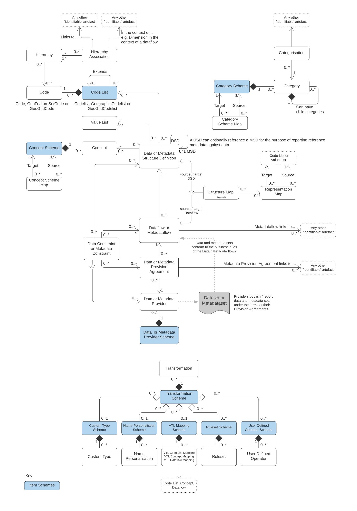

## Processes and Business Scope

### Process Patterns

SDMX identifies three basic process patterns regarding the exchange of
statistical data and metadata. These can be described as follows:

1. *Bilateral exchange:* All aspects of the exchange process are agreed
    between counterparties, including the mechanism for exchange of data
    and metadata, the formats, the frequency or schedule, and the mode
    used for communications regarding the exchange. This is perhaps the
    most common process pattern.

2. *Gateway exchange:* Gateway exchanges are an organized set of
    bilateral exchanges, in which several data and metadata collecting
    organizations or individuals agree to exchange the collected
    information with each other in a single, known format, and according
    to a single, known process. This pattern has the effect of reducing
    the burden of managing multiple bilateral exchanges (in data and
    metadata collection) across the sharing organizations/individuals.
    This is also a very common process pattern in the statistical area,
    where communities of institutions agree on ways to gain efficiencies
    within the scope of their collective responsibilities.

3. *Data-sharing exchange:* Open, freely available data formats and
    process patterns are known and standard. Thus, any organization or
    individual can use any counterparty's data and metadata (assuming
    they are permitted access to it). This model requires no bilateral
    agreement, but only requires that data and metadata providers and
    consumers adhere to the standards.

This document specifies the SDMX standards designed to facilitate
exchanges based on any of these process patterns, and shows how SDMX
offers advantages in all cases. It is possible to agree bilaterally to
use a standard format (such as SDMX-ML or SDMX-JSON); it is possible for
data senders in a gateway process to use a standard format for data
exchange with each other, or with any data providers who agree to do so;
it is possible to agree to use the full set of SDMX standards to support
a common data-sharing process of exchange, whether based on an
SDMX-conformant registry or some other architecture.

The standards specified here specifically support a data-sharing process
based on the use of central registry services. Registry services provide
visibility into the data and metadata existing within the community, and
support the access and use of this data and metadata by providing a set
of triggers for automated processing. The data or metadata itself is not
stored in a central registry -- these services merely provide a useful
set of metadata about the data (and additional metadata) in a known
location, so that users/applications can easily locate and obtain
whatever data and/or metadata is registered. The use of standards for
all data, metadata, and the registry services themselves is ubiquitous,
permitting a high level of automation within a data-sharing community.

It should be pointed out that these different process models are not
mutually exclusive -- a single system capable of expressing data and
metadata in SDMX-conformant formats could support all three scenarios.
Different standards may be applicable to different processes (for
example, many registry services interfaces are used only in a
data-sharing scenario) but all have a common basis in a shared
information model.

In addition to looking at collection and reporting, it is also important
to consider the dissemination of data. Data and metadata -- no matter
how they are exchanged between counterparties in the process of their
development and creation -- are all eventually supplied to an end user
of some type. Often, this is through specific applications inside of
institutions. But more and more frequently, data and metadata are also
published on websites in various formats. The dissemination of data and
its accompanying metadata on the web is a focus of the SDMX standards.
Standards for statistical data and metadata allow improvements in the
publication of data -- it becomes more easily possible to process a
standard format once the data is obtained, and the data and metadata are
linked together, making the comprehension and further processing of the
data easier.

In discussions of statistical data, there are many aspects of its
dissemination which impact data quality: data discovery, ease of use,
and timeliness. SDMX standards provide support for all of these aspects
of data dissemination. Standard data formats promote ease of use, and
provide links to relevant metadata. The concept of registry services
means that data and metadata can more easily be discovered. Timeliness
is improved throughout the data lifecycle by increases in efficiency,
promoted through the availability of metadata and ease of use.

It is important to note that SDMX is primarily focused on the *exchange*
and *dissemination* of statistical data and metadata. There may also be
many uses for the standard model and formats specified here in the
context of internal processing of data that are not concerned with the
exchange between organizations and users, however. It is felt that a
clear, standard formatting of data and metadata for the purposes of
exchange and dissemination can also facilitate internal processing by
organizations and users, but this is not the focus of the specification.

### SDMX and Process Automation

Statistical data and metadata exchanges employ many different automated
processes, but some are of more general interest than others. There are
some common information technologies that are nearly ubiquitous within
information systems today. SDMX aims to provide standards that are most
useful for these automated processes and technologies.

Briefly, these can be described as:

1. *Batch Exchange of Data and Metadata:* The transmission of whole or
    partial databases between counterparties, including incremental
    updating.

2. *Provision of Data and Metadata on the Internet:* Internet
    technology - including its use in private or semi-private TCP/IP
    networks - is extremely common. This technology includes XML, JSON
    and REST web services as primary mechanisms for automating data and
    metadata provision, as well as the more traditional static HTML and
    database-driven publishing.

3. *Generic Processes:* While many applications and processes are
    specific to some set of data and metadata, other types of automated
    services and processes are designed to handle any type of
    statistical data and metadata whatsoever. This is particularly true
    in cases where portal sites and data feeds are made available on the
    Internet.

4. *Presentation and Transformation of Data:* In order to make data and
    metadata useful to consumers, they must support automated processes
    that transform them into application-specific processing formats,
    other standard formats, and presentational formats. Although not
    strictly an aspect of exchange, this type of automated processing
    represents a set of requirements that must be supported if the
    information exchange between counterparties is itself to be
    supported.

The SDMX standards specified here are designed to support the
requirements of all of these automation processes and technologies.

### Statistical Data and Metadata

To avoid confusion about which \"data\" and \"metadata\" are the
intended content of the SDMX formats specified here, a statement of
scope is offered. Statistical \"data\" are sets of often numeric
observations which typically have time associated with them. They are
associated with a set of metadata values, representing specific
concepts, which act as identifiers and descriptors of the data. These
metadata values and concepts can be understood as the named dimensions
of a multi-dimensional co-ordinate system, describing what is often
called a \"cube\" of data.

SDMX identifies a standard technique for modelling, expressing, and
understanding the structure of this multi-dimensional \"cube\", allowing
automated processing of data from a variety of sources. This approach is
widely applicable across types of data and attempts to provide the
simplest and most easily comprehensible technique that will support the
exchange of this broad set of data and related metadata.

The term \"metadata\" is very broad indeed. A distinction can be made
between "structural" metadata -- those concepts used in the description
and identification of statistical data and metadata -- and "reference"
metadata -- the larger set of concepts that describe and qualify
statistical data sets and processing more generally, and which are often
associated not with specific observations or series of data, but with
entire collections of data or even the institutions which provide that
data.

The SDMX Information Model provides for the structuring not only of
data, but also of "reference" metadata. While these reference metadata
structures exist independent of the data and its structural metadata,
they are often linked. The SDMX Information Model provides for the
attachment of reference metadata to any part of the data or structural
metadata, as well as for the reporting and exchange of the reference
metadata and its structural descriptions. This function of the SDMX
standards supports many aspects of data quality initiatives, allowing as
it does for the exchange of metadata in its broadest sense, of which
quality-related metadata is a major part.

Metadata are associated not only with data, but also with the process of
providing and managing the flow of data. The SDMX Information Model
provides for a set of metadata concerned with "data provisioning" --
metadata which are useful to those who need to understand the content
and form of a data provider's output. Each data provider can describe in
standard fashion the content of and dependencies within the data and
metadata sets which they produce, and supply information about the
scheduling and mechanism by which their data and metadata are provided.
This allows for automation of some validation and control functions, as
well as supporting management of data reporting.

SDMX also recognizes the importance of classification schemes in
organizing and managing the exchange and dissemination of data and
metadata. It is possible to express information about classification
schemes and domain categories in SDMX, along with their relationships to
data and metadata sets, as well as to categorize other objects in the
model.

The SDMX standards offer a common model, a choice of syntax and, for
XML, a choice of data formats which support the exchange of any type of
statistical data meeting the definition above; several optimized formats
are specified based on the specific requirements of each implementation,
as described below in the SDMX-ML section.

The formal objects in the information model are presented schematically
in Figure 1, and are discussed in more detail elsewhere in this
document.

>  **Figure 1: High Level Schematic of Major Artefacts in the SDMX 3.0
> Information Model**

### The SDMX View of Statistical Exchange

Version 1.0 of ISO/TS 17369 SDMX covered statistical data sets and the
metadata related to the structure of these data sets. This scope was
useful in supporting the different models of statistical exchange
(bilateral exchange, gateway exchange, and data-sharing) but was not by
itself sufficient to support them completely. Versions 2.0 and 2.1
provide a much more complete view of statistical exchange, so that an
open data-sharing model can be fully supported, and other models of
exchange can be more completely automated. In order to produce technical
standards that will support this increased scope, the SDMX Information
Model provides a broader set of formal objects which describe the
actors, processes, and resources within statistical exchanges.

It is important to understand the set of formal objects not only in a
technical sense, but also in terms of what they represent in the
real-world exchange of statistical data and metadata.

The first version of SDMX provided for data sets - specific statistical
data reported according to a specific structure, for a specific time
range - and for data structure definitions - the metadata which
describes the structure of statistical data sets. These are important
objects in statistical exchanges, and are retained and enhanced in the
second version of the standards in a backward-compatible form. A related
object in statistical exchanges is the \"data flow\" - this supports the
concept of data reporting or dissemination on an ongoing basis. \"Data
flows\" can be understood as data sets which are not bounded by time.
Data structures are owned and maintained by agencies - in a similar
fashion, data flows are owned by maintenance agencies.

SDMX allows for the publication of statistical data (and the related
structural metadata) but also provided for the standard, systematic
representation of reference metadata. In version 2.1, reference metadata
were reported independent of the statistical data. However, in 3.0
reference metadata associated directly with data such as footnotes are
reported as attributes of the data set. For other reference metadata,
principally that linked to structures like "concepts", SDMX provides
reference \"metadata sets\", \"metadata structure definitions\", and
\"metadata flows\". These objects are very similar to data sets, data
structure definitions, and data flows, but concern reference metadata
rather than statistical observations. In the same way that data
providers may publish statistical data, they may also publish reference
metadata. Metadata structural definitions are maintained by agencies in
a fashion similar to the way that agencies maintain data structure
definitions, the structural definitions of data sets.

The structural definitions of both data and reference metadata associate
specific statistical concepts with their representations, whether
textual, coded, etc. These concepts are taken from a \"concept scheme\"
which is maintained by a specific agency. Concept schemes group a set of
concepts, provide their definitions and names, and allow for semantic
relationships to be expressed, when some concepts are specializations of
others. It is possible for a single concept scheme to be used both for
data structures - key families - and for reference metadata structures.

Inherent in any statistical exchange -- and in many dissemination
activities -- is a concept of \"service level agreement\", even if this
is not formalized or made explicit. SDMX incorporates this idea in
objects termed \"provision agreements\". Data providers may provide data
to many different data flows. Data flows may incorporate data coming
from more than one data provider. Provision agreements are the objects
which tell you which data providers are supplying what data to which
data flows. Similarly, metadata provision agreements for metadata flows.

Provision agreements allow for a variety of information to be made
available: the schedule by which statistical data or metadata is
reported or published, the specific topics about which data or metadata
is reported within the theoretically possible set of data (as described
by a data structure definition or reference metadata structure
definition), and the time period covered by the statistical data and
metadata. This set of information is termed \"constraint\" in the SDMX
Information Model.

A brief summary of the objects described in the information model
includes:

- ***Data Set:*** Data is organized into discrete sets, which include
    particular observations for a specific period of time. A data set
    can be understood as a collection of similar data, sharing a
    structure, which covers a fixed period of time.

- ***Data Structure Definition (DSD, also known as Key Family in
    Version 2.0):*** Each data set has a set of structural metadata.
    These descriptions are referred to in SDMX as Data Structure
    Definitions, which include information about how concepts are
    associated with the measures, dimensions, and attributes of a data
    "cube," along with information about the representation of data and
    related identifying and descriptive (structural) metadata. In
    Version 2.1, the term \"Key Family\" was replaced by \"Data
    Structure Definition\" (DSD) both in XML Schemas and the Information
    Model. The DSD has been modified in version 3.0 to better support
    microdata by providing the option to define multiple measures and
    for attributes and measures to take arrays of values. An optional
    reference to a Metadata Structure Definition has also been added for
    describing the reference metadata associated with the data. When
    reported, these reference metadata are included as part of the
    dataset.

- ***Code list:*** Code lists enumerate a set of codes to be used in
    the representation of dimensions, attributes, and other structural
    parts of SDMX. Codes can be organised into simple hierarchies within
    a code list, and more complex hierarchies potentially involving
    multiple code lists using hierarchy and hierarchy association
    structures.

- ***Value list:*** Value lists introduced in version 3.0 are similar
    to codelists with the exception that the items do not need to
    conform to the usual SDMX rules for identifiable objects. That
    allows the values to include characters such as currency symbols
    (e.g. ¥) which would otherwise make illegal codes. However, unlike
    codes, values are not individually identifiable. Value lists find
    application in concepts and data structures definitions for less
    structured data and microdata enumerations and can be mapped to
    other value or code lists using representation maps.

- ***Organisation Scheme:*** Organisations and organisation structure
    can be defined in an Organisation Scheme. Specific Organisation
    Schemes exist for Maintenance Agency, Data Provider, Metadata
    Provider, Data Consumer, and Organisation Unit.

- ***Category Scheme and Categorisation:*** Category schemes are made
    up of a hierarchy of categories, which in SDMX may include any type
    of useful classification for the organization of data and metadata.
    A Categorisation links a category to an identifiable object. In this
    way sets of objects can be categorised. A statistical subject-matter
    domain scheme is implemented in SDMX as a Category Scheme.

- ***Concept Scheme:*** A concept scheme is a maintained list of
    concepts that are used in data structure definitions and metadata
    structure definitions. There can be many such concept schemes. A
    "core" representation of the concept can be specified (e.g. a core
    code list, or other representation such as "date"). Note that this
    core representation can be overridden in the data structure
    definition or metadata structure definition that uses the concept.
    Indeed, organisations wishing to remain with version 1.0 key family
    schema specifications will continue to declare the representation in
    the key family definition.

- ***Metadata Set:*** A reference metadata set is a set of information
    pertaining to an object within the formal SDMX view of statistical
    exchange: they may describe the maintainers of data or structural
    definitions; they may describe the schedule on which data is
    released; they may describe the flow of a single type of data over
    time; they may describe the quality of data, etc. In SDMX, the
    creators of reference metadata may take whatever concepts they are
    concerned with, or obliged to report, and provide a reference
    metadata set containing that information.

- ***Metadata Structure Definition:*** A reference metadata set also
    has a set of structural metadata which describes how it is
    organized. This metadata set identifies what reference metadata
    concepts are being reported, how these concepts relate to each other
    (typically as hierarchies), what their presentational structure is,
    how they may be represented (as free text, as coded values, etc.),
    and with which formal SDMX object types they are associated.

- ***Dataflow Definition:*** In SDMX, data sets are reported or
    disseminated according to a data flow definition. The data flow
    definition identifies the data structure definition and may be
    associated with one or more subject matter domains via a
    Categorisation (this facilitates the search for data according to
    organised category schemes). Constraints, in terms of reporting
    periodicity or sub set of possible keys that are allowed in a data
    set, may be attached to the data flow definition.

- ***Metadataflow Definition:*** A metadata flow definition is very
    similar to a data flow definition, but describes, categorises, and
    constrains metadata sets.

- ***Data Provider:*** An organization which produces data is termed a
    data provider.

- ***Metadata Provider:*** An organization which produces reference
    metadata is termed a metadata provider.

- ***Provision Agreement (Metadata Provision Agreement):*** The set of
    information which describes the way in which data sets and metadata
    sets are provided by a data/metadata provider. A provision agreement
    can be constrained in much the same way as a data or metadata flow
    definition. Thus, a data provider can express the fact that it
    provides a particular data flow covering a specific set of countries
    and topics, Importantly, the actual source of registered data or
    metadata is attached to the provision agreement (in terms of a URL).
    The term "agreement" is used because this information can be
    understood as the basis of a "service-level agreement". In SDMX,
    however, this is informational metadata to support the technical
    systems, as opposed to any sort of contractual information (which is
    outside the scope of a technical specification). In version 3.0,
    metadata provision agreement and data provision agreement are two
    separate artefacts.

- ***Constraint:*** Data and Metadata Constraints describe a subset of
    a data source or metadata source, and may also provide information
    about scheduled releases of data. They are associated with data /
    metadata providers, provision agreements, data flows, metadataflows,
    data structure definitions and metadata structure definitions.

- ***Structure Map:*** Structure maps describes a mapping between data
    structure definitions or dataflows for the purpose of transforming a
    data set into a different structure. The mapping rules are defined
    using one or more component maps which each map in turn describes
    how one or more components from the source data structure definition
    map to one or more components in that of the target. Represent maps
    act as lookup tables and specific provision is made for mapping
    dates and times.

- ***Representation Map:*** Representation maps describe mappings
    between source value(s) and target value(s) where the values are
    restricted to those in a code list, value list or be of a certain
    type such as integer or string.

- ***Item Scheme Map:*** An item scheme map describes mapping rules
    between any item scheme with the exception of code lists and value
    lists which use representation maps. The version 3.0 information
    model provides four item scheme maps: organisation scheme map,
    concept scheme map, category scheme map and reporting taxonomy map.
    Organisation scheme map and reporting scheme map have been omitted
    from the information model schematic in Figure 1.

- ***Reporting Taxonomy:*** A reporting taxonomy allows an
    organisation to link (possibly in a hierarchical way) a number of
    cube or data flow definitions which together form a complete
    "report" of data or metadata. This supports primary reporting which
    often comprises multiple cubes of heterogeneous data, but may also
    support other collection and reporting functions. It also supports
    the specification of publications such as a yearbook, in terms of
    the data or metadata contained in the publication.

- ***Process:*** The process class provides a way to model statistical
    processes as a set of interconnected *process steps.* Although not
    central to the exchange and dissemination of statistical data and
    metadata, having a shared description of processing allows for the
    interoperable exchange and dissemination of reference metadata sets
    which describe processes-related concepts.

- ***Hierarchy***: Describes complex code hierarchies principally for
    data discovery purposes. The codes themselves are referenced from
    the code lists in which they are maintained.

- ***Hierarchy Association***: A hierarchy association links a
    hierarchy to something that needs it like a dimension. Furthermore,
    the linking can be specified in the context of another object such
    as a dimension in the context of a dataflow. Thus, a dimension in a
    data structure definition could have different hierarchies depending
    on the dataflow.

- ***Transformation Scheme:*** A transformation scheme is a set of
    Validation and Transformation Language (VTL) transformations aimed
    at obtaining some meaningful results for the user (e.g., the
    validation of one or more data sets). The set of transformations is
    meant to be executed together (in the same run) and may contain any
    number of transformations in order to produce any number of results.
    Thus, a transformation scheme can be considered as a VTL 'program'.

### SDMX Registry Services

In order to provide visibility into the large amount of data and
metadata which exists within the SDMX model of statistical exchange, it
is felt that an architecture based on a set of registry services is
potentially useful. A "registry" -- as understood in webservices
terminology -- is an application which maintains and stores metadata for
querying, and which can be used by any other application in the network
with sufficient access privileges (though note that the mechanism of
access control is outside of the scope of the SDMX standard). It can be
understood as the index of a distributed database or metadata repository
which is made up of all the data provider's data sets and reference
metadata sets within a statistical community, located across the
Internet or similar network.

Note that the SDMX registry services are not concerned with the storage
of data or reference metadata. The assumption is that data and reference
metadata lives on the sites of its data and metadata providers. The SDMX
registry services concern themselves with providing visibility of the
data and reference metadata, and information needed to access the data
and reference metadata. Thus, a registered data set will have its URL
available in the registry, but not the data itself. An application which
wishes to access that data would query the registry, perhaps by drilling
down via a Category Scheme and Dataflow, for the URL of a registered
data source, and then retrieve the data directly from the data provider
(using an SDMX REST API query message or other mechanism).

SDMX does not require a particular technology implementation of the
registry -- instead, it specifies the standard interfaces which may be
supported by a registry. Thus, users may implement an SDMX-conformant
registry in any fashion they choose, provided the interfaces are
supported as specified in Section 5 on the Registry Specification. These
interfaces are expressed as XML documents, but also REST API
request/response messages

The registry services discussed here can be briefly summarized:

- ***Maintenance of Structural Metadata*:** This registry service
    allows users with maintenance agency access privileges to submit and
    modify structural metadata. In this aspect the registry is acting as
    a structural metadata repository. However, it is permissible in an
    SDMX structure to submit just the "stub" of the structural object,
    such as a code list, and for this stub to reference the actual
    location from where the metadata can be retrieved, either from a
    file or a structural metadata resource, such as another registry.

- ***Registration of Data and Metadata Sources:*** This registry
    service allows users with maintenance agency access privileges to
    inform the registry of the existence and location (for retrieval) of
    data sets and reference metadata sets. The registry stores metadata
    about these objects, and links it to the structural metadata that
    give sufficient structural information for an application to process
    it, or for an application to discover its existence. Objects in the
    registry are organized and categorized according to one or more
    category schemes.

- ***Querying:*** The registry services have interfaces for querying
    the metadata contained in a registry, so that applications and users
    can discover the existence of data sets and reference metadata sets,
    structural metadata, the providers/agencies associated with those
    objects, and the provider agreements which describe how the data and
    metadata are made available, and how they are categorized.

- ***Subscription/Notification:*** It is possible to "subscribe" to
    specific objects in a registry, so that a notification will be sent
    to all subscribers whenever the registry objects are updated.

### RESTful Web services

Web services allow computer applications to exchange data directly over
the Internet, essentially allowing modular or distributed computing in a
more flexible fashion than ever before. In order to allow web services
to function, however, many standards are required: for requesting and
supplying data; for expressing the enveloping data which is used to
package exchanged data; for describing web services to one another, to
allow for easy integration into applications that use other web services
as data resources.

Version 3.0 has standardized on RESTful web services with a OpenAPI
specification published on the SDMX Technical Working Group's GitHub
repository <https://github.com/sdmx-twg>. There are five 'resources':

- structure -- retrieval and maintenance of structural metadata

- data -- retrieval of data

- schema -- retrieval of XML schemas to validate specific data or
    metadata sets

- availability -- retrieval of information on the data available for a
    Dataflow

- metadata -- retrieval of reference metadata

The following conceptual example uses the 'data' resource to query a
data repository for a series identified by the key 'M.USD.EUR.SP00.A' in
the EXR (ECB exchange rates) Dataflow:

> <https://ws-entry-point/data/dataflow/ECB/EXR/1.0.0/M.USD.EUR.SP00.A>