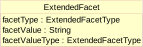
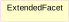
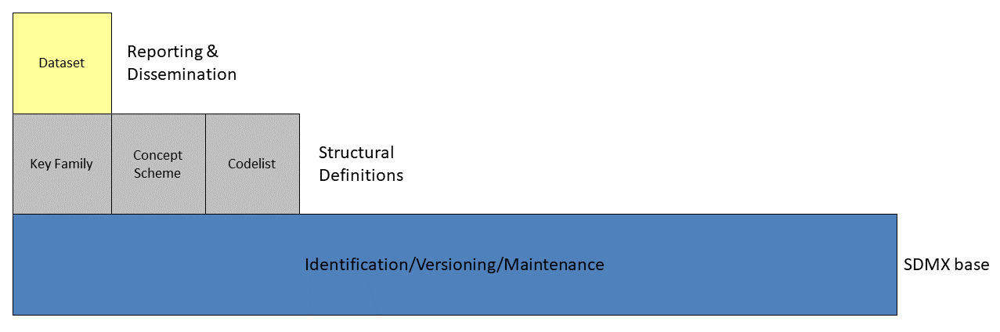
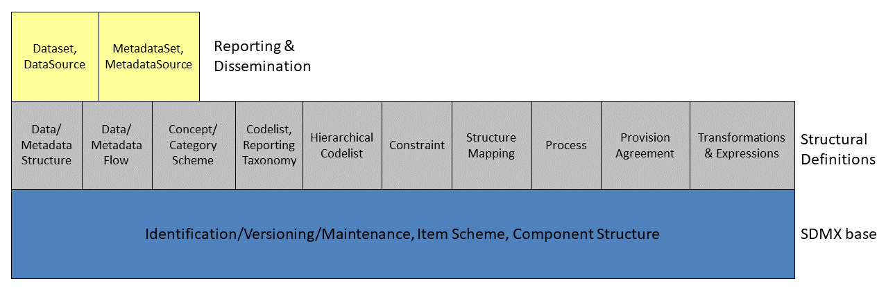
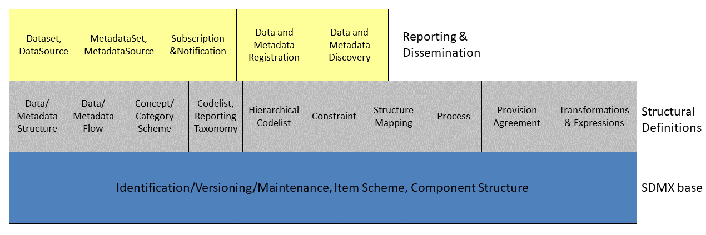
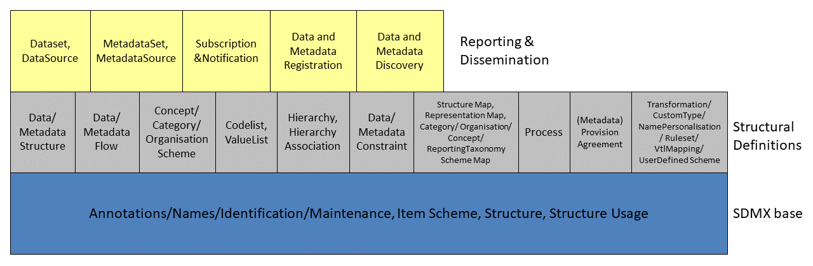

# Introduction

This document is not normative but provides a detailed view of the
information model on which the normative SDMX specifications are based.
Those new to the UML notation or to the concept of Data Structure
Definitions may wish to read the appendixes in this document as an
introductory exercise.

## Related Documents

This document is one of two documents concerned with the SDMX
Information Model. The complete set of documents is:

- SDMX SECTION 02 INFORMATION MODEL: UML CONCEPTUAL DESIGN (this
    document): This document comprises the complete definition of the
    information model, with the exception of the registry interfaces. It
    is intended for technicians wishing to understand the complete scope
    of the SDMX technical standards in a syntax neutral form.
- SDMX SECTION 05 REGISTRY SPECIFICATION: LOGICAL INTERFACES: This
    document provides the logical specification for the registry
    interfaces, including subscription/notification,
    registration/submission of data and metadata, and querying.

## Modelling Technique and Diagrammatic Notes

The modelling technique used for the SDMX Information Model (SDMX-IM) is
the Unified Modelling Language (UML). An overview of the constructs of
UML that are used in the SDMX-IM can be found in the Appendix “A Short
Guide to UML in the SDMX Information Model”

UML diagramming allows a class to be shown with or without the
compartments for one or both of attributes and operations (sometimes
called methods). In this document the operations compartment is not
shown as there are no operations.

 
/// caption
Figure 1 Class with operations suppressed
///

In some diagrams for some classes the attribute compartment is
suppressed even though there may be some attributes. This is deliberate
and is done to aid clarity of the diagram. The method used is:

- The attributes will always be present on the class diagram where the
    class is defined and its attributes and associations are defined.
- On other diagrams, such as inheritance diagrams, the attributes may
    be suppressed from the class for clarity.

 
/// caption
Figure 2 Class with attributes also suppressed
///

Note that, in any case, attributes inherited from a super class are not
shown in the sub class.

The following table structure is used in the definition of the classes,
attributes, and associations.

| Class | Feature | Description |
| :--- | :--- | :--- |
| ClassName |  |  |
|  | attributeName |  |
|  | associationName |  |
|  | +roleName |  |

The content in the “Feature” column comprises or explains one of the
following structural features of the class:

- Whether it is an abstract class. Abstract classes are shown in
    *italic Courier* font.
- The superclass this class inherits from, if any.
- The sub classes of this class, if any.
- Attribute – the attributeName is shown in Courier font.
- Association – the associationName is shown in Courier font. If the
    association is derived from the association between super classes,
    then the format is /associationName.
- Role – the +roleName is shown in Courier font.

The Description column provides a short definition or explanation of the
Class or Feature. UML class names may be used in the description and if
so, they are presented in normal font with spaces between words. For
example, the class ConceptScheme will be written as Concept Scheme.

## Overall Functionality

### Information Model Packages

The SDMX Information Model (SDMX-IM) is a conceptual metamodel from
which syntax specific implementations are developed. The model is
constructed as a set of functional packages which assist in the
understanding, re-use and maintenance of the model.

In addition to this, in order to aid understanding each package can be
considered to be in one of three conceptual layers:

- the SDMX Base layer comprises fundamental building blocks which are used
    by the Structural Definitions layer and the Reporting and Dissemination
    layer
- the Structural Definitions layer comprises the definition of the
    structural artefacts needed to support data and metadata reporting and
    dissemination
- the Reporting and Dissemination layer comprises the definition of the
    data and metadata containers used for reporting and dissemination

In reality the layers have no implicit or explicit structural function
as any package can make use of any construct in another package.

### Version 1.0

In version 1.0 the metamodel supported the requirements for:

- Data Structure Definition including (domain) category scheme, (metadata)
    concept scheme, and code list
- Data and related metadata reporting and dissemination

The SDMX-IM comprises a number of packages. These packages act as
convenient compartments for the various sub models in the SDMX-IM. The
diagram below shows the sub models of the SDMX-IM that were included in
the version 1.0 specification.

/// caption
Figure 3: SDMX Information Model Version 1.0 package structure
///

### Version 2.0/2.1

The version 2.0/2.1 model extends the functionality of version 1.0.
principally in the area of metadata, but also in various ways to define
structures to support data analysis by systems with knowledge of cube
type structures such as OLAP[1] systems. The following major constructs
have been added at version 2.0/2.1

- Metadata structure definition
- Metadata set
- Hierarchical Codelist
- Data and Metadata Provisioning
- Process
- Mapping
- Constraints
- Constructs supporting the Registry

Furthermore, the term Data Structure Definition replaces the term Key
Family: as both of these terms are used in various communities, they are
synonymous. The term Data Structure Definition is used in the model and
this document.

 
/// caption
Figure 4 SDMX Information Model Version 2.0/2.1 package
structure
///

Additional constructs that are specific to a registry-based scenario can
be found in the Specification of Registry Interfaces. For information
these are shown on the diagram below and comprise:

- Subscription and Notification
- Registration
- Discovery

Note that the data and metadata required for registry functions are not
confined to the registry, and the registry also makes use of the other
packages in the Information Model.

/// caption
Figure 5: SDMX Information Model Version 2.0/2.1 package structure
including the registry
///

### Version 3.0

The version 3.0 model introduces changes in the way reference metadata
are handled. In addition, it includes a few more artefacts. Finally, a
few abstractions have been added, as shown in section “Basic
Inheritance” in “Figure 11: Basic Inheritance from the Base Structures”.

The IM packages are largely the same.

/// caption
Figure 6: SDMX Information Model version 3.0 package structure
///