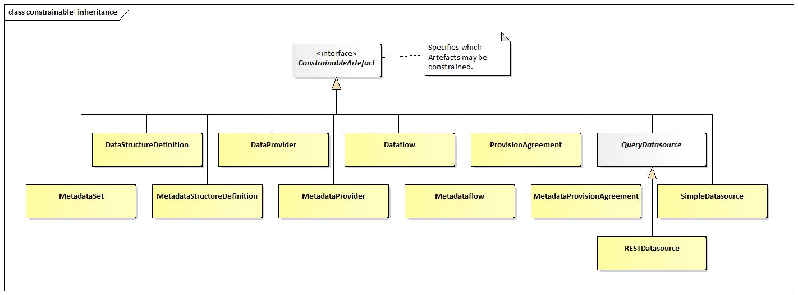

# Constraints

## Scope

The scope of this section is to describe the support in the metamodel
for specifying both the access to and the content of a data source. The
information may be stored in a resource such as a registry for use by
applications wishing to locate data and metadata which are available via
the Internet. The *Constraint* is also used to specify a subset of a
Codelist which may be used as a partial Codelist, relevant in the
context of the artefact to which the *Constraint* is attached e.g.,
DataStructureDefinition, Dataflow, ProvisionAgreement,
MetadataStructureDefinition, Metadataflow, MetadataProvisionAgreement.

Note that in this metamodel the term data source refers to both data and
metadata sources, and data provider refers to both data and metadata
providers.

A data source may be a simple file of data or metadata (in SDMX-ML, JSON
or other format), or a database or metadata repository. A data source
may contain data for many data or metadata flows (called Dataflow, and
Metadataflow in the model), and the mechanisms described in this section
allow an organisation to specify precisely the scope of the content of
the data source where this data source is registered (SimpleDataSource,
*QueryDataSource*).

The Dataflow and Metadataflow, themselves may be specified as containing
only a subset of all the possible keys that could be derived from a
DataStructureDefinition or MetadataStructureDefinition. Respectively,
further subsets may be defined within a ProvisionAgreement and
MetadataProvisionAgreement.

These specifications are called *Constraint* in this model.

## Inheritance

### Class Diagram of Constrainable Artefacts - Inheritance

Figure 41: Inheritance class diagram of constrainable and provisioning
artefacts

### Explanation of the Diagram

#### Narrative

Any artefact that inherits from the *ConstrainableArtefact* interface
can have constraints defined. The artefacts that can have constraint
metadata attached are:

Dataflow

ProvisionAgreement

DataProvider – this is restricted to release calendar

DataStructureDefinition

Metadataflow

MetaDataProvider – this is restricted to release calendar

MetadataProvisionAgreement

MetadataSetMetadataStructureDefinition

SimpleDataSource – this is a registered data source where the
registration references the actual Data Set or Metadata Set

*QueryDataSource*

Note that, because the *Constraint* can specify a subset of the
component values implied by a specific *Structure* (such as a specific
DataStructureDefinition or specific MetadataStructureDefinition), the
*ConstrainableArtefact*s must be associated with a specific *Structure*.
Therefore, whilst the *Constraint* itself may not be linked directly to
a DataStructureDefinition or MetadataStructureDefinition, the artefact
that it is constraining will be linked to a DataStructureDefinition or
MetadataStructureDefinition. As a DataProvider or a MetadataProvider
does not link to any one specific DSD or MSD the type of information
that can be contained in a Constraint linked to a
DataProvider/MetadataProvider is restricted to ReleaseCalendar.

## Constraints

### Relationship Class Diagram – high level view

Figure 42: Relationship class diagram showing constraint metadata

### Explanation of the Diagram

#### Narrative

The constraint mechanism allows specific constraints to be attached to a
*ConstrainableArtefact*. With the exception of ReleaseCalendar these
constraints specify a subset of the total set of values or keys that may
be present in any of the *ConstrainableArtefacts*.

For instance, a DataStructureDefinition specifies, for each Dimension,
the list of allowable code values. However, a specific Dataflow that
uses the DataStructureDefinition may contain only a subset of the
possible range of keys that is theoretically possible from the
DataStructureDefinition definition (the total range of possibilities is
sometimes called the Cartesian product of the dimension values). In
addition to this, a DataProvider that is capable of supplying data
according to the Dataflow has a ProvisionAgreement, and the DataProvider
may also wish to supply constraint information which may further
constrain the range of possibilities in order to describe the data that
the provider can supply. It may also be useful to describe the content
of a data source in terms of the KeySets or CubeRegions contained within
it.

A *ConstrainableArtefact* can have two types of *Constraint*s:

1.  DataConstraint – is used as a mechanism to specify, either the
    available set of keys (DataKeySet), or set of component values
    (CubeRegion) in a *DataSource* such as a Simpledatasource or a
    database (*QueryDatasource*), or the allowable keys that can be
    constructed from a DataStructureDefinition. Multiple such
    DataConstraints may be present for a *ConstrainableArtefact*. For
    instance, there may be a DataConstraint that specifies the values
    allowed for the *ConstrainableArtefact* (role is allowableContent)
    which can be used for validation or for constructing a partial code
    list for one Dimension, while another provides the validation for
    another Dimension within the same DSD.

2.  MetadataConstraint – is used as a mechanism to specify a set of
    component values (MetadatTargetRegion) in a *DataSource* such as a
    MetadataSet or a database (*QueryDatasource*). Multiple such
    MetadataConstraints may be present for a *ConstrainableArtefact*.
    For instance, there may be a MetadataConstraint that specifies the
    values allowed for the *ConstrainableArtefact* (role is
    allowableContent) which can be used for validation or for
    constructing a partial code list, whilst another MetadataConstraint
    can specify the actual content of a metadata source (role is
    actualContent).

In addition to DataKeySet and/or CubeRegion/MetadataTargetRegion a
Constraint can have a ReleaseCalendar specifying when data or metadata
are released for publication or reporting.

Note also that another possible type of a DataConstraint is available;
that is a DataConstraint with the role of actualContent where it
describes the data that an SDMX Web Service contains. This type of
DataConstraint is not maintained in a Registry and is always a response
to the data availability SDMX REST API. Thus, its identification is
auto-generated by the service responding to a data availability request.

### Relationship Class Diagram – Detail

Figure 43: Constraints – Key Set, Cube Region and Metadata Target Region

#### Explanation of the Diagram

A *Constraint* is a *MaintainableArtefact*.

A DataConstraint has a choice of two ways of specifying value subsets:

1.  As a set of keys that can be present in the *DataSet* (DataKeySet).
    Each DataKey specifies a number of ComponentValues each of which
    reference a *Component* (e.g., Dimension, DataAttribute). Each
    ComponentValue is a value that may be present for a *Component* of a
    structure when contained in a *DataSet*. In addition, each
    DataKeySet may also include MemberSelections for AttributeComponents
    or Measures.

2.  As a set of CubeRegions each of which defines a “slice” of the total
    structure (MemberSelection) in terms of one or more MemberValues
    that may be present for a *Component* of a structure when contained
    in a *DataSet*.

The difference between (1) and (2) above is that in (1) a complete key
is defined whereas in (2) above the “slice” defines a list of possible
values for each of the *Component*s but does not specify specific key
combinations. In addition, in (1) the association between *Component*
and DataKeyValue is constrained to the components that comprise the key,
whereas in (2) it can contain other component types (such as
AttributeComponents or Measures). By adding MemberSelections to the
DataKeySets of (1), AttributeComponents and Measures are constrained for
the related DataKeys.

A MetadataConstraint has only one way of specifying value subsets:

1.  As a set of MetadataTargetRegions each of which defines a “slice” of
    the total structure (MemberSelection) in terms of one or more
    MemberValues that may be present for a *Component* of a structure
    when contained in a MetadataSet.

In both CubeRegion and MetadataTargetRegion, the value in
ComponentValue.value and MemberValue.value must be consistent with the
*Representation* declared for the *Component* in the
DataStructureDefinition (Dimension or DataAttribute) or
MetadataStructureDefinition (MetadataAttribute). Note that in all cases
the "operator" on the value is deemed to be "equals", unless the
wildcard character is used '%'. In the latter case the "operation" is a
partial matching, where the percentage character ('%') may match zero or
more characters. Furthermore, it is possible in a MemberValue to specify
that child values (e.g., child codes) are included in the Constraint by
means of the cascadeValues attribute. The latter may take the following
values:

-   "true": all children are included,

-   "false" (default), or

-   "excludeRoot", where all children are included, and the root Code is
    excluded (i.e. the referenced Code).

It is possible to define for the DataKeySet, DataKey, CubeRegion,
MetadataTargetRegion and MemberSelection whether the set is included
(isIncluded = "true", default) or excluded (isIncluded = "false") from
the Constraint definition. This attribute is useful if, for example,
only a small sub-set of the possible values are not included in the set,
then this smaller sub-set can be defined and excluded from the
constraint. Note that if the child construct is “included” and the
parent construct is “excluded” then the child construct is included in
the list of constructs that are “excluded”.

In any MemberSelection that the corresponding *Component* was using
Codelist with extensions, it is possible to remove the prefix that has
been used, in order to refer to the original Codes. This is achieved via
property removePrefix, which defaults to “false”.

In DataKeys and MemberValues it is possible, via the validFrom and
validTo properties, to set a validity period for which the selected key
or value is constrained.

#### Definitions

| Class | Feature | Description |
| :--- | :--- | :--- |
| <em>ConstrainableArtefact</em> | 
Abstract Class  Sub classes are:
 
Dataflow
 
DataProvider
 
DataStructureDefinition
 
Metadataflow
 
MetadataProvisionAgreement
 
MetadataSet
 
MetadataStructureDefinition
 
ProvisionAgreement
 
<em>QueryDatasource</em>
 
SimpleDatasource
 | An artefact that can have Constraints specified. |
|  | content | Associates the metadata that constrains the content to be found in a data or metadata source linked to the Constrainable Artefact. |
| <em>Constraint</em> | 
Inherits from
 
<em>MaintainableArtefact</em>
 
Abstract class
 
Sub classes are:
 
DataConstraint  MetadataConstraint
 | Specifies a subset of the definition of the allowable or actual content of a data or metadata source that can be derived from the Structure that defines code lists and other valid content. |
|  | +dataContentKeys | Association to a subset of Data Key Sets (i.e., value combinations) that can be derived from the definition of the structure to which the Constrainable Artefact is linked. |
|  | +dataContentRegion | Association to a subset of component values that can be derived from the Data Structure Definition to which the Constrainable Artefact is linked. |
|  | +metadataContentRegion | Association to a subset of component values that can be derived from the Metadata Structure Definition to which the Constrainable Artefact is linked. |
|  | role | Association to the role that the Constraint plays |
| DataConstraint | 
Inherits from
 
<em>Constraint</em>
 | Defines a Constraint in terms of the content that can be found in data sources linked to the Constrainable Artefact to which this constraint is associated. |
| ConstraintRoleType |  | Specifies the way the type of content of a Constraint in terms of its purpose. |
|  | allowableContent | The Constraint contains a specification of the valid subset of the Component values or keys. |
|  | actualContent | The Constraint contains a specification of the actual content of a data or metadata source in terms of the Component values or keys in the source. |
| MetadataConstraint | 
Inherits from
 
<em>Constraint</em>
 | Defines a Constraint in terms of the content that can be found in metadata sources linked to the Constrainable Artefact to which this constraint is associated. |
| DataKeySet |  | A set of data keys. |
|  | isIncluded | Indicates whether the Data Key Set is included in the constraint definition or excluded from the constraint definition. |
|  | +keys | Association to the Data Keys in the set. |
|  | +member | Association to the selection of a value subset for Attributes and Measures. |
| DataKey |  | The values of a key in a data set. |
|  | isIncluded | Indicates whether the Data Key is included in the constraint definition or excluded from the constraint definition. |
|  | +keyValue | Associates the Component Values that comprise the key. |
|  | validFrom | Date from which the Data Key is valid. |
|  | validTo | Date from which the Data Key is superseded. |
| ComponentValue |  | The identification and value of a Component of the key (e.g., Dimension) |
|  | value | The value of Component |
|  | +valueFor | Association to the Component (e.g., Dimension) in the Structure to which the Constrainable Artefact is linked. |
| TimeDimensionValue |  | The value of the Time Dimension component. |
|  | timeValue | The value of the time period. |
|  | operator | 
<mark>Indicates whether the specified value represents and exact time or time period, or whether the value should be handled as a range.</mark>
 
<mark>A value of greaterThan or greaterThanOrEqual indicates that the value is the beginning of a range (exclusive or inclusive, respectively).</mark>
 
<mark>A value of lessThan or lessThanOrEqual indicates that the value is the end or a range (exclusive or inclusive, respectively).</mark>
 
<mark>In the absence of the opposite bound being specified for the range, this bound is to be treated as infinite (e.g., any time period after the beginning of the provided time period for greaterThanOrEqual)</mark>
 |
| CubeRegion |  | A set of Components and their values that defines a subset or “slice” of the total range of possible content of a data structure to which the Constrainable Artefact is linked. |
|  | isIncluded | Indicates whether the Cube Region is included in the constraint definition or excluded from the constraint definition. |
|  | +member | Associates the set of Components that define the subset of values. |
| MetadataTargetRegion |  | A set of Components and their values that defines a subset or “slice” of the total range of possible content of a metadata structure to which the Constrainable Artefact is linked. |
|  | isIncluded | Indicates whether the Metadata Target Region is included in the constraint definition or excluded from the constraint definition. |
|  | +member | Associates the set of Components that define the subset of values. |
| MemberSelection |  | A set of permissible values for one component of the axis. |
|  | isIncluded | Indicates whether the Member Selection is included in the constraint definition or excluded from the constraint definition. |
|  | removePrefix | Indicates whether the Codes should keep or not the prefix, as defined in the extension of Codelist. |
|  | +valuesFor | Association to the Component in the Structure to which the Constrainable Artefact is linked, which defines the valid Representation for the Member Values. |
| <em>SelectionValue</em> | 
Abstract class. Sub classes are:
 
MemberValue  <em>TimeRangeValue</em>
 
LocalisedMemberValue
 | A collection of values for the Member Selections that, combined with other Member Selections, comprise the value content of the Cube Region. |
|  | validFrom | Date from which the Selection Value is valid. |
|  | validTo | Date from which the Selection Value is superseded. |
| MemberValue | 
Inherits from
 
<em>SelectionValue</em>
 | A single value of the set of values for the Member Selection. |
|  | value | A value of the member. |
|  | cascadeValues | Indicates that the child nodes of the member are included in the Member Selection (e.g., child codes) |
| LocalisedMemberValue | 
Inherits from
 
<em>SelectionValue</em>
 | A single localised value of the set of values for a Member Selection. |
|  | value | A value of the member. |
|  | locale | The locale that the values must adhere to in the dataset. |
| <em>TimeRangeValue</em> | 
Inherits from
 
<em>SelectionValue</em>
 
Abstract Class
 
Concrete Classes:
 
BeforePeriod  AfterPeriod  RangePeriod
 | A time value or values that specifies the date or dates for which the constrained selection is valid. |
| BeforePeriod | 
Inherits from
 
<em>TimeRangeValue</em>
 | The period before which the constrained selection is valid. |
|  | isInclusive | Indication of whether the date is inclusive in the period. |
|  | period | The time period which acts as the latest possible reported period |
| AfterPeriod | 
Inherits from
 
<em>TimeRangeValue</em>
 | The period after which the constrained selection is valid. |
|  | isInclusive | Indication of whether the date is inclusive in the period. |
|  | period | The time period which acts as the earliest possible reported period |
| RangePeriod |  | The start and end periods in a date range. |
|  | +start | Association to the Start Period. |
|  | +end | Association to the End Period. |
| StartPeriod | 
Inherits from
 
<em>TimeRangeValue</em>
 | The period from which the constrained selection is valid. |
|  | isInclusive | Indication of whether the date is inclusive in the period. |
|  | period | The time period which acts as the start of the range |
| EndPeriod | 
Inherits from
 
<em>TimeRangeValue</em>
 | The period to which the constrained selection is valid. |
|  | isInclusive | Indication of whether the date is inclusive in the period. |
|  | period | The time period which acts as the end of the range |
| ReleaseCalendar |  | The schedule of publication or reporting of the data or metadata |
|  | periodicity | The time period between the releases of the data or metadata |
|  | offset | Interval between January 1st and the first release of the data |
|  | tolerance | Period after which the data or metadata may be deemed late. |