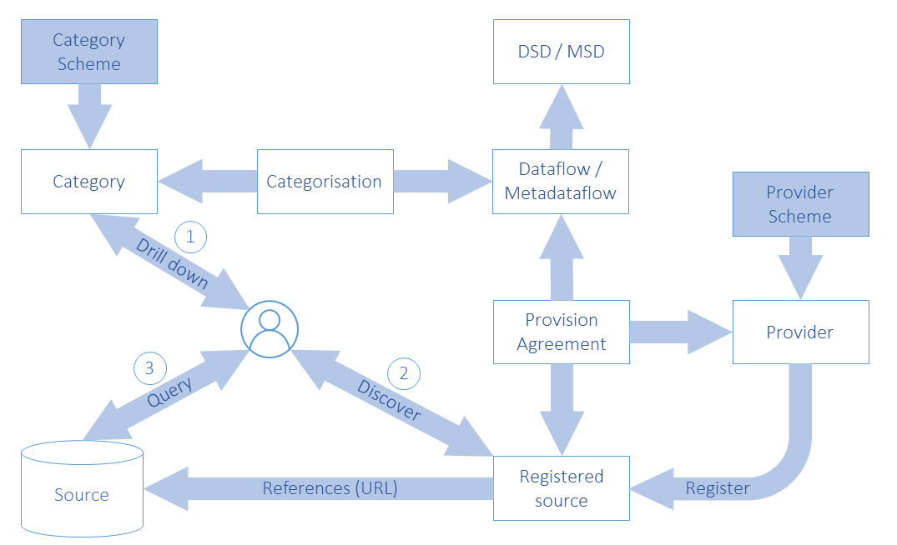

# Data Provisioning

## Class Diagram

Figure 44: Relationship and inheritance class diagram of data/metadata
provisioning

## Explanation of the Diagram

### Narrative

This sub model links many artefacts in the SDMX-IM and is pivotal to an
SDMX metadata registry, as all of the artefacts in this sub model must
be accessible to an application that is responsible for data and
metadata registration or for an application that requires access to the
data or metadata.

Whilst a registry contains all of the metadata depicted on the diagram
above, the classes in the grey shaded area are specific to a
registry-based scenario where data sources (either physical data and
metadata sets or databases and metadata repositories) are registered.
More details on how these classes are used in a registry scenario can be
found in the SDMX Registry Interface document. (Section 5 of the SDMX
Standards).

A ProvisionAgreement / MetadataProvisionAgreement links the artefact
that defines how data / metadata are structured and classified
(*StructureUsage*) to the DataProvider / MetadataProvider. By means of a
data or metadata registration, it references the *Datasource* (this can
be data or metadata), whether this be an SDMX conformant file on a
website (SimpleDatasource) or a database service capable of supporting
an SDMX query and responding with an SDMX conformant document
(*QueryDatasource*).

The *StructureUsage*, which has concrete classes of Dataflow and
Metadataflow identifies the corresponding DataStructureDefinition or
MetadataStructureDefinition, and, via Categorisation, can link to one or
more Category(s) in a CategoryScheme such as a subject matter domain
scheme, by which the *StructureUsage* can be classified. This can assist
in drilling down from subject matter domains to find the data or
metadata that may be relevant.

The SimpleDatasource links to the actual DataSet or MetadataSet on a
website (this is shown on the diagram as a dependency called
“references”). The sourceURL is obtained during the registration process
of the DataSet or the MetadataSet. Additional information about the
content of the SimpleDatasource is stored in the registry in terms of a
*Constraint* (see 12.3) for the Registration.

The *QueryDatasource* is an abstract class that represents a data
source, which can understand an SDMX RESTful query (RESTDatasource) and
respond appropriately. Each of these different *Datasource*s inherit the
dataURL from *Datasource*, and the *QueryDatasource* has an additional
URL, the specURL, to locate the specification of the service (i.e., the
open API specification for RESTDatasource), which describes how to
access it. All other supported protocols are assumed to use the
SimpleDatasource URL.

The diagram below shows in schematic way the essential navigation
through the SDMX structural artefacts that eventually link to a data or
metadata registration[4].

Figure 45: Schematic of the linking of structural metadata to data and
metadata registration

### Definitions

| Class | Feature | Description |
| :--- | :--- | :--- |
| <em>StructureUsage</em> | 
Abstract class:
 
Sub classes are:
 
Dataflow  Metadataflow
 | This is described in the Base. |
|  | controlledBy | Association to the Provision Agreements that comprise the metadata related to the provision of data. |
| DataProvider |  | See Organisation Scheme. |
|  | hasAgreement | Association to the Provision Agreements for which the provider supplies data or metadata. |
|  | +source | Association to a data source, which can process a data query. |
| MetadataProvider |  | See Organisation Scheme. |
|  | hasAgreement | Association to the Metadata Provision Agreements for which the provider supplies data or metadata. |
|  | +source | Association to a metadata source, which can process a metadata query. |
| ProvisionAgreement |  | Links the Data Provider to the relevant Structure Usage (i.e., the Dataflow) for which the provider supplies data. The agreement may constrain the scope of the data that can be provided, by means of a DataConstraint. |
|  | +source | Association to a data source, which can process a data query. |
| MetadataProvisionAgreement |  | Links the Metadata Provider to the relevant Structure Usage (i.e., the Metadataflow) for which the provider supplies metadata. The agreement may constrain the scope of the metadata that can be provided, by means of a MetadataConstraint. |
|  | +source | Association to reference metadata source, which can process a metadata query. |
| <em>Datasource</em> | 
Abstract class
 
Sub classes are:
 
SimpleDatasource
 
<em>QueryDatasource</em>
 | Identification of the location or service from where data or reference metadata can be obtained. |
|  | +sourceURL | The URL of the data or reference metadata source (a file or a web service). |
| SimpleDatasource |  | An SDMX dataset / metadataset accessible as a file at a URL. |
| <em>QueryDatasource</em> | 
Abstract class
 
Inherits from:
 
<em>Datasource</em>
 
Sub classes are:
 
RESTDatasource
 | A data or reference metadata source, which can process a data or metadata query. |
| RESTDatasource |  | A data or reference metadata source that is accessible via a RESTful web services interface. |
|  | +specificationURL | Association to the URL for the specification of the web service. |
| Registration |  | This is not detailed here but is shown as the link between the SDMX-IM and the Registry Service API. It denotes a data or metadata registration document. |