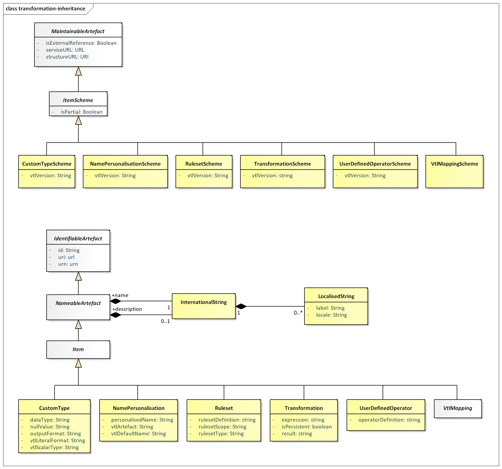
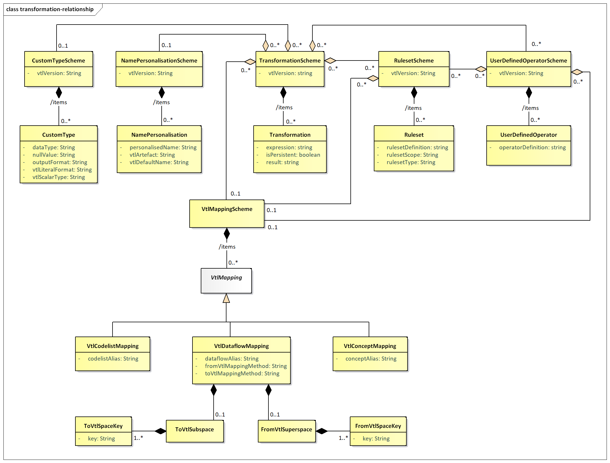

#  Validation and Transformation Language

## Introduction

This SDMX model package supports the definition of Transformations,
which are algorithms to calculate new data starting from already
existing ones, written using the Validation and Transformation Language
(VTL)[5].

The purpose of this model package is to enable the:

-   definition of validation and transformation algorithms by means of
    VTL, in order to specify how to calculate new SDMX data from
    existing ones;

-   exchange of the definition of VTL algorithms, also together the
    definition of the data structures of the involved data (for example,
    exchange the data structures of a reporting framework together with
    the validation rules to be applied, exchange the input and output
    data structures of a calculation task together with the VTL
    transformations describing the calculation algorithms);

-   execution of VTL algorithms, either interpreting the VTL
    transformations or translating them in whatever other computer
    language is deemed as appropriate;

This model package does not explain the VTL language or any of the
content published in the VTL guides. Rather, this is an illustration of
the SDMX classes and attributes that allow defining VTL transformations
applied to SDMX artefacts.

The SDMX model represented below is consistent with the VTL 2.0
specification. However, the former uses the SDMX terminology and is a
model at technical level (from which the SDMX implementation artefacts
for defining VTL transformations are built), whereas the latter uses the
VTL terminology and is at conceptual level. The guidelines for mapping
these terminologies and using the VTL in the SDMX context can be found
in a dedicated chapter (“*Validation and Transformation Language*”) of
the Section 6 of the SDMX Standards (“*SDMX Technical Notes*”), often
referenced below.

## Model - Inheritance view

### Class Diagram

Figure 47: Class inheritance diagram in the Transformations and
Expressions Package

### Explanation of the Diagram

#### Narrative

The model artefacts TransformationScheme, RulesetScheme,
UserDefinedOperatorScheme, NamePersonalisationScheme, CustomTypeScheme,
and VtlMappingScheme inherit from ItemScheme

These schemes inherit from the *ItemScheme* and therefore have the
following attributes:

id

uri

urn

version

validFrom

validTo

isExternalReference

registryURL

structureURL

repositoryURL

isPartial

The model artefacts Transformation, Ruleset, UserDefinedOperator,
NamePersonalisation, VtlMapping, CustomType inherit the attributes and
associations of Item which itself inherits from *NameableArtefact*. They
have the following attributes:

id

uri

urn

The multi-lingual name and description are provided by the relationship
to InternationalString from *NameableArtefact*.

## Model - Relationship View

### Class Diagram

Figure 48: Relationship diagram in the Transformations and Expressions
Package

### Explanation of the Diagram

#### Narrative - Overview

**Transformation Scheme**

A TransformationScheme is a set of Transformations aimed at obtaining
some meaningful results for the user (e.g. the validation of one or more
Data Sets). This set of Transformations is meant to be executed together
(in the same run) and may contain any number of Transformations in order
to produce any number of results. Therefore, a TransformationScheme can
be considered as a VTL program.

The TransformationScheme must include the attribute vtlVersion expressed
as a string (e.g. “2.0”), as the version of the VTL determines which
syntax is used in defining the transformations of the scheme.

A Transformation consists of a statement which assigns the outcome of
the evaluation of a VTL expression to a result (an artefact of the VTL
Information Model, which in the SDMX context can be a persistent or
non-persistent Dataflow[6]).

For example, assume that D1, D2 and D3 are SDMX Dataflows (called Data
Sets in VTL) containing information on some goods, specifically: D3 the
current stocks, D1 the stocks of the previous date, D2 the flows in the
last period. A possible VTL Transformation aimed at checking the
consistency between flows and stocks is the following:

> Dr := If ( (D1 + D2) = D3, then "true", else "false")

In this Transformation:

Dr is the result (a new dataflow)

:= is an assignment operator

If((D1+D2)=D3, then "true", else "false") is the expression

D1, D2, D3 are the operands

If, ( ), +, = are VTL operators

The Transformation model artefact contains three attributes:

1.  result

> The left-hand side of a VTL statement, which specifies the Artefact to
> which the outcome of the expression is assigned. An artefact cannot be
> result of more than one Transformation.

1.  isPersistent

> An assignment operator, which specifies also the persistency of the
> left-hand side. The assignment operators are two, namely ‘:=’ for
> non-persistent assignment (the result is non-persistent) and ‘&lt;-’
> for persistent assignment (the result is persistent).

1.  expression

> The right-hand side of a VTL statement, which is the expression to be
> evaluated. An expression consists in the invocation of VTL operators
> in a certain order. When an operator is invoked, for each input
> parameter, an actual argument is passed to the operator, which returns
> an actual argument for the output parameter. An expression is simply a
> text string written according the VTL grammar.

Because an Artefact can be the result of just one Transformation and a
Transformation belongs to just one TransformationScheme, it follows also
that a derived Artefact (e.g., a new Dataflow) is produced in just one
TransformationScheme.

The result of a Transformation can be input of other Transformations.
The VTL assumes that non-persistent results are maintained only within
the same TransformationScheme in which they are produced. Therefore, a
non-persistent result of a Transformation can be the operand of other
Transformations of the same TransformationScheme, whereas a persistent
result can be operand of transformations of any TransformationScheme[7].

The TransformationScheme has an association to zero of more
RulesetScheme, zero or more UserDefinedOperatorScheme, zero or one
NamePersonalisationScheme, zero or one VtlMappingScheme, and zero or one
CustomTypeScheme.

The RulesetScheme, UserDefinedOperatorScheme, NamePersonalisationScheme
and CustomTypeScheme have the attribute vtlVersion. Thus, a
TransformationScheme using a specific version of VTL can be linked to
such schemes only if they are consistent with the same VTL version.

The VtlMappingScheme associated to a TransformationScheme must contain
the mappings between the references to the SDMX artefacts from the
TransformationScheme and the structured identifiers of these SDMX
artefacts.

**Ruleset Scheme**

Some VTL Operators can invoke rulesets, i.e., sets of previously defined
rules to be applied by the Operator. Once defined, a Ruleset is
persistent and can be invoked as many times as needed. The knowledge of
the rulesets’ definitions (if any) is essential for understanding the
actual behaviour of the Transformation that use them: this is achieved
through the RulesetScheme model artefact. The RulesetScheme is the
container for one or more Ruleset.

The Ruleset model artefact contains the following attributes:

1.  rulesetType – the type of the ruleset according to VTL (VTL 2.0
    allows two types: “datapoint” and “hierarchical” ruleset);

2.  rulesetScope – the VTL artefact on which the ruleset is defined; VTL
    2.0 allows rulesets defined on Value Domains, which correspond to
    SDMX Codelists and rulesets defined on Variables, which correspond
    to SDMX Concepts for which a definite Representation is assumed;

3.  rulesetDefinition – the VTL statement that defines the ruleset
    according to the syntax of the VTL definition language.

The RulesetScheme can have an association with zero or more
VtlMappingScheme. These mappings define the correspondence between the
references to the SDMX artefacts contained in the rulesetDefinition and
the structured identifiers of these SDMX artefacts.

The rulesets defined on Value Domains reference Codelists. The rulesets
defined on Variables reference Concepts (for which a definite
Representation is assumed). In conclusion, in the VTL rulesets there can
exist mappings for: Codelists and Concepts.

**User Defined Operator Scheme**

The UserDefinedOperatorScheme is a container for zero of more
UserDefinedOperator. The UserDefinedOperator is defined using VTL
standard operators. This is essential for understanding the actual
behaviour of the Transformations that invoke them.

The attribute operatorDefinition contains the VTL statement that defines
the operator according to the syntax of the VTL definition language.

Although the VTL user defined operators are conceived to be defined on
generic operands, so that the specific artefacts to be manipulated are
passed as parameters at the invocation, it is also possible that they
reference specific SDMX artefacts like Dataflows and Codelists.
Therefore, the UserDefinedOperatorScheme can link to zero or one
VtlMappingScheme, which must contain the mappings between the VTL
references and the structured URN of the corresponding SDMX artefacts
(see also the “*VTL mapping*” section below).

The definition of a UserDefinedOperator can also make use of VTL
rulesets; therefore, the UserDefinedOperatorScheme can link to zero, one
or more RulesetScheme**, which** must contain the definition of these
Rulesets (see also the “*Ruleset Scheme*” section above).

**Name Personalisation Scheme**

In some operations, the VTL assigns by default some standard names to
some measures and/or attributes of the data structure of the result[8].
The VTL allows also to personalise the names to be assigned. The
knowledge of the personalised names (if any) is essential for
understanding the actual behaviour of the Transformation: this is
achieved through the NamePersonalisationScheme. A NamePersonalisation
specifies a personalised name that will be assigned in place of a VTL
default name. The NamePersonalisationScheme is a container for zero or
more NamePersonalisation.

**VTL Mapping**

The mappings between SDMX and VTL can be relevant to the names of the
artefacts and to the methods for converting the data structures from
SDMX to VTL and vice-versa. These features are achieved through the
VtlMappingScheme, which is a container for zero or more VtlMapping.

The VTL assumes that the operands are directly referenced through their
actual names (unique identifiers). In the VTL transformations, rulesets,
user defined operators, the SDMX artefacts are referenced through VTL
aliases. The alias can be the complete URN of the artefact, an
abbreviated URN, or another user-defined name, as described in the
Section 6 of the SDMX Standards.[9]

The VTLmapping defines the correspondence between the VTL alias and the
structured identifier of the SDMX artefact, for each referenced SDMX
artefact. This correspondence is needed for the following kinds of SDMX
artefacts: Dataflows, Codelists and Concepts. Therefore, there are the
following corresponding mapping subclasses: VtlDataflowMapping,
VtlCodelistMapping and VtlConceptMapping.

As for the Dataflows, it is also possible to specify the method to
convert the Data Structure of the Dataflow. This kind of conversion can
happen in two directions, from SDMX to VTL when a SDMX Dataflow is
accessed by a VTL Transformation (toVtlMappingMethod), or from VTL to
SDMX when a SDMX derived Dataflow is calculated through VTL
(fromVtlMappingMethod).[10]

The default mapping method from SDMX to VTL is called “Basic”. Three
alternative mapping methods are possible, called “Pivot”, “Basic-A2M”,
“Pivot-A2M” (“A2M” stands for “Attributes to Measures”, i.e. the SDMX
DataAttributes become VTL measures).

The default mapping method from VTL to SDMX is also called “Basic”, and
the two alternative mapping methods are called “Unpivot” and “M2A”
(“M2A” stands for “Measures to Attributes”, i.e. some VTL measures
become SDMX DataAttributes according to what is declared in the DSD).

In both the mapping directions, no specification is needed if the
default mapping method (Basic) is used. When an alternative mapping
method is applied for some Dataflow, this must be specified in
toVtlMappingMethod or fromVtlMappingMethod.

**ToVtlSubspace, ToVtlSpaceKey, FromVtlSuperspace, FromVtlSpaceKey**

Although in general one SDMX Dataflow is mapped to one VTL dataset and
vice-versa, it is also allowed to map distinct parts of a single SDMX
Dataflow to distinct VTL data sets according to the rules and
conventions described in the Section 6 of the SDMX Standards.[11]

In the direction from SDMX to VTL, this is achieved by fixing the values
of some predefined Dimensions of the SDMX Data Structure: all the
observations having such combination of values are mapped to one
corresponding VTL dataset (the Dimensions having fixed values are not
maintained in the Data Structure of the resulting VTL dataset). The
ToVtlSubspace and ToVtlSpaceKey classes allow to define these
Dimensions. When one SDMX Dataflow is mapped to just one VTL dataset
these classes are not used.

Analogously, in the direction from VTL to SDMX, it is possible to map
more calculated VTL datasets to distinct parts of a single SDMX
Dataflow, as long as these VTL datasets have the same Data Structure.
This can be done by providing, for each VTL dataset, distinct values for
some additional SDMX Dimensions that are not part of the VTL data
structure. The FromVtlSuperspace and FromVtlSpaceKey classes allow to
define these dimensions. When one VTL dataset is mapped to just one SDMX
Dataflow these classes are not used.

**Custom Type Scheme**

As already said, a Transformation consists of a statement which assigns
the outcome of the evaluation of a VTL expression to a result, i.e. an
artefact of the VTL Information Model. which in the SDMX context can be
a persistent or non-persistent Dataflow[12]. Therefore, the VTL data
type of the outcome of the VTL expression has to be converted into the
SDMX data type of the resulting Dataflow. A default conversion table
from VTL to SDMX data types is assumed[13]. The CustomTypeScheme allows
to specify custom conversions that override the default conversion
table. The CustomTypeScheme is a container for zero or more CustomType.
A CustomType specifies the custom conversion from a VTL scalar type that
will override the default conversion. The overriding SDMX data type is
specified by means of the dataType and outputFormat attributes (the SDMX
data type assumes the role of external representation in respect to
VTL[14]).

Moreover, the CustomType allows to customize the default format of VTL
literals and the (possible) SDMX value to be produced when a VTL measure
or attribute is NULL.

VTL expression can contain literals, i.e. specific values of a certain
VTL data type written according to a certain format. For example,
consider the following Transformation that extracts from the dataflow D1
the observations for which the “reference\_date” belongs to the years
2018 and 2019:

Dr := D1 \[ filter between (reference\_date, 2018-01-01, 2019-12-31)\]

In this expression, the two values 2018-01-01 and 2019-12-31 are
literals of the VTL “date” scalar type expressed in the format
YYYY-MM-DD.

The VTL literals are assumed to be written in the same SDMX format
specified in the default conversion table mentioned above, for the
conversion from VTL to SDMX data types. If a different format is used
for a certain VTL scalar type, it must be specified in the
vtlLiteralFormat attribute of the CustomType

Regarding the management of NULLs, in the conversions between SDMX and
VTL, by default a missing value in SDMX in converted in VTL NULL and
vice-versa, for any VTL scalar type. If a different value is needed,
after the conversion from SDMX to VTL, proper VTL operators can be used
for obtaining it. In the conversion from VTL to SDMX the desired value
can be declared in the nullValue attribute (separately for each VTL
basic scalar type).

#### Definitions

| Class | Feature | Description |
| :--- | :--- | :--- |
| Transformation  Scheme | 
Inherits from
 
ItemScheme
 | Contains the definitions of transformations meant to produce some derived data and be executed together |
|  | vtlVersion | The version of the VTL language used for defining transformations |
| Transformation | 
Inherits from
 
<em>Item</em>
 | A VTL statement which assigns the outcome of an expression to a result. |
|  | result | The left-hand side of the VTL statement, which identifies the result artefact. |
|  | isPersistent | A boolean that indicates whether the result is permanently stored or not, depending on the VTL assignment operator. |
|  | expression | The right-hand side of the VTL statement that is the expression to be evaluated, which includes the references to the operands of the Transformation. |
| RulesetScheme | 
Inherits from
 
<em>ItemScheme</em>
 | Container of rulesets. |
|  | vtlVersion | The version of the VTL language used for defining the rulesets |
| Ruleset | 
Inherits from
 
<em>Item</em>
 | A persistent set of rules which can be invoked by means of appropriate VTL operators. |
|  | rulesetDefinition | A VTL statement for the definition of a ruleset (according to the syntax of the VTL definition language) |
|  | rulesetType | The VTL type of the ruleset (e.g., in VTL 2.0, datapoint or hierarchical) |
|  | rulesetScope | The model artefact on which the ruleset is defined (e.g., in VTL 2.0, valuedomain or variable) |
| UserDefinedOperatorScheme | 
Inherits from
 
<em>ItemScheme</em>
 | Container of user defined operators |
|  | vtlVersion | The version of the VTL language used for defining the user defined operators |
| UserDefinedOperator | 
Inherits from
 
<em>Item</em>
 | Custom VTL operator (not existing in the standard library) that extends the VTL standard library for specific purposes. |
|  | operatorDefinition | A VTL statement for the definition of a new operator: it specifies the operator name, its parameters and their data types, the VTL expression that defines its behaviour. |
| NamePersonalisationScheme | 
Inherits from
 
<em>ItemScheme</em>
 | Container of name personalisations. |
|  | vtlVersion | The VTL version which the VTL default names to be personalised belong to. |
| NamePersonalisation | 
Inherits from
 
<em>Item</em>
 | Definition of personalised name to be used in place of a VTL default name. |
|  | vtlArtefact | VTL model artefact to which the VTL default name to be personalised refers, e.g. variable, value domain. |
|  | vtlDefaultName | The VTL default name to be personalised. |
|  | personalisedName | The personalised name to be used in place of the VTL default name. |
| VtlMappingScheme | 
Inherits from
 
<em>ItemScheme</em>
 | Container of VTL mappings. |
| VtlMapping | 
Inherits from
 
<em>Item</em>
 
Sub classes are:
 
VtlDataflowMapping
 
VtlCodelistMapping
 
VtlConceptMapping
 | Single mapping between the reference to a SDMX artefact made from VTL transformations, rulesets, user defined operators and the corresponding SDMX structure identifier. |
| VtlDataflowMapping | 
Inherits from
 
<em>VtlMapping</em>
 | Single mapping between the reference to a SDMX dataflow and the corresponding SDMX structure identifier |
|  | dataflowAlias | Alias used in VTL to reference a SDMX dataflow (it can be the URN, the abbreviated URN or a user defined alias). The alias must be univocal: different SDMX artefacts cannot have the same VTL alias. |
|  | toVtlMappingMethod | Custom specification of the mapping method from SDMX to VTL data structures for the dataflow (overriding the default “basic” method). |
|  | fromVtlMappingMethod | Custom specification of the mapping method from VTL to SDMX data structures for the dataflow (overriding the default “basic” method). |
| VtlCodelistMapping | 
Inherits from
 
<em>VtlMapping</em>
 | Single mapping between the VTL reference to a SDMX codelist and the SDMX structure identifier of the codelist. |
|  | codelistAlias | Name used in VTL to reference a SDMX codelist. The name/alias must be univocal: different SDMX artefacts cannot have the same VTL alias. |
| VtlConceptMapping | 
Inherits from
 
<em>VtlMapping</em>
 | Single mapping between the VTL reference to a SDMX concept and the SDMX structure identifier of the concept. |
|  | conceptAlias | Name used in VTL to reference a SDMX concept. The name/alias must be univocal: different SDMX artefacts cannot have the same VTL alias. |
| ToVtlSubspace |  | Subspace of the dimensions of the SDMX dataflow used to identify the parts of the dataflow to be mapped to distinct VTL datasets |
| ToVtlSpaceKey |  | A dimension of the SDMX dataflow that contributes to identify the parts of the dataflow to be mapped to distinct VTL datasets. |
|  | Key | The identity of the dimension in the data structure definition of the dataflow that contributes to identify the parts of the dataflow to be mapped to distinct VTL datasets |
| FromVtlSuperspace |  | Superspace is composed of the dimensions to be added to the data structure of the VTL result dataset in order to obtain the data structure of the derived SDMX dataflow (in case the latter is a superset of distinct VTL datasets calculated independently). |
| FromVtlSpaceKey |  | A SDMX dimension to be added to the data structure of the VTL result dataset in order to obtain the data structure of the derived SDMX dataflow |
|  | Key | The identity of the dimension to be added to the data structure of the VTL result dataset in order to obtain the data structure of the derived SDMX dataflow. |
| CustomTypeScheme | 
Inherits from
 
<em>ItemScheme</em>
 | Container of custom specifications for VTL basic scalar types. |
|  | vtlVersion | The VTL version, which the VTL scalar types belong to. |
| CustomType | 
Inherits from
 
<em>Item</em>
 | Custom specification for a VTL basic scalar type. |
|  | vtlScalarType | VTL scalar type for which the custom specifications are given. |
|  | outputFormat | Custom specification of the VTL formatting mask needed to obtain to the desired representation, i.e. the desired SDMX format (e.g. YYYY-MM-DD, see also the VTL formatting mask in the VTL Reference Manual and the SDMX Technical Notes). If not specified, the “Default output format” of the default conversion table from VTL to SDMX is used. <a class="footnote-ref" href="#fn1" id="fnref1" role="doc-noteref">1</a> |
|  | datatype | Custom specification of the external (SDMX) data type in which the VTL data type must be converted (e.g. the GregorianDay). If not specified, the “Default SDMX data type” of the default conversion table from VTL to SDMX is used. <a class="footnote-ref" href="#fn2" id="fnref2" role="doc-noteref">2</a> |
|  | nullValue | Custom specification of the SDMX value to be produced for the VTL NULL values, with reference to the vtlScalarType specified above. If no value is specified, no value is produced. |
|  | vtlLiteralFormat | Custom specification of the format of the VTL literals belonging to the vtlScalarType used in the VTL program (e.g. YYYY-MM-DD)<a class="footnote-ref" href="#fn3" id="fnref3" role="doc-noteref">3</a>. If not specified, the “Default output format” of the default conversion table from VTL to SDMX is assumed.<a class="footnote-ref" href="#fn4" id="fnref4" role="doc-noteref">4</a> |

<aside id="footnotes" class="footnotes footnotes-end-of-document"
role="doc-endnotes">

<ol>
<li id="fn1">
See “Mapping VTL basic scalar types to SDMX data types”
in the SDMX Technical Notes, chapter “Validation and Transformation
Language”.<a href="#fnref1" class="footnote-back"
role="doc-backlink">↩︎</a>
</li>
<li id="fn2">
See “Mapping VTL basic scalar types to SDMX data types”
in the SDMX Technical Notes, chapter “Validation and Transformation
Language”.<a href="#fnref2" class="footnote-back"
role="doc-backlink">↩︎</a>
</li>
<li id="fn3">
See also the VTL formatting mask in the VTL Reference
Manual and the SDMX Technical Notes.<a href="#fnref3"
class="footnote-back" role="doc-backlink">↩︎</a>
</li>
<li id="fn4">
See “Mapping VTL basic scalar types to SDMX data types”
in the SDMX Technical Notes, chapter “Validation and Transformation
Language.<a href="#fnref4" class="footnote-back"
role="doc-backlink">↩︎</a>
</li>
</ol>
</aside>