# Appendix 1: A Short Guide to UML in the SDMX Information Model

## Scope

The scope of this document is to give a brief overview of the diagram
notation used in UML. The examples used in this document have been taken
from the SDMX UML model.

## Use Cases

In order to develop the data models it is necessary to understand the
functions that require to be supported. These are defined in a use case
model. The use case model comprises actors and use cases and these are
defined below.

The **actor** can be defined as follows:

> “An actor defines a coherent set of roles that users of the system can
> play when interacting with it. An actor instance can be played by
> either an individual or an external system”

The actor is depicted as a stick man as shown below.

 
/// caption
Figure 49 Actor
///

The **use cas**e can be defined as follows:

> “A use case defines a set of use-case instances, where each instance
> is a sequence of actions a system performs that yields an observable
> result of value to a particular actor”

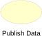 
/// caption
Figure 50 Use case
///

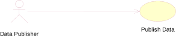 
/// caption
Figure 51 Actor and use case
///

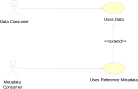 
/// caption
Figure 52 Extend use cases
///

An extend use case is where a use case may be optionally extended by a
use case that is independent of the using use case. The arrow in the
association points to he owning use case of the extension. In the
example above the Uses Data use case is optionally extended by the Uses
Metadata use case.

## Classes and Attributes

### General

A class is something of interest to the user. The equivalent name in an
entity-relationship model (E-R model) is the entity and the attribute.
In fact, if the UML is used purely as a means of modelling data, then
there is little difference between a class and an entity.

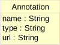 
/// caption
Figure 53 Class and its attributes
///

Figure 53 shows that a class is represented by a rectangle split into
three compartments. The top compartment is for the class name, the
second is for attributes and the last is for operations. Only the first
compartment is mandatory. The name of the class is Annotation, and it
belongs to the package SDMX-Base. It is common to group related
artefacts (classes, use-cases, etc.) together in packages. . Annotation
has three “String” attributes – name, type, and url. The full identity
of the attribute includes its class e.g. the name attribute is
Annotation.name.

Note that by convention the class names use UpperCamelCase – the words
are concatenated and the first letter of each word is capitalized. An
attribute uses lowerCamelCase - the first letter of the first (or only)
word is not capitalized, the remaining words have capitalized first
letters.

### Abstract Class

An abstract class is drawn because it is a useful way of grouping
classes, and avoids drawing a complex diagram with lots of association
lines, but where it is not foreseen that the class serves any other
purpose (i.e. it is always implemented as one of its sub classes). In
the diagram in this document an abstract class is depicted with its name
in italics, and coloured white.

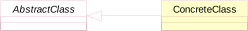 
/// caption
Figure 54 Abstract and concrete classes
///

## Associations

### General

In an E-R model these are known as relationships. A UML model can give
more meaning to the associations than can be given in an E-R
relationship. Furthermore, the UML notation is fixed (i.e. there is no
variation in the way associations are drawn). In an E-R diagram, there
are many diagramming techniques, and it is the relationship in an E-R
diagram that has many forms, depending on the particular E-R notation
used.

### Simple Association

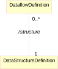 
/// caption
Figure 55 A simple association
///

Here the DataflowDefinition class has an association with the
DataStructureDefinition class. The diagram shows that a
DataflowDefinition can have an association with only one
DataStructureDefinition (1) and that a DataStructureDefinition can be
linked to many DataflowDefinitions (0..\*). The association is sometimes
named to give more semantics.

In UML it is possible to specify a variety of “multiplicity” rules. The
most common ones are:

Zero or one (0..1)

Zero or many (0..\*)

One or many (1..\*)

Many (\*)

Unspecified (blank)

### Aggregation

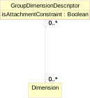

Figure 56: A simple aggregate association

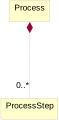 
/// caption
Figure 57 A composition aggregate association
///

An association with an aggregation relationship indicates that one class
is a subordinate class (or a part) of another class. In an aggregation
relationship. There are two types of aggregation, a simple aggregation
where the child class instance can outlive its parent class, and a
composition aggregation where

the child class's instance lifecycle is dependent on the parent class's
instance lifecycle. In the simple aggregation it is usual, in the SDMX
Information model, for this association to also be a reference to the
associated class.

### Association Names and Association-end (role) Names

It can be useful to name associations as this gives some more semantic
meaning to the model i.e. the purpose of the association. It is possible
for two classes to be joined by two (or more) associations, and in this
case it is extremely useful to name the purpose of the association.
Figure 58 shows a simple aggregation between CategoryScheme and Category
called /*items* (this means it is derived from the association between
the super classes – in this case between the *ItemScheme* and the
*Item,* and another between Category called /*hierarchy*.

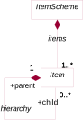 
/// caption
Figure 58 Association names and end names
///

Furthermore, it is possible to give role names to the association-ends
to give more semantic meaning – such as parent and child in a tree
structure association. The role is shown with “+” preceding the role
name (e.g. in the diagram above the semantic of the association is that
a Item can have zero or one parent Items and zero or many child Item).

In this model the preference has been to use role names for associations
between concrete classes and association names for associations between
abstract classes. The reason for using an association name is often
useful to show a physical association between two sub classes that
inherit the actual association between the super class from which they
inherit. This is possible to show in the UML with association names, but
not with role names. This is covered later in “Derived Association”.

Note that in general the role name is given at just one end of the
association.

### Navigability

Associations are, in general, navigable in both directions. For a
conceptual data model it is not necessary to give any more semantic than
this.

However, UML allows a notation to express navigability in one direction
only. In this model this “navigability” feature has been used to
represent referencing. In other words, the class at the navigable end of
the association is referenced from the class at the non-navigable end.
This is aligned, in general, with the way this is implemented in the XML
schemas.

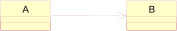 
/// caption
Figure 59 One way association
///

Here it is possible to navigate from A to B, but there is no
implementation support for navigation from B to A using this
association.

### Inheritance

Sometimes it is useful to group common attributes and associations
together in a super class. This is useful if many classes share the same
associations with other classes, and have many (but not necessarily all)
attributes in common. Inheritance is shown as a triangle at the super
class.

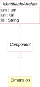 
/// caption
Figure 60 Inheritance
///

Here the Dimension is derived from Component which itself is derived
from *IdentifiableArtefact*. Both Component and IdentifiableArtefact are
abstract superclasses. The Dimension inherits the attributes and
associations of all of the the super classes in the inheritance tree.
Note that a super class can be a concrete class (i.e. it exists in its
own right as well as in the context of one of its sub classes), or an
abstract class.

### Derived association

It is often useful in a relationship diagram to show associations
between sub classes that are derived from the associations of the super
classes from which the sub classes inherit. A derived association is
shown by “/” preceding the association name e.g. */name*.

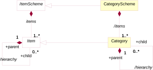 
/// caption
Figure 61 Derived associations
///

[1] OLAP: On line analytical processing

[2] The Codelist that extends 0..\* Codelists is the 'extending'
Codelist, while the Codelist(s) that are inherited is/are the 'extended'
Codelist(s).

[3] Source and target Data Structure Definition are either directly
linked from the StructureMap or indirectly via the linked source and
target Dataflow

[4] Provider Scheme, Provider, Provision Agreement and Registered source
refer both to data and reference metadata.

[5] The Validation and Transformation Language is a standard language
designed and published under the SDMX initiative. VTL is described in
the VTL User and Reference Guides available on the SDMX website
<https://sdmx.org>.

[6] Or a part of a Dataflow, see also the chapter “Validation and
Transformation Language” of the Section 6 of the SDMX Standards (“SDMX
Technical Notes”), paragraph “Mapping dataflow subsets to distinct VTL
data sets”.

[7] Provided that the VTL consistency rules are accomplished (see the
“Generic Model for Transformations” in the VTL User Manual and its
sub-section “Transformation Consistency”).

[8] For example, the **check** operator produces some new components in
the result called by default **bool\_var**, **errorcode**,
**errorlevel**, **imbalance**. These names can be personalised if
needed.

[9] SDMX Technical Notes, chapter “Validation and Transformation
Language”, section “References to SDMX artefacts from VTL statements”.

[10] For a more thorough description of these conversions, see the
Section 6 of the SDMX Standards (“SDMX Technical Notes”), chapter
“Validation and Transformation Language”, section “Mapping between SDMX
and VTL”.

[11] SDMX Technical Notes, chapter “Validation and Transformation
Language”, section “Mapping dataflow subsets to distinct VTL data sets”.

[12] Or a part of a Dataflow, as described in the previous paragraph.

[13] The default conversion table from VTL to SDMX is described in the
the Section 6 of the SDMX Standards (“SDMX Technical Notes”), chapter
“Validation and Transformation Language”, section “Mapping VTL basic
scalar types to SDMX data types”.

[14] About VTL internal and external representations, see also the VTL
User Manual, section “Basic scalar types”, p.53.