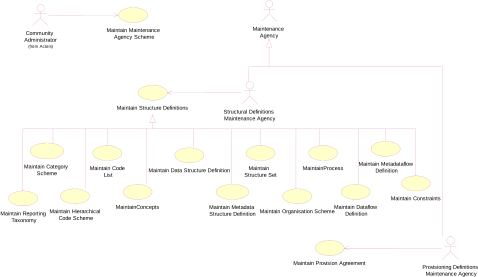
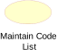
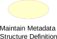
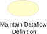
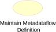
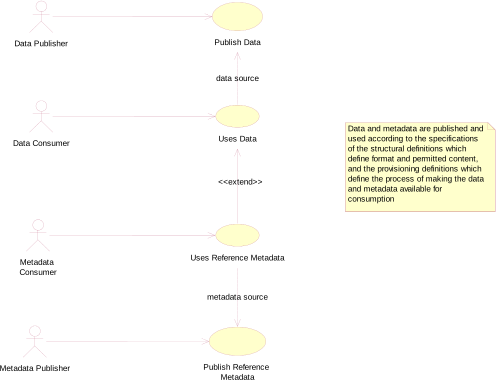
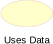

# Actors and Use Cases

## Introduction

In order to develop the data models it is necessary to understand the
functions to be supported resulting from the requirements definition.
These are defined in a use case model. The use case model comprises
actors and use cases and these are defined below.

Actor: “An actor defines a coherent set of roles that users of the system can
play when interacting with it. An actor instance can be played by either
an individual or an external system”

Use case: “A use case defines a set of use-case instances, where each instance is
a sequence of actions a system performs that yields an observable result
of value to a particular actor”

The overall intent of the model is to support data and metadata
reporting, dissemination, and exchange in the field of aggregated
statistical data and related metadata. In order to achieve this, the
model needs to support three fundamental aspects of this process:

- Maintenance of structural and provisioning definitions
- Data and reference metadata publishing (reporting), and consuming
    (using)
- Access to data, reference metadata, and structural and provisioning
    definitions

This document covers the first two aspects, whilst the document on the
Registry logical model covers the last aspect.

## Use Case Diagrams

### Maintenance of Structural and Provisioning Definitions

#### Use cases

/// caption
Figure 7 Use cases for maintaining data and metadata structural and
provisioning definitions
///

#### Explanation of the Diagram

In order for applications to publish and consume data and reference
metadata it is necessary for the structure and permitted content of the
data and reference metadata to be defined and made available to the
applications, as well as definitions that support the actual process of
publishing and consuming. This is the responsibility of a Maintenance
Agency.

All maintained artefacts are maintained by a Maintenance Agency. For
convenience the Maintenance Agency actor is sub divided into two actor
roles:

- maintaining structural definitions

- maintaining provisioning definitions

Whilst both these functions may be carried out by the same person, or at
least by the same maintaining organization, the purpose of the
definitions is different and so the roles have been differentiated:
structural definitions define the format and permitted content of data
and reference metadata when reported or disseminated, whilst
provisioning definitions support the process of reporting and
dissemination (who reports what to whom, and when).

In a community-based scenario where at least the structural definitions
may be shared, it is important that the scheme of maintenance agencies
is maintained by a responsible organization (called here the Community
Administrator), as it is important that the Id of the Maintenance Agency
is unique.

#### Definitions

| Actor | Use Case | Description |
| :--- | :--- | :--- |
|  |  | Responsible organisation that administers structural definitions common to the community as a whole. |
|  |  | Creation and maintenance of the top-level scheme of maintenance agencies for the Community. |
|  |  | 
Responsible agency for maintaining structural artefacts such as code lists, concept schemes, Data Structure Definition structural definitions, metadata structure definitions, data and metadata provisioning artefacts such as provision agreement, and sub-maintenance agencies.
 
sub roles are:
 
Structural Definitions Maintenance Agency
 
Provisioning Definitions Maintenance Agency
 |
|  |  | Responsible for maintaining structural definitions. |
|  |  | The maintenance of structural definitions. This use case has sub class use cases for each of the structural artefacts that are maintained. |
|  | 

 

 

 

 

 

 

 

 

 

 

 | 
Creation and maintenance of the Data Structure Definition, Metadata Structure Definition, and the supporting artefacts that they use, such as code list and concepts
 
This includes Agency, Data Provider, Data Consumer, and Organisation Unit Scheme
 |
|  |  | Responsible for maintaining data and metadata provisioning definitions. |  |
|  |  | The maintenance of provisioning definitions. |  |

/// caption
Figure 8: Table of Actors and Use Cases for Maintenance of Structural
and Provisioning Definitions
///

### Publishing and Using Data and Reference Metadata

#### Use Cases

/// caption
Figure 9: Actors and use cases for data and metadata publishing and
consuming
///

#### Explanation of the Diagram

Note that in this diagram “publishing” data and reference metadata is
deemed to be the same as “reporting” data and reference metadata. In
some cases the act of making the data available fulfils both functions.
Aggregated data is published and in order for the Data Publisher to do
this and in order for consuming applications to process the data and
reference metadata its structure must be known. Furthermore, consuming
applications may also require access to reference metadata in order to
present this to the Data Consumer so that the data is better understood.
As with the data, the reference metadata also needs to be formatted in
accordance with a maintained structure. The Data Consumer and Metadata
Consumer cannot use the data or reference metadata unless it is
“published” and so there is a “data source” or “metadata source”
dependency between the “uses” and “publish” use cases.

In any data and reference metadata publishing and consuming scenario
both the publishing and the consuming applications will need access to
maintained Provisioning Definitions. These definitions may be as simple
as who provides what data and reference metadata to whom, and when, or
it can be more complex with constraints on the data and metadata that
can be provided by a particular publisher, and, in a data sharing
scenario where data and metadata are “pulled” from data sources, details
of the source.

#### Definitions

| Actor | Use Case | Description |
| :--- | :--- | :--- |
|  |  | Responsible for publishing data according to a specified Data Structure Definition (data structure) definition, and relevant provisioning definitions. |
|  |  | Publish a data set. This could mean a physical data set or it could mean to make the data available for access at a data source such as a database that can process a query. |
|  |  | The user of the data. It may be a human consumer accessing via a user interface, or it could be an application such as a statistical production system. |
|  |  | 
Use data that is formatted according to the structural definitions and made available according to the provisioning definitions.
 
Data are often linked to metadata that may reside in a different location and be published and maintained independently.
 |
|  |  | Responsible for publishing reference metadata according to a specified metadata structure definition, and relevant provisioning definitions. |
|  |  | Publish a reference metadata set. This could mean a physical metadata set or it could mean to make the reference metadata available for access at a metadata source such as a metadata repository that can process a query. |
|  |  | The user of the reference metadata. It may be a human consumer accessing via a user interface, or it could be an application such as a statistical production or dissemination system. |
|  |  | Use reference metadata that is formatted according to the structural definitions and made available according to the provisioning definitions. |
