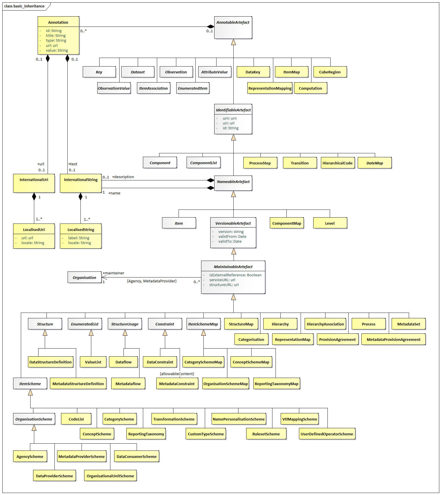
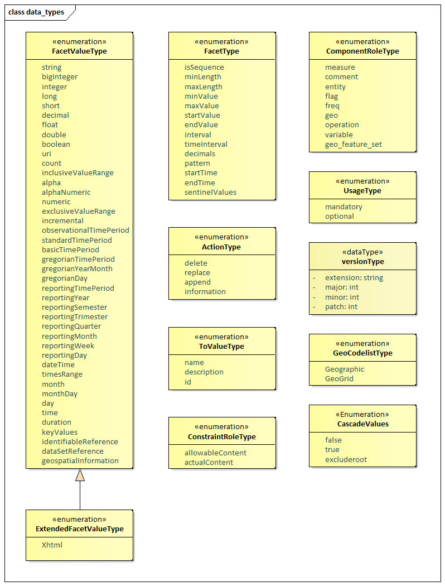
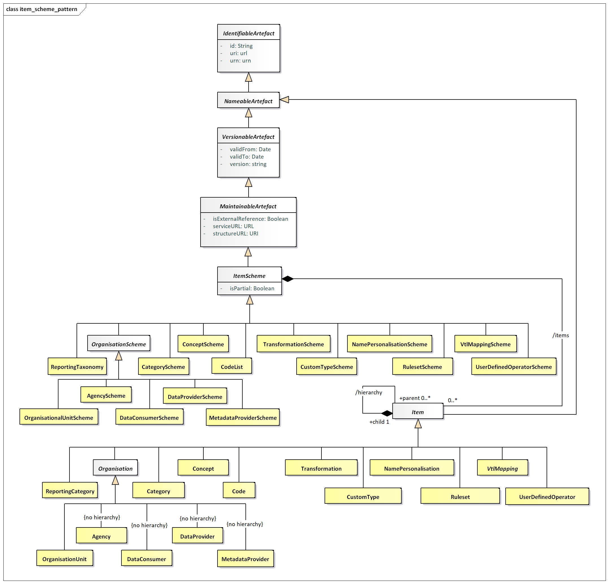
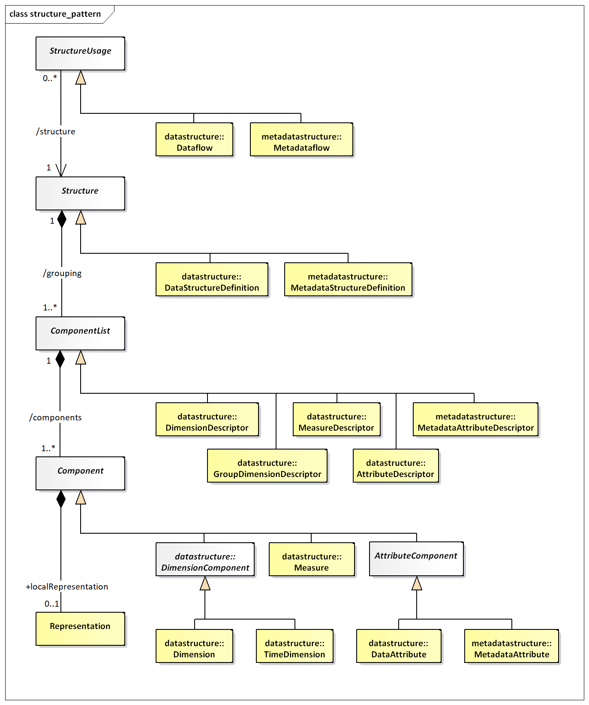
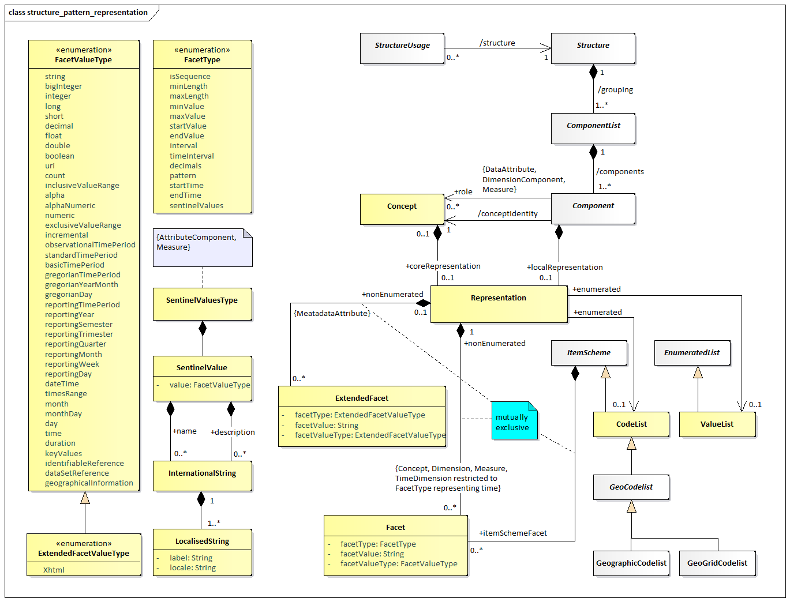

#  SDMX Base Package

## Introduction

The constructs in the SDMX Base package comprise the fundamental
building blocks that support many of the other structures in the model.
For this reason, many of the classes in this package are abstract (i.e.,
only derived sub-classes can exist in an implementation).

The motivation for establishing the SDMX Base package is as follows:

it is accepted “Best Practise” to identify fundamental archetypes
occurring in a model

identification of commonly found structures or “patterns” leads to
easier understanding

identification of patterns encourages re-use

Each of the class diagrams in this section views classes from the SDMX
Base package from a different perspective. There are detailed views of
specific patterns, plus overviews showing inheritance between classes,
and relationships amongst classes.

## Base Structures - Identification, Versioning, and Maintenance

### Class Diagram

/// caption
Figure 10: SDMX Identification, Maintenance and Versioning
///

### Explanation of the Diagram

#### Narrative

This group of classes forms the nucleus of the administration facets of
SDMX objects. They provide features which are reusable by derived
classes to support horizontal functionality such as identity, versioning
etc.

All classes derived from the abstract class *AnnotableArtefact* may have
Annotations (or notes): this supports the need to add notes to all
SDMX-ML elements. The Annotation is used to convey extra information to
describe any SDMX construct. This information may be in the form of a
URL reference and/or a multilingual text (represented by the association
to InternationalString).

The *IdentifiableArtefact* is an abstract class that comprises the basic
attributes needed for identification. Concrete classes based on
*IdentifiableArtefact* all inherit the ability to be uniquely
identified.

The *NamableArtefact* is an abstract class that inherits from
*IdentifiableArtefact* and in addition the +description and +name roles
support multilingual descriptions and names for all objects based on
*NameableArtefact*. The InternationalString supports the representation
of a description in multiple locales (locale is similar to language but
includes geographic variations such as Canadian French, US English
etc.). The *LocalisedString* supports the representation of a
description in one locale.

*VersionableArtefact* is an abstract class which inherits from
*NameableArtefact* and adds versioning ability to all classes derived
from it, as explained in the SDMX versioning rules in SDMX Standards
Section 6 “Technical Notes”, paragraph “4.3 Versioning”.

*MaintainableArtefact* further adds the ability for derived classes to
be maintained via its association to an *Organisation*, and adds
locational information (i.e., from where the object can be retrieved).

The inheritance chain from *AnnotableArtefact* through to
*MaintainableArtefact* allows SDMX classes to inherit the features they
need, from simple annotation, through identity, naming, to versioning
and maintenance.

#### Definitions

| Class | Feature | Description |
| :--- | :--- | :--- |
| <em>AnnotableArtefact</em> | 
Base inheritance sub classes are:
 
<em>IdentifiableArtefact</em>
 | Objects of classes derived from this can have attached annotations. |
| Annotation |  | Additional descriptive information attached to an object. |
|  | id | Identifier for the Annotation. It can be used to disambiguate one Annotation from another where there are several Annotations for the same annotated object. |
|  | title | A title used to identify an annotation. |
|  | type | Specifies how the annotation is to be processed. |
|  | url | A link to external descriptive text. |
|  | value | A non-localised version of the Annotation content. |
|  | +url | An International URI provides a set of links that are language specific, via this role. |
|  | +text | An International String provides the multilingual text content of the annotation via this role. |
| InternationalUri |  | The International Uri is a collection of Localised URIs and supports linking to external descriptions in multiple locales. |
| LocalisedUri |  | The Localised URI supports the link to an external description in one locale (locale is similar to language but includes geographic variations such as Canadian French, US English etc.). |
| <em>IdentifiableArtefact</em> | 
Superclass is <em>AnnotableArtefact</em>
 
Base inheritance sub classes are:
 
<em>NameableArtefact</em>
 | Provides identity to all derived classes. It also provides annotations to derived classes because it is a subclass of Annotable Artefact. |
|  | id | The unique identifier of the object. |
|  | uri | Universal resource identifier that may or may not be resolvable. |
|  | urn | Universal resource name – this is for use in registries: all registered objects have a urn. |
| <em>NameableArtefact</em> | 
Superclass is <em>IdentifiableArtefact</em>
 
Base inheritance sub classes are:
 
<em>VersionableArtefact</em>
 | Provides a Name and Description to all derived classes in addition to identification and annotations. |
|  | +description | A multi-lingual description is provided by this role via the International String class. |
|  | +name | A multi-lingual name is provided by this role via the International String class |
| InternationalString |  | The International String is a collection of Localised Strings and supports the representation of text in multiple locales. |
| LocalisedString |  | The Localised String supports the representation of text in one locale (locale is similar to language but includes geographic variations such as Canadian French, US English etc.). |
|  | label | Label of the string. |
|  | locale | The geographic locale of the string e.g French, Canadian French. |
| <em>VersionableArtefact</em> | 
Superclass is <em>NameableArtefact</em>
 
Base inheritance sub classes are:
 
<em>MaintainableArtefact</em>
 | Provides versioning information for all derived objects. |
|  | version | A version string following SDMX versioning rules. |
|  | validFrom | Date from which the version is valid |
|  | validTo | Date from which version is superseded |
| <em>MaintainableArtefact</em> | 
Inherits from
 
<em>VersionableArtefact</em>
 | An abstract class to group together primary structural metadata artefacts that are maintained by an Agency. |
|  | isExternalReference | If set to “true” it indicates that the content of the object is held externally. |
|  | structureURL | The URL of an SDMX-ML document containing the external object. |
|  | serviceURL | The URL of an SDMX-compliant web service from which the external object can be retrieved. |
|  | +maintainer | Association to the Maintenance Agency responsible for maintaining the artefact. |
| Agency |  | See section on “Organisations” |

## Basic Inheritance

### Class Diagram – Basic Inheritance from the Base Inheritance Classes

/// caption
Figure 11: Basic Inheritance from the Base Structures
///

### Explanation of the Diagram

#### Narrative

The diagram above shows the inheritance within the base structures. The
concrete classes are introduced and defined in the specific package to
which they relate.

## Data Types

### Class Diagram

/// caption
Figure 12: Class Diagram of Basic Data Types
/// 

### Explanation of the Diagram

#### Narrative

The FacetType and FacetValueType enumerations are used to specify the
valid format of the content of a non-enumerated Concept or the usage of
a Concept when specified for use on a *Component* on a *Structure* (such
as a Dimension in a DataStructureDefinition). The description of the
various types can be found in the chapter on ConceptScheme (section
4.5).

The ActionType enumeration is used to specify the action that a
receiving system should take when processing the content that is the
object of the action. It is enumerated as follows:

-   Append: Data or metadata is an incremental update for an existing
    data/metadata set or the provision of new data or documentation
    (attribute values) formerly absent. If any of the supplied data or
    metadata is already present, it will not replace that data or
    metadata. This corresponds to the "Update" value found in version
    1.0 of the SDMX Technical Standards.

-   Replace: Data/metadata is to be replaced and may also include
    additional data/metadata to be appended.

-   Delete: Data/Metadata is to be deleted.

-   Information: Data and metadata are for information purposes.

The ToValueType data type contains the attributes to support
transformations defined in the StructureMap (see Section 0).

The ConstraintRoleType data type contains the attributes that identify
the purpose of a Constraint (allowableContent, actualContent).

The ComponentRoleType data type contains the predefined Concept roles
that can be assigned to any Component.

The CascadeValues data type contains the possible values for a
MemberValue within a CubeRegion, in order to enable cascading to all
children Codes of a selected Code, while including/excluding the latter
in the selection.

The VersionType data types provides the details for versioning according
to SDMX versioning rules, as explained in SDMX Standards Section 6,
paragraph “4.3 Versioning”.

## The Item Scheme Pattern

### Context

The Item Scheme is a basic architectural pattern that allows the
creation of list schemes for use in simple taxonomies, for example.

The *ItemScheme* is the basis for CategoryScheme, Codelist,
ConceptScheme, ReportingTaxonomy, *OrganisationScheme*,
TransformationScheme, CustomTypeScheme, NamePersonalisationScheme,
RulesetScheme, VtlMappingScheme and UserDefinedOperatorScheme.

### Class Diagram

 
/// caption
Figure 13 The Item Scheme pattern
///

### Explanation of the Diagram

#### Narrative 

The *ItemScheme* is an abstract class which defines a set of *Item*
(this class is also abstract). Its main purpose is to define a mechanism
which can be used to create taxonomies which can classify other parts of
the SDMX Information Model. It is derived from *MaintainableArtefact*
which gives it the ability to be annotated, have identity, naming,
versioning and be associated with an Agency. An example of a concrete
class is a ConceptScheme. The associated Concepts are *Item*s.

In an exchange environment an *ItemScheme* is allowed to contain a
sub-set of the *Item*s in the maintained *ItemScheme*. If such an
ItemScheme is disseminated with a sub-set of the *Item*s then the fact
that this is a sub-set is denoted by setting the isPartial attribute to
"true".

A “partial” *ItemScheme* cannot be maintained independently in its
partial form i.e., it cannot contain *Item*s that are not present in the
full *ItemScheme* and the content of any one *Item* (e.g., names and
descriptions) cannot deviate from the content in the full *ItemScheme*.
Furthermore, the id of the *ItemScheme* where isPartial is set to "true"
is the same as the id of the full *ItemScheme* (agencyId, id, version).
This is important as this is the id that that is referenced in other
structures (e.g., a Codelist referenced in a DSD) and this id is always
the same, regardless of whether the disseminated *ItemScheme* is the
full *ItemScheme* or a partial *ItemScheme*.

The purpose of a partial *ItemScheme* is to support the exchange and
dissemination of a sub-set *ItemScheme* without the need to maintain
multiple *ItemScheme*s which contain the same *Item*s. For instance,
when a Codelist is used in a DataStructureDefinition it is sometimes the
case that only a sub-set of the Codes in a Codelist are relevant. In
this case a partial Codelist can be constructed using the Constraint
mechanism explained later in this document.

*Item* inherits from *NameableArtefact* which gives it the ability to be
annotated and have identity, and therefore has id, uri and urn
attributes, a name and a description in the form of an
InternationalString. Unlike the parent *ItemScheme*, the *Item* itself
is not a *MaintainableArtefact* and therefore cannot have an independent
Agency (i.e., it implicitly has the same agencyId as the *ItemScheme*).

The *Item* can be hierarchic and so one *Item* can have child *Item*s.
The restriction of the hierarchic association is that a child *Item* can
have only parent *Item*.

#### Definitions

| Class | Feature | Description |
| :--- | :--- | :--- |
| <em>ItemScheme</em> | 
Inherits from:
 
<em>MaintainableArtefact</em>
 
Direct sub classes are:
 
CategoryScheme  ConceptScheme  Codelist
 
ReportingTaxonomy
 
<em>OrganisationScheme</em>
 
TransformationScheme
 
CustomTypeScheme
 
NamePersonalisationScheme
 
RulesetScheme
 
VtlMappingScheme
 
UserDefinedOperatorScheme
 | The descriptive information for an arrangement or division of objects into groups based on characteristics, which the objects have in common. |
|  | isPartial | Denotes whether the Item Scheme contains a subset of the full set of Items in the maintained scheme. |
|  | /items | Association to the Items in the scheme. |
| <em>Item</em> | 
Inherits from:
 
<em>NameableArtefact</em>
 
Direct sub classes are
 
Category  Concept  Code  ReportingCategory  <em>Organisation</em>  Transformation  CustomType  NamePersonalisation  Ruleset  VtlMapping  UserDefinedOperator
 | 
The Item is an item of content in an Item Scheme. This may be a node in a taxonomy or ontology, a code in a code list etc.
 
Node that at the conceptual level the Organisation is not hierarchic.
 |
|  | hierarchy | This allows an Item optionally to have one or more child Items. |

## The Structure Pattern

### Context

The Structure Pattern is a basic architectural pattern which allows the
specification of complex tabular structures which are often found in
statistical data (such as Data Structure Definition, and Metadata
Structure Definition). A Structure is a set of ordered lists. A pattern
to underpin this tabular structure has been developed, so that
commonalities between these structure definitions can be supported by
common software and common syntax structures.

### Class Diagrams

/// caption
Figure 14: The Structure Pattern
///

/// caption
Figure 15: Representation within the Structure Pattern
///

### Explanation of the Diagrams

#### Narrative

The *Structure* is an abstract class which contains a set of one or more
*ComponentList*(s) (this class is also abstract). An example of a
concrete *Structure* is DataStructureDefinition.

The *ComponentList* is a list of one or more *Component*(s*)*. The
*ComponentList* has several concrete descriptor classes based on it:
DimensionDescriptor, GroupDimensionDescriptor, MeasureDescriptor, and
AttributeDescriptor of the DataStructureDefinition and
MetadataAttributeDescriptor of the MetadataStructureDefinition.

The *Component* is contained in a *ComponentList*. The type of
*Component* in a *ComponentList* is dependent on the concrete class of
the ComponentList as follows:

DimensionDescriptor: Dimension, TimeDimension

GroupDimensionDescriptor: Dimension, TimeDimension

MeasureDescriptor: Measure

AttributeDescriptor: DataAttribute, MetadataAttributeRef

MetadataAttributeDescriptor: MetadataAttribute

Each *Component* takes its semantic (and possibly also its
representation) from a Concept in a ConceptScheme. This is represented
by the conceptIdentity association to Concept.

The *Component* may also have a localRepresentation. This allows a
concrete class, such as Dimension, to specify its representation which
is local to the *Structure* in which it is contained (for Dimension this
will be DataStructureDefinition), and thus overrides any
coreRepresentation specified for the Concept.

The Representation can be enumerated or non-enumerated. The valid
content of an enumerated representation is specified either in an
*ItemScheme* which can be one of Codelist, ValueList or *GeoCodelist*.
The valid content of a non-enumerated representation is specified as one
or more Facet(s) (for example, these may specify minimum and maximum
values). For any Attribute this is achieved by one of more
ExtendedFacet(s), which allow the additional representation of XHTML.

The types of representation that are valid for specific components is
expressed in the model as a constraint on the association:

-   The Dimension, DataAttribute, Measure, MetadataAttribute may be
    enumerated and, if so, use an *EnumeratedList*.

-   The Dimension and Measure may be non-enumerated and, if so, use one
    or more Facet(s), note that the FacetValueType applicable to the
    TimeDimension is restricted to those that represent time.

-   The MetadataAttribute and DataAttribute may be non-enumerated and,
    if so, use one or more ExtendedFacet(s).

The *Structure* may be used by one or more *StructureUsage*(s). An
example of this, in terms of concrete classes, is that a Dataflow (sub
class of *StructureUsage*) may use a particular DataStructureDefinition
(sub class of *Structure*), and similar constructs apply for the
Metadataflow (link to MetadataStructureDefinition).

#### Definitions

| Class | Feature | Description |
| :--- | :--- | :--- |
| StructureUsage | 
Inherits from:
 
<em>MaintainableArtefact</em>
 
Sub classes are:
 
Dataflow  Metadataflow
 | An artefact whose components are described by a Structure. In concrete terms (sub-classes) an example would be a Dataflow which is linked to a given structure – in this case the Data Structure Definition. |
|  | structure | An association to a Structure specifying the structure of the artefact. |
| Structure | 
Inherits from:
 
<em>MaintainableArtefact</em>
 
Sub classes are:
 
DataStructureDefinition  MetadataStructureDefinition
 | Abstract specification of a list of lists to define a complex tabular structure. A concrete example of this would be statistical concepts, code lists, and their organisation in a data or metadata structure definition, defined by a centre institution, usually for the exchange of statistical information with its partners. |
|  | grouping | A composite association to one or more component lists. |
| <em>ComponentList</em> | 
Inherits from:
 
<em>IdentifiableArtefact</em>
 
Sub classes are:
 
DimensionDescriptor  GroupDimensionDescriptor  MeasureDescriptor  AttributeDescriptor  MetadataAttributeDescriptor
 | An abstract definition of a list of components. A concrete example is a Dimension Descriptor, which defines the list of Dimensions in a Data Structure Definition. |
|  | components | An aggregate association to one or more components which make up the list. |
| <em>Component</em> | 
Inherits from:
 
<em>IdentifiableArtefact</em>
 
Sub classes are:
 
Measure  <em>AttributeComponent</em>
 
<em>DimensionComponent</em>
 | A Component is an abstract super class used to define qualitative and quantitative data and metadata items that belong to a Component List and hence a Structure. Component is refined through its sub-classes. |
|  | conceptIdentity | Association to a Concept in a Concept Scheme that identifies and defines the semantic of the Component. |
|  | localRepresentation | Association to the Representation of the Component if this is different from the coreRepresentation of the Concept, which the Component uses (ConceptUsage). |
| Representation |  | The allowable value or format for Component or Concept |
|  | +enumerated | Association to an enumerated list that contains the allowable content for the Component when reported in a data or metadata set. The type of enumerated list that is allowed for any concrete Component is shown in the constraints on the association. |
|  | +nonEnumerated | Association to a set of Facets that define the allowable format for the content of the Component when reported in a data or metadata set. |
| Facet |  | Defines the format for the content of the Component when reported in a data or metadata set. |
|  | facetType | A specific content type, which is constrained by the Facet Type enumeration. |
|  | facetValueType | The format of the value of a Component when reported in a data or metadata set. This is constrained by the Facet Value Type enumeration. |
|  | +itemSchemeFacet | Defines the format of the identifiers in an Item Scheme used by a Component. Typically, this would define the number of characters (length) of the identifier. |
| ExtendedFacet |  | This has the same function as Facet but allows additionally an XHTML representation. This is constrained for use with a Metadata Attribute and a Data Attribute. |

The specification of the content and use of the sub classes to
*ComponentList* and *Component* can be found in the section in which
they are used (DataStructureDefinition and MetadataStructureDefinition).
Moreover, the FacetType SentinelValues is explained in the datastructure
representation diagram (see 5.3.2.2), since it only concerns
DataStructureDefinitions.

#### Representation Constructs

The majority of SDMX FacetValueTypes are compatible with those found in
XML Schema, and have equivalents in most current implementation
platforms:

| <strong>SDMX Facet Value Type</strong> | <strong>XML Schema Data Type</strong> | <strong>JSON Schema Data Type</strong> | <strong>.NET Framework Type</strong> | <strong>Java Data Type</strong> |
| :--- | :--- | :--- | :--- | :--- |
| String | xsd:string | string | System.String | java.lang.String |
| Big Integer | xsd:integer | integer | System.Decimal | java.math.BigInteger |
| Integer | xsd:int | integer | System.Int32 | int |
| Long | xsd.long | integer | System.Int64 | long |
| Short | xsd:short | integer | System.Int16 | short |
| Decimal | xsd:decimal | number | System.Decimal | java.math.BigDecimal |
| Float | xsd:float | number | System.Single | float |
| Double | xsd:double | number | System.Double | double |
| Boolean | xsd:boolean | boolean | System.Boolean | boolean |
| URI | xsd:anyURI | string:uri | System.Uri | Java.net.URI or java.lang.String |
| DateTime | xsd:dateTime | string:date-time | System.DateTime | javax.xml.datatype.XMLGregorianCalendar |
| Time | xsd:time | string:time | System.DateTime | javax.xml.datatype.XMLGregorianCalendar |
| GregorianYear | xsd:gYear | string<a class="footnote-ref" href="#fn1" id="fnref1" role="doc-noteref">1</a> | System.DateTime | javax.xml.datatype.XMLGregorianCalendar |
| GregorianMonth | xsd:gYearMonth | string | System.DateTime | javax.xml.datatype.XMLGregorianCalendar |
| GregorianDay | xsd:date | string | System.DateTime | javax.xml.datatype.XMLGregorianCalendar |
| Day, MonthDay, Month | xsd:g* | string | System.DateTime | javax.xml.datatype.XMLGregorianCalendar |
| Duration | xsd:duration | string | System.TimeSpan | javax.xml.datatype.Duration |

<aside id="footnotes" class="footnotes footnotes-end-of-document"
role="doc-endnotes">

<ol>
<li id="fn1">
In the JSON schemas, more complex data types are
complemented with regular expressions, whenever no direct mapping to a
standard type exists.<a href="#fnref1" class="footnote-back"
role="doc-backlink">↩︎</a>
</li>
</ol>
</aside>

There are also a number of SDMX data types which do not have these
direct correspondences, often because they are composite representations
or restrictions of a broader data type. These are detailed in Section 6
of the standards.

The Representation is composed of Facets, each of which conveys
characteristic information related to the definition of a value domain.
Often a set of Facets are needed to convey the required semantic. For
example, a sequence is defined by a minimum of two Facets: one to define
the start value, and one to define the interval.

| Facet Type | Explanation |
| :--- | :--- |
| isSequence | The isSequence facet indicates whether the values are intended to be ordered, and it may work in combination with the interval, startValue, and endValue facet or the timeInterval, startTime, and endTime, facets. If this attribute holds a value of true, a start value or time and a numeric or time interval must be supplied. If an end value is not given, then the sequence continues indefinitely. |
| interval | The interval attribute specifies the permitted interval (increment) in a sequence. In order for this to be used, the isSequence attribute must have a value of true. |
| startValue | The startValue facet is used in conjunction with the isSequence and interval facets (which must be set in order to use this facet). This facet is used for a numeric sequence and indicates the starting point of the sequence. This value is mandatory for a numeric sequence to be expressed. |
| endValue | The endValue facet is used in conjunction with the isSequence and interval facets (which must be set in order to use this facet). This facet is used for a numeric sequence and indicates that ending point (if any) of the sequence. |
| timeInterval | The timeInterval facet indicates the permitted duration in a time sequence. In order for this to be used, the isSequence facet must have a value of true. |
| startTime | The startTime facet is used in conjunction with the isSequence and timeInterval facets (which must be set in order to use this facet). This attribute is used for a time sequence and indicates the start time of the sequence. This value is mandatory for a time sequence to be expressed. |
| endTime | The endTime facet is used in conjunction with the isSequence and timeInterval facets (which must be set in order to use this facet). This facet is used for a time sequence and indicates that ending point (if any) of the sequence. |
| minLength | The minLength facet specifies the minimum and length of the value in characters. |
| maxLength | The maxLength facet specifies the maximum length of the value in characters. |
| minValue | The minValue facet is used for inclusive and exclusive ranges, indicating what the lower bound of the range is. If this is used with an inclusive range, a valid value will be greater than or equal to the value specified here. If the inclusive and exclusive data type is not specified (e.g., this facet is used with an integer data type), the value is assumed to be inclusive. |
| maxValue | The maxValue facet is used for inclusive and exclusive ranges, indicating what the upper bound of the range is. If this is used with an inclusive range, a valid value will be less than or equal to the value specified here. If the inclusive and exclusive data type is not specified (e.g., this facet is used with an integer data type), the value is assumed to be inclusive. |
| decimals | The decimals facet indicates the number of characters allowed after the decimal separator. |
| pattern | The pattern attribute holds any regular expression permitted in the implementation syntax (e.g., W3C XML Schema). |