# Specific Item Schemes

## Introduction

The structures that are an arrangement of objects into hierarchies or
lists based on characteristics, and which are maintained as a group
inherit from *ItemScheme*. These concrete classes are:

- Codelist
- ConceptScheme
- CategoryScheme
- AgencyScheme, DataProviderScheme, MetadataProviderScheme,
    DataConsumerScheme, OrganisationUnitScheme, which all inherit from the
    abstract class *OrganisationScheme*
- ReportingTaxonomy
- TransformationScheme
- RulesetScheme
- UserDefinedOperatorScheme
- NamePersonalisationScheme
- CustomTypeScheme
- VtlMappingScheme

Note that the VTL related schemes (the last 6 of the above list) are
detailed in a dedicated section below (section 15).

## Inheritance View

The inheritance and relationship views are shown together in each of the
diagrams in the specific sections below.

## Codelist

### Class Diagram

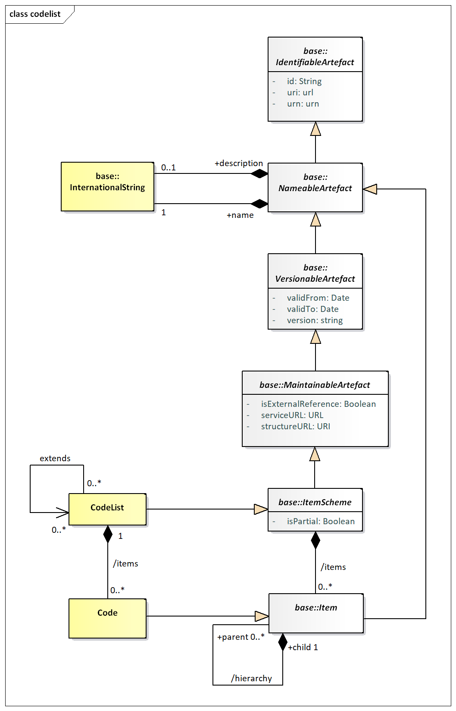
/// caption
Figure 16: Class diagram of the Codelist
///

### Explanation of the Diagram

#### Narrative

The Codelist inherits from the *ItemScheme* and therefore has the
following attributes:

- id
- uri
- urn
- version
- validFrom
- validTo
- isExternalReference
- serviceURL
- structureURL
- isPartial

The Code inherits from *Item* and has the following attributes:

- id
- uri
- urn

Both Codelist and Code have the association to InternationalString to
support a multi-lingual name, an optional multi-lingual description, and
an association to Annotation to support notes (not shown).

Through the inheritance the Codelist comprise one or more Codes, and the
Code itself can have one or more child Codes in the (inherited)
hierarchy association. Note that a child Code can have only one parent
Code in this association. A more complex Hierarhcy, which allows
multiple parents is described later.

A partial Codelist (where isPartial is set to 'true') is identical to a
Codelist and contains the Code and associated names and descriptions,
just as in a normal Codelist. However, its content is a subset of the
full Codelist. The way this works is described in section 3.5.3.1 on
*ItemScheme*.

#### Definitions

| | | |
| :--- | :--- | :--- |
| Class | Feature | Description |
| Codelist | 
Inherits from
 
<em>ItemScheme</em>
 | A list from which some statistical concepts (coded concepts) take their values. |
| Code | 
Inherits from
 
Item
 | A language independent set of letters, numbers or symbols that represent a concept whose meaning is described in a natural language. |
|  | hierarchy | Associates the parent and the child codes. |
|  | extends | Associates a Codelist with any Codelists that it may extend. |

### Class Diagram – Codelist Extension

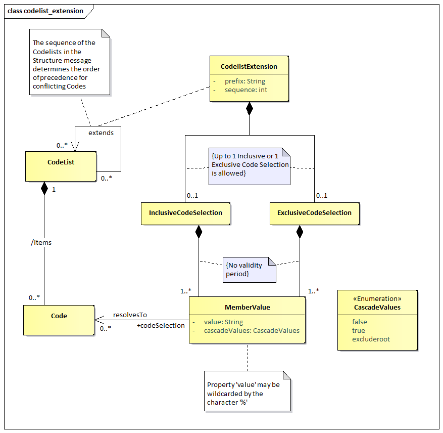
/// caption
Figure 17: Class diagram for Codelist Extension
///

#### Narrative

A Codelist may extend other Codelists via the CodelistExtension class.
The latter, via the sequence, indicates the order of precedence of the
extended Codelists for conflict resolution of Codes. Besides that, the
prefix property is used to ensure uniqueness of inherited Codes in the
extending[2] Codelist in case conflicting Codes must be included in the
latter. Each CodelistExtension association may include one
InclusiveCodeSelection or one ExclusiveCodeSelection; those allow
including or excluding a specific selection of Codes from the extended
Codelists.

The code selection classes may have MemberValues in order to specify the
subset of the Codes that should be included or excluded from the
extended Codelist. A MemberValue may have a value that corresponds to a
Code, including its children Codes (via the cascadeValues property), or
even include instances of the wildcard character ‘%’ in order to point
to a set of Codes with common parts in their identifiers.

#### Definitions

| | | |
| :--- | :--- | :--- |
| Class | Feature | Description |
| CodelistExtension |  | The association between Codelists that may extend other Codelists. |
|  | prefix | A prefix to be used for a Codelist used in a extension, in order to avoid Code Conflicts. |
|  | sequence | The order that will be used when extending a Codelist, for resolving Code conflicts. The latest Codelist used overrides any previous Codelist. |
| InclusiveCodeSelection |  | The subset of Codes to be included when extending a Codelist. |
| ExclusiveCodeSelection |  | The subset of Codes to be excluded when extending a Codelist. |
| MemberValue | 
Inherits from:
 
<em>SelectionValue</em>
 | A collection of values based on Codes and their children. |
|  | cascadeValues | A property to indicate if the child Codes of the selected Code shall be included in the selection. It is also possible to include children and exclude the Code by using the 'excluderoot' value. |
|  | value | The value of the Code to include in the selection. It may include the ‘%’ character as a wildcard. |

### Class Diagram – Geospatial Codelist

The geospatial support is implemented via an extension of the normal
Codelist. This is illustrated in the following diagrams.

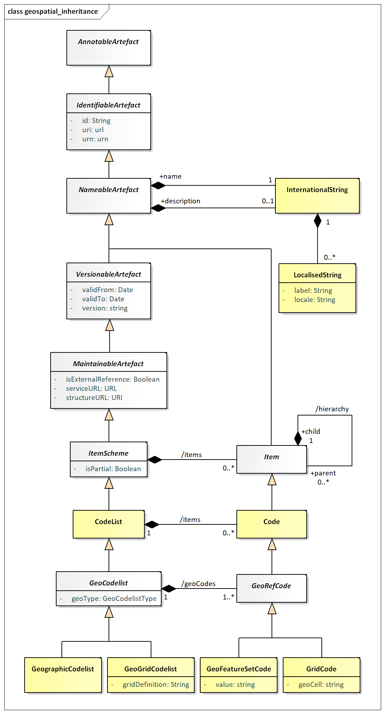
/// caption
Figure 18: Inheritance for the GeoCodelist
///

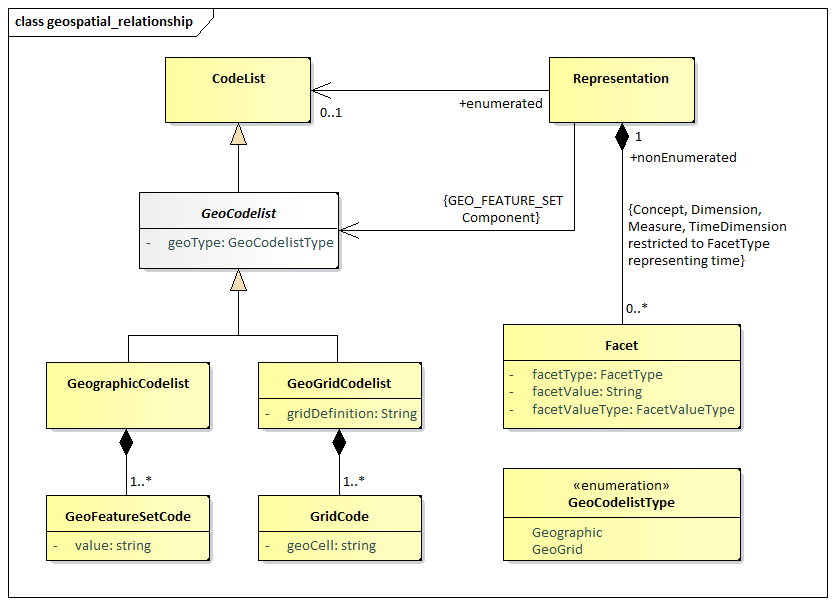
/// caption
Figure 19: Class diagram for Geospatial Codelist
///

#### Narrative

A *GeoCodelist* is a specialisation of Codelist that includes geospatial
information, by comprising a set of special Codes, i.e., *GeoRefCode*s.
A *GeoCodelist* may be implemented by any of the two following classes,
via the geoType property:

- GeographicCodelist
- GeoGridCodelist

The former, i.e., GeographicCodelist, comprises a set of
GeoFeatureSetCodes, by adding a value in the Code that follows a pattern
to represent a geo feature set.

The latter, i.e., GeoGridCodelist, comprises a set of GridCodes, which
are related to the gridDefinition specified in the GeoGridCodelist.

#### Definitions

| | | |
| :--- | :--- | :--- |
| Class | Feature | Description |
| <em>GeoCodelist</em> | 
Abstract Class
 
Sub Classes:
 
GeographicCodelist
 
GeoGridCodelist
 | The abstract class that represents a special type of Codelist, which includes geospatial information. |
|  | geoType | The type of Geo Codelist that the Codelist will become. |
| <em>GeoRefCode</em> | 
Abstract Class
 
Sub Classes:
 
GeoFeatureSetCode
 
GeoGridCode
 | The abstract class that represents a special type of Code, which includes geospatial information. |
| GeographicCodelist |  | A special Codelist that has been extended to add a geographical feature set to each of its items, typically, this would include all types of administrative geographies. |
| GeoGridCodelist |  | A code list that has defined a geographical grid composed of cells representing regular squared portions of the Earth. |
|  | gridDefinition | Contains a regular expression string corresponding to the grid definition for the GeoGrid Codelist. |
| GeoFeatureSetCode |  | A Code that has a geo feature set. |
|  | value | The geo feature set of the Code, which represents a set of points defining a feature in a format defined a predefined pattern (see section 6). |
| GeoGridCode |  | A Code that represents a Geo Grid Cell belonging in a specific grid definition. |
|  | geoCell | The value used to assign the Code to one cell in the grid. |

## ValueList

### Class Diagram

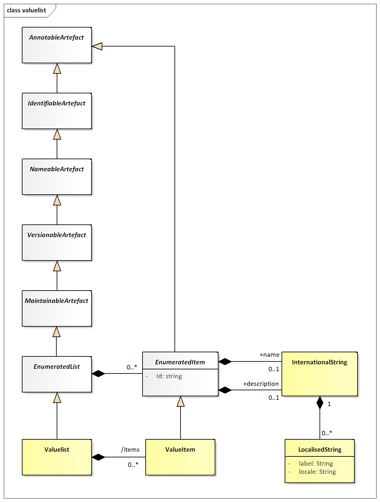
/// caption
Figure 20: Class diagram of the ValueList
///

### Explanation of the Diagram

#### Narrative

A ValueList inherits from *EnumeratedList* (and hence the
*MaintenableArtefact*) and thus has the following attributes:

- id
- uri
- urn
- version
- validFrom
- validTo
- isExternalReference
- registryURL
- structureURL
- repositoryURL
- ValueItem inherits from *EnumeratedItem*, which adds an id, with relaxed constraints, to the former.

Through the inheritance from *NameableArtefact* the ValueList has the
association to InternationalString to support a multi-lingual name, an
optional multi-lingual description, and an association to Annotation to
support notes (not shown). Similarly, the ValueItem, inherits the
association to InternationalString and to the Annotation from the
*EnumeratedItem*.

The ValueList can have one or more ValueItems.

#### Definitions

| | | |
| :--- | :--- | :--- |
| <strong>Class</strong> | <strong>Feature</strong> | <strong>Description</strong> |
| ValueList | 
Inherits from
 
<em>EnumeratedList</em>
 | A list from which some statistical concepts (enumerated concepts) take their values. |
| ValueItem | 
Inherits from
 
<em>EnumeratedItem</em>
 | A language independent set of letters, numbers or symbols that represent a concept whose meaning is described in a natural language. |

## Concept Scheme and Concepts

### Class Diagram - Inheritance

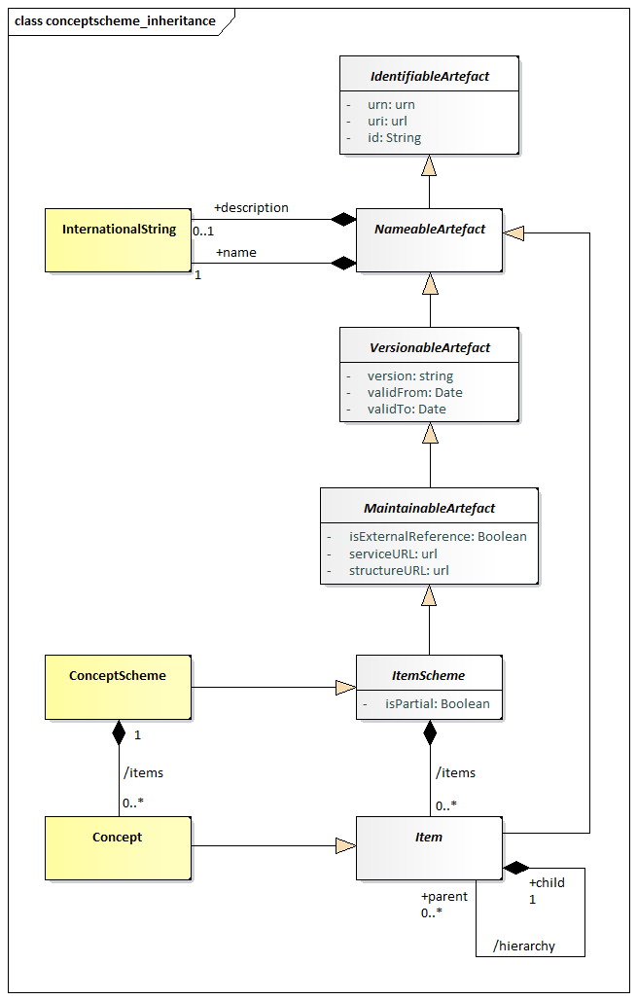
/// caption
Figure 21 Class diagram of the Concept Scheme
///

### Explanation of the Diagram

The ConceptScheme inherits from the *ItemScheme* and therefore has the
following attributes:

- id
- uri
- urn
- version
- validFrom
- validTo
- isExternalReference
- registryURL
- structureURL
- repositoryURL
- isPartial

Concept inherits from Item and has the following attributes:

- id
- uri
- urn

Through the inheritance from *NameableArtefact* both ConceptScheme and
Concept have the association to InternationalString to support a
multi-lingual name, an optional multi-lingual description, and an
association to Annotation to support notes (not shown).

Through the inheritance from *ItemScheme* the ConceptScheme comprise one
or more Concepts, and the Concept itself can have one or more child
Concepts in the (inherited) hierarchy association. Note that a child
Concept can have only one parent Concept in this association.

A partial ConceptScheme (where isPartial is set to “true”) is identical
to a ConceptScheme and contains the Concept and associated names and
descriptions, just as in a normal ConceptScheme. However, its content is
a subset of the full ConceptScheme. The way this works is described in
section 3.5.3.1 on ItemScheme.

### Class Diagram - Relationship

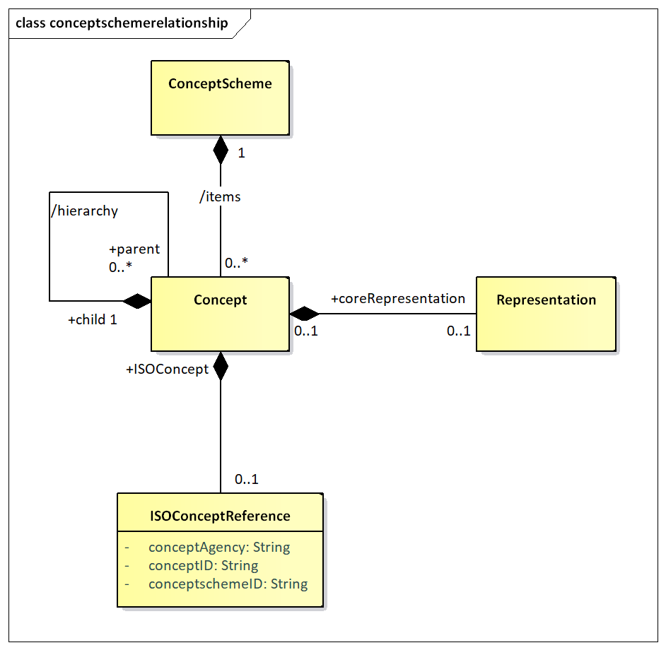
/// caption
Figure 22: Relationship class diagram of the Concept Scheme
///

### Explanation of the diagram

#### Narrative

The ConceptScheme can have one or more Concepts. A Concept can have zero
or more child Concepts, thus supporting a hierarchy of Concepts. Note
that a child Concept can have only one parent Concept in this
association. The purpose of the hierarchy is to relate concepts that
have a semantic relationship: for example, a Reporting\_Country and
Vis\_a\_Vis\_Country may both have Country as a parent concept, or a
CONTACT may have a PRIMARY\_CONTACT as a child concept. It is not the
purpose of such schemes to define reporting structures: these reporting
structures are defined in the MetadataStructureDefinition.

The Concept can be associated with a coreRepresentation. The
coreRepresentation is the specification of the format and value domain
of the Concept when used on a structure like a DataStructureDefinition
or a MetadataStructureDefinition, unless the specification of the
Representation is overridden in the relevant structure definition. In a
hierarchical ConceptScheme the Representation is inherited from the
parent Concept unless overridden at the level of the child Concept.

The Representation is documented in more detail in the section on the
SDMX Base.

The Concept may be related to a concept described in terms of the
ISO/IEC 11179 standard. The ISOConceptReference identifies this concept
and concept scheme in which it is contained.

#### Definitions

| Class | Feature | Description |
| :--- | :--- | :--- |
| ConceptScheme | 
Inherits from
 
<em>ItemScheme</em>
 | The descriptive information for an arrangement or division of concepts into groups based on characteristics, which the objects have in common. |
| Concept | 
Inherits from
 
<em>Item</em>
 | A concept is a unit of knowledge created by a unique combination of characteristics. |
|  | /hierarchy | Associates the parent and the child concept. |
|  | coreRepresentation | Associates a Representation. |
|  | +ISOConcept | Association to an ISO concept reference. |
| ISOConceptReference |  | The identity of an ISO concept definition. |
|  | conceptAgency | The maintenance agency of the concept scheme containing the concept. |
|  | conceptSchemeID | The identifier of the concept scheme. |
|  | conceptID | The identifier of the concept. |

## Category Scheme

### Context

This package defines the structure that supports the definition of and
relationships between categories in a category scheme. It is similar to
the package for concept scheme. An example of a category scheme is one
which categorises data – sometimes known as a subject matter domain
scheme or a data category scheme. Importantly, as will be seen later,
the individual nodes in the scheme (the “categories”) can be associated
to any set of IdentiableArtefacts in a Categorisation.

### Class diagram - Inheritance

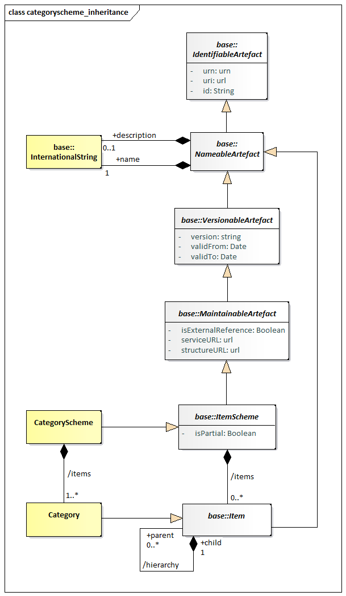
/// caption
Figure 23 Inheritance Class diagram of the Category Scheme
///

### Explanation of the Diagram

#### Narrative

The categories are modelled as a hierarchical *ItemScheme*. The
CategoryScheme inherits from the *ItemScheme* and has the following
attributes:

- id
- uri
- urn
- version
- validFrom
- validTo
- isExternalReference
- structureURL
- serviceURL
- isPartial

Category inherits from *Item* and has the following attributes:

- id
- uri
- urn

Both CategoryScheme and Category have the association to
InternationalString to support a multi-lingual name, an optional
multi-lingual description, and an association to Annotation to support
notes (not shown on the model).

Through the inheritance the CategoryScheme comprise one or more
Categorys, and the Category itself can have one or more child Category
in the (inherited) hierarchy association. Note that a child Category can
have only one parent Category in this association.

A partial CategoryScheme (where isPartial is set to “true”) is identical
to a CategoryScheme and contains the Category and associated names and
descriptions, just as in a normal CategoryScheme. However, its content
is a subset of the full CategoryScheme. The way this works is described
in section 3.5.3.1 on ItemScheme.

### Class diagram - Relationship

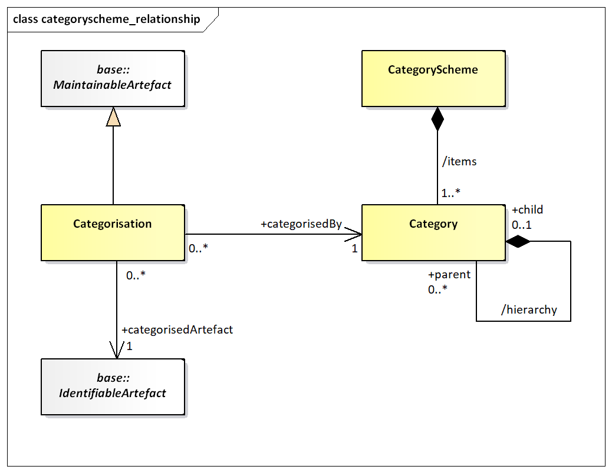
/// caption
Figure 24: Relationship Class diagram of the Category Scheme
///

The CategoryScheme can have one or more Categorys. The Category is
Identifiable and has identity information. A Category can have zero or
more child Categorys, thus supporting a hierarchy of Categorys. Any
IdentifiableArtefact can be +categorisedBy a Category. This is achieved
by means of a Categorisation. Each Categorisation can associate one
IdentifiableArtefact with one Category. Multiple Categorisations can be
used to build a set of IdentifiableArtefacts that are +categorisedBy the
same Category. Note that there is no navigation (i.e. no embedded
reference) to the Categorisation from the Category. From an
implementation perspective this is necessary as Categorisation has no
affect on the versioning of either the Category or the
IdentifiableArtefact.

#### Definitions

| Class | Feature | Description |
| :--- | :--- | :--- |
| CategoryScheme | 
Inherits from
 
<em>ItemScheme</em>
 | The descriptive information for an arrangement or division of categories into groups based on characteristics, which the objects have in common. |
|  | /items | Associates the categories. |
| Category | 
Inherits from
 
<em>Item</em>
 | An item at any level within a classification, typically tabulation categories, sections, subsections, divisions, subdivisions, groups, subgroups, classes and subclasses. |
|  | /hierarchy | Associates the parent and the child Category. |
| Categorisation | 
Inherits from
 
<em>MaintainableArtefact</em>
 | Associates an Identifable Artefact with a Category. |
|  | +categorisedArtefact | Associates the Identifable Artefact. |
|  | +categorisedBy | Associates the Category. |

## Organisation Scheme

### Class Diagram

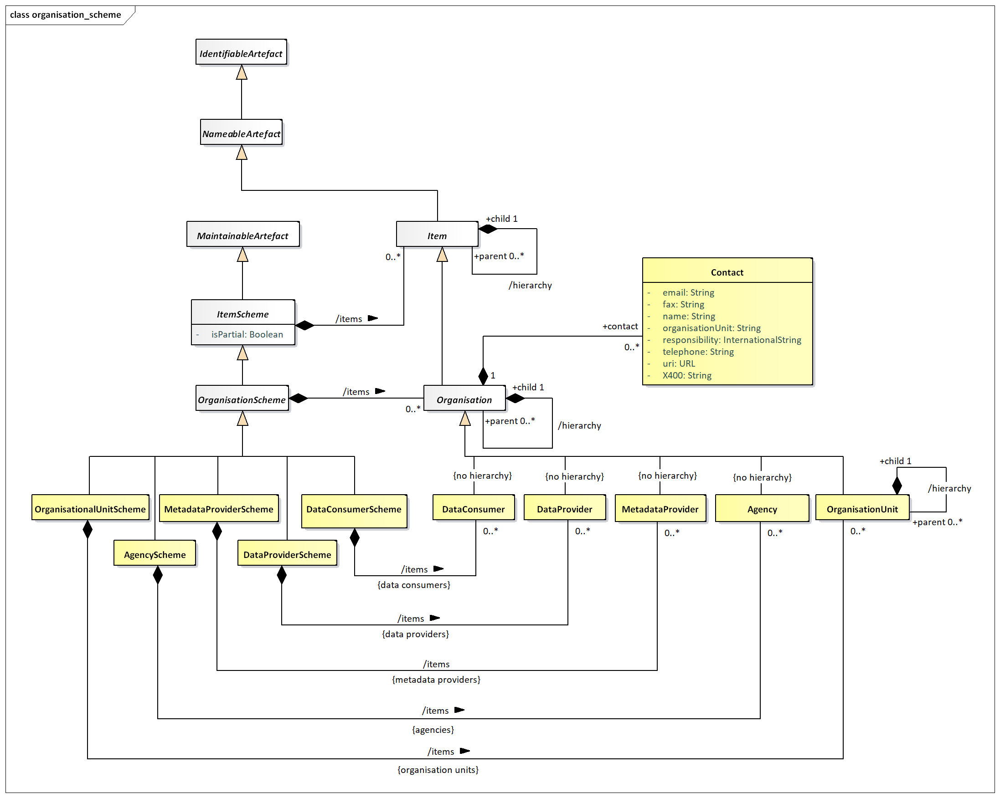
/// caption
Figure 25 The Organisation Scheme class diagram
///

### Explanation of the Diagram

#### Narrative

The *OrganisationScheme* is abstract. It contains *Organisation* which
is also abstract. The *Organisation* can have child *Organisation*.

The *OrganisationScheme* can be one of five types:

1. AgencyScheme – contains Agency which is restricted to a flat list of
    agencies (i.e., there is no hierarchy). Note that the SDMX system of
    (Maintenance) Agency can be hierarchic and this is explained in more
    detail in the SDMX Standards Section 6 “Technical Notes”.
2. DataProviderScheme – contains DataProvider which is restricted to a
    flat list of agencies (i.e., there is no hierarchy).
3. MetadataProviderScheme – contains MetadataProvider which is
    restricted to a flat list of agencies (i.e., there is no hierarchy).
4. DataConsumerScheme – contains DataConsumer which is restricted to a
    flat list of agencies (i.e., there is no hierarchy).
5. OrganisationUnitScheme – contains OrganisationUnit which does
    inherit the /hierarchy association from Organisation.

Reference metadata can be attached to the *Organisation* by means of the
metadata attachment mechanism. This mechanism is explained in the
Reference Metadata section of this document (see section 7). This means
that the model does not specify the specific reference metadata that can
be attached to a DataProvider, MetadataProvider, DataConsumer,
OrganisationUnit or Agency, except for limited Contact information.

A partial *OrganisationScheme* (where isPartial is set to “true”) is
identical to an *OrganisationScheme* and contains the *Organisation* and
associated names and descriptions, just as in a normal
*OrganisationScheme*. However, its content is a subset of the full
*OrganisationScheme*. The way this works is described in section 3.5.3.1
on *ItemScheme*.

#### Definitions

| Class | Feature | Description |
| :--- | :--- | :--- |
| <em>OrganisationScheme</em> | 
Abstract Class
 
Inherits from
 
<em>ItemScheme</em>
 
Sub classes are:
 
AgencyScheme  DataProviderScheme
 
MetadataProviderScheme  DataConsumerScheme  OrganisationUnitScheme
 | A maintained collection of Organisations. |
|  | /items | Association to the Organisations in the scheme. |
| <em>Organisation</em> | 
Abstract Class
 
Inherits from
 
<em>Item</em>
 
Sub classes are:
 
Agency  DataProvider  MetadataProvider DataConsumer  OrganisationUnit
 | An organisation is a unique framework of authority within which a person or persons act, or are designated to act, towards some purpose. |
|  | +contact | Association to the Contact information. |
|  | /hierarchy | Association to child Organisations. |
| Contact |  | An instance of a role of an individual or an organization (or organization part or organization person) to whom an information item(s), a material object(s) and/or person(s) can be sent to or from in a specified context. |
|  | name | The designation of the Contact person by a linguistic expression. |
|  | organisationUnit | The designation of the organisational structure by a linguistic expression, within which Contact person works. |
|  | responsibility | The function of the contact person with respect to the organisation role for which this person is the Contact. |
|  | telephone | The telephone number of the Contact. |
|  | fax | The fax number of the Contact. |
|  | email | The Internet e-mail address of the Contact. |
|  | X400 | The X400 address of the Contact. |
|  | uri | The URL address of the Contact. |
| AgencyScheme |  | A maintained collection of Maintenance Agencies. |
|  | /items | Association to the Maintenance Agency in the scheme. |
| DataProviderScheme |  | A maintained collection of Data Providers. |
|  | /items | Association to the Data Providers in the scheme. |
| MetadataProviderScheme |  | A maintained collection of Metadata Providers. |
|  | /items | Association to the Metadata Providers in the scheme. |
| DataConsumerScheme |  | A maintained collection of Data Consumers. |
|  | /items | Association to the Data Consumers in the scheme. |
| OrganisationUnitScheme |  | A maintained collection of Organisation Units. |
|  | /items | Association to the Organisation Units in the scheme. |
| Agency | 
Inherits from
 
<em>Organisation</em>
 | Responsible agency for maintaining artefacts such as statistical classifications, glossaries, structural metadata such as Data and Metadata Structure Definitions, Concepts and Code lists. |
| DataProvider | 
Inherits from
 
<em>Organisation</em>
 | An organisation that produces data. |
| MetadataProvider | 
Inherits from
 
<em>Organisation</em>
 | An organisation that produces reference metadata. |
| DataConsumer | 
Inherits from
 
<em>Organisation</em>
 | An organisation using data as input for further processing. |
| OrganisationUnit | 
Inherits from
 
<em>Organisation</em>
 | A designation in the organisational structure. |
|  | /hierarchy | Association to child Organisation Units |

## Reporting Taxonomy

### Class Diagram

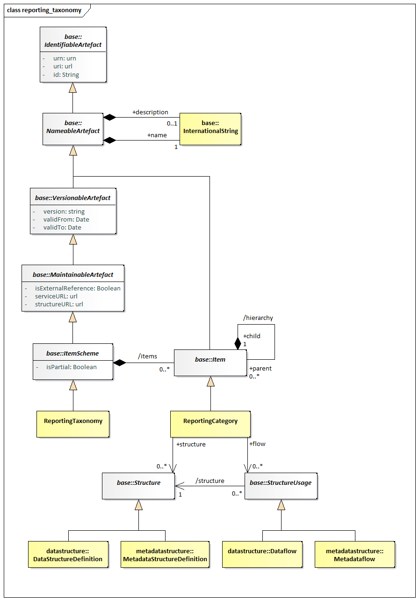
/// caption
Figure 26: Class diagram of the Reporting Taxonomy
///

### Explanation of the Diagram

#### Narrative

In some data reporting environments, and in particular those in primary
reporting, a report may comprise a variety of heterogeneous data, each
described by a different *Structure*. Equally, a specific disseminated
or published report may also comprise a variety of heterogeneous data.
The definition of the set of linked sub reports is supported by the
ReportingTaxonomy.

The ReportingTaxonomy is a specialised form of *ItemScheme*. Each
ReportingCategory of the ReportingTaxonomy can link to one or more
*StructureUsage* which itself can be one of Dataflow, or Metadataflow,
and one or more *Structure*, which itself can be one of
DataStructureDefinition or MetadataStructureDefinition. It is expected
that within a specific ReportingTaxonomy each Category that is linked in
this way will be linked to the same class (e.g. all Category in the
scheme will link to a Dataflow). Note that a ReportingCategory can have
child ReportingCategory and in this way it is possible to define a
hierarchical ReportingTaxonomy. It is possible in this taxonomy that
some ReportingCategory are defined just to give a reporting structure.
For instance:

Section 1

1\. linked to Dataflow\_1
2\. linked to Dataflow\_2

Section 2

1\. linked to Dataflow\_3
2\. linked to Dataflow\_4

Here, the nodes of Section 1 and Section 2 would not be linked to
Dataflow but the other would be linked to a Dataflow (and hence the
DataStructureDefinition).

A partial ReportingTaxonomy (where isPartial is set to “true”) is
identical to a ReportingTaxonomy and contains the ReportingCategory and
associated names and descriptions, just as in a normal
ReportingTaxonomy. However, its content is a sub set of the full
ReportingTaxonomy The way this works is described in section 3.5.3.1 on
*ItemScheme*.

#### Definitions

| Class | Feature | Description |
| :--- | :--- | :--- |
| ReportingTaxonomy | 
Inherits from
 
<em>ItemScheme</em>
 | A scheme which defines the composition structure of a data report where each component can be described by an independent Dataflow or Metadataflow. |
|  | /items | Associates the Reporting Category |
| ReportingCategory | 
Inherits from
 
<em>Item</em>
 | A component that gives structure to the report and links to data and metadata. |
|  | /hierarchy | Associates child Reporting Category. |
|  | +flow | Association to the data and metadata flows that link to metadata about the provisioning and related data and metadata sets, and the structures that define them. |
|  | +structure | Association to the Data Structure Definition and Metadata Structure Definitions which define the structural metadata describing the data and metadata that are contained at this part of the report. |
