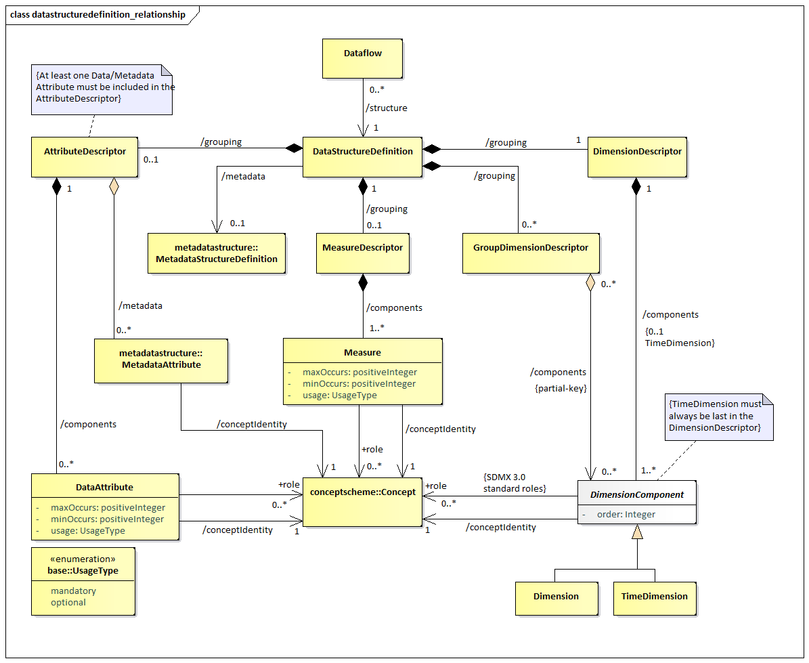
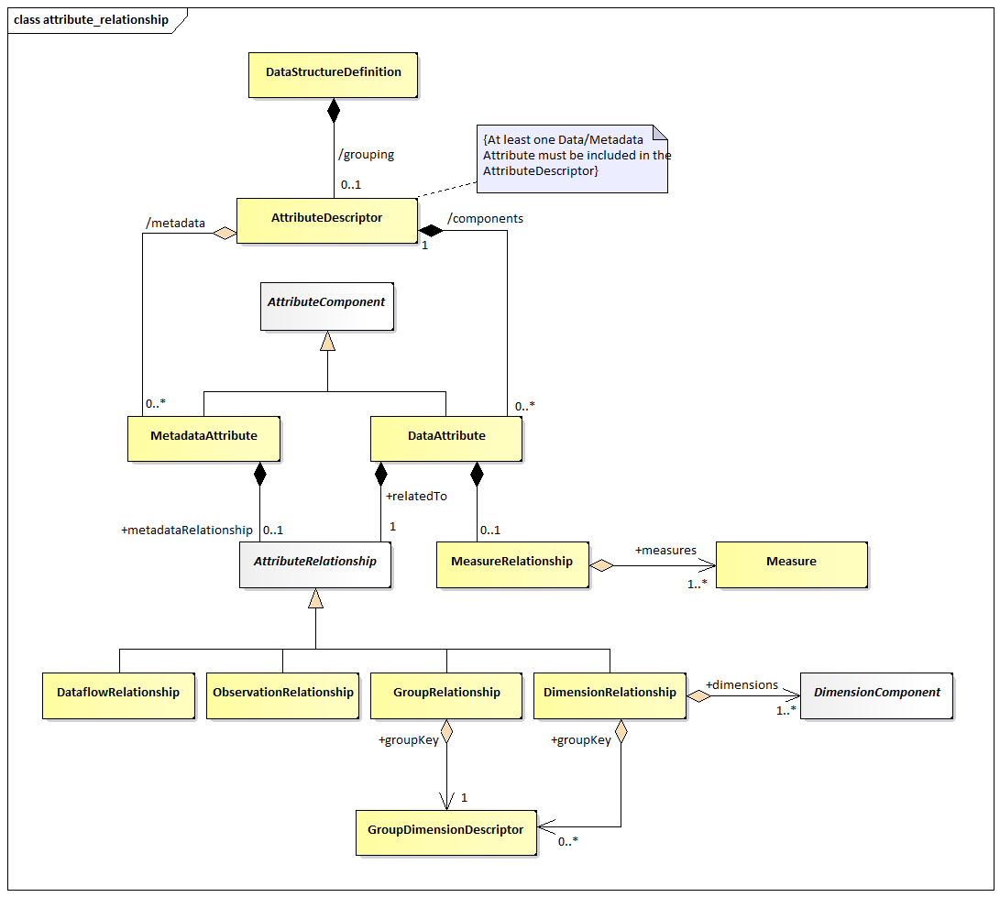
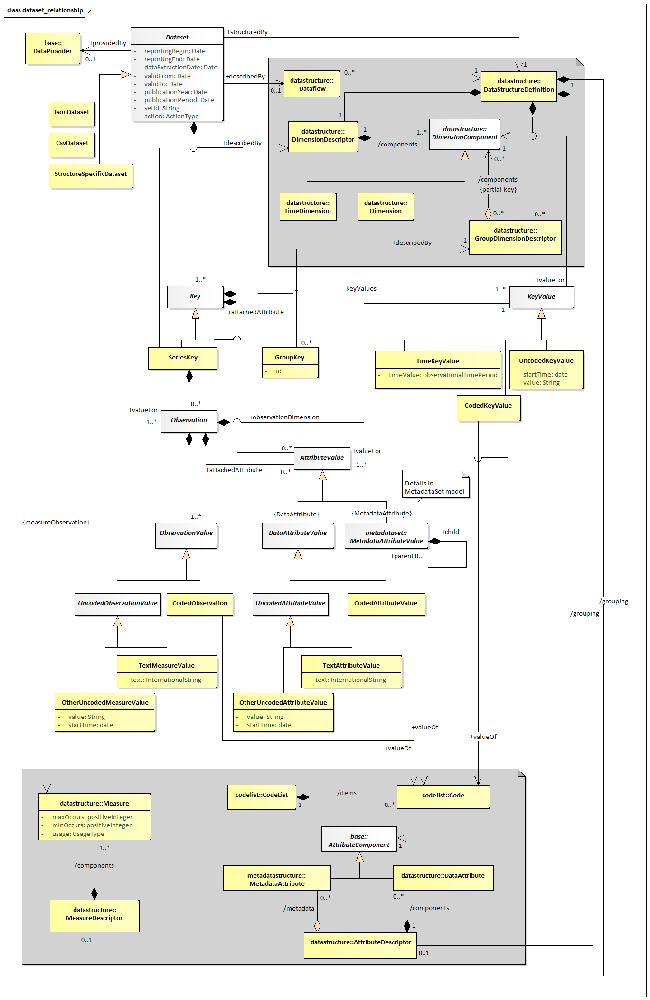

#  Data Structure Definition and Dataset

## Introduction

The DataStructureDefiniton is the class name for a structure definition
for data. Some organisations know this type of definition as a “Key
Family” and so the two names are synonymous. The term Data Structure
Definition (also referred to as DSD) is used in this specification.

Many of the constructs in this layer of the model inherit from the SDMX
Base Layer. Therefore, it is necessary to study both the inheritance and
the relationship diagrams to understand the functionality of individual
packages. In simple sub models these are shown in the same diagram but
are omitted from the more complex sub models for the sake of clarity. In
these cases, the inheritance diagram below shows the full inheritance
tree for the classes concerned with data structure definitions.

There are very few additional classes in this sub model other than those
shown in the inheritance diagram below. In other words, the SDMX Base
gives most of the structure of this sub model both in terms of
associations and in terms of attributes. The relationship diagrams shown
in this section show clearly when these associations are inherited from
the SDMX Base (see the Appendix “A Short Guide to UML in the SDMX
Information Model” to see the diagrammatic notation used to depict
this).

The actual SDMX Base construct from which the concrete classes inherit
depends upon the requirements of the class for:

Annotation – *AnnotableArtefact*

Identification – *IdentifiableArtefact*

Naming – *NameableArtefact*

Versioning – *VersionableArtefact*

Maintenance – *MaintainableArtefact*

## Inheritance View

### Class Diagram

 
/// caption
Figure 27 Class inheritance in the Data Structure Definition and
Data Set Packages
///

### Explanation of the Diagram

#### Narrative

Those classes in the SDMX metamodel which require annotations inherit
from *AnnotableArtefact*. These are:

*IdentifiableArtefact*

*DataSet*

*Key* (and therefore *SeriesKey* and *GroupKey*)

*Observation*

Those classes in the SDMX metamodel which require annotations and global
identity are derived from *IdentifiableArtefact*. These are:

*NameableArtefact*

*ComponentList*

*Component*

Those classes in the SDMX metamodel which require annotations, global
identity, multilingual name and multilingual description are derived
from *NameableArtefact*. These are:

*VersionableArtefact*

*Item*

The classes in the SDMX metamodel which require annotations, global
identity, multilingual name and multilingual description, and versioning
are derived from *VersionableArtefact*. These are:

*MaintainableArtefact*

Abstract classes which represent information that is maintained by
Maintenance Agencies all inherit from *MaintainableArtefact*, they also
inherit all the features of a *VersionableArtefact*, and are:

*StructureUsage*

*Structure*

*ItemScheme*

All the above classes are abstract. The key to understanding the class
diagrams presented in this section are the concrete classes that inherit
from these abstract classes.

Those concrete classes in the SDMX Data Structure Definition and Dataset
packages of the metamodel which require to be maintained by Agencies all
inherit (via other abstract classes) from *MaintainableArtefact*, these
are:

Dataflow

DataStructureDefinition

The component structures that are lists of lists, inherit directly from
*Structure*. A *Structure* contains several lists of components. The
concrete class that inherits from *Structure* is:

DataStructureDefinition

A DataStructureDefinition contains a list of dimensions, a list of
measures and a list of attributes.

The concrete classes which inherit from *ComponentList* and are
subcomponents of the DataStructureDefinition are:

DimensionDescriptor – content is Dimension and TimeDimension

DimensionGroupDescriptor – content is an association to Dimension,
TimeDimension

MeasureDescriptor – content is Measure

AttributeDescriptor – content is DataAttribute and an association to
MetadataAttribute

The classes that inherit from *Component* are:

Measure

*DimensionComponent* and thereby its sub classes of Dimension and
TimeDimension

*Attribute* and thereby its sub classes of DataAttribute and
MetadataAttribute

The concrete classes identified above are the majority of the classes
required to define the metamodel for the DataStructureDefinition. The
diagrams and explanations in the rest of this section show how these
concrete classes are related in order to support the functionality
required.

## Data Structure Definition – Relationship View

### Class Diagram 

| Figure 28 Relationship class diagram of the Data Structure Definition excluding representation |
| :--- |

### Explanation of the Diagrams

#### Narrative

A DataStructureDefinition defines the Dimensions, TimeDimension,
DataAttributes, and Measures, and associated Representations, that
comprise the valid structure of data and related attributes that are
contained in a DataSet, which is defined by a Dataflow. In addition, a
DataStructureDefinition may be related to one
MetadataStructureDefinition, in order to use the latter’s
MetadataAttributes, by relating them to other *Components* within the
DSD, as explained below.

The Dataflow may also have additional metadata attached that define
qualitative information and Constraints on the use of the
DataStructureDefinition such as the subset of Codes used in a Dimension
(this is covered later in this document – see sections “Constraints” and
“Data Provisioning”). Each Dataflow has a maximum of one
DataStructureDefinition specified which defines the structure of any
DataSets to be reported/disseminated.

There are two types of dimensions each having a common association to
Concept:

-   Dimension

-   TimeDimension

Note that DimensionComponent can be any or all its sub classes i.e.,
Dimension, TimeDimension.

The *DimensionComponent*, DataAttribute, MetadataAttribute and Measure
link to the Concept that defines its name and semantic (/conceptIdentity
association to Concept). The DataAttribute, Dimension (but not
TimeDimension) and Measure can optionally have a +conceptRole
association with a Concept that identifies its role in the
DataStructureDefinition, or one of the standard pre-defined roles, i.e.,
those published in "GUIDELINES FOR SDMX CONCEPT ROLES" by the SDMX SWG.
The use of these roles is to enable applications to process the data in
a meaningful way (e.g., relating a dimension value to a mapping vector).
It is expected, beyond the standard roles published by the SWG, that
communities (such as the official statistics community) will harmonise
such roles within their community so that data can be exchanged and
shared in a meaningful way within that community.

The valid values for a *DimensionComponent*, Measure, DataAttribute or
MetadataAttribute, when used in this DataStructureDefinition, are
defined by the Representation. This Representation is taken from the
Concept definition (coreRepresentation) unless it is overridden in this
DataStructureDefinition (localRepresentation) – see Figure 28. Note also
that TimeDimension is constrained to specific FacetValueTypes. Moreover,
the Representations of MetadataAttributes are specified in the
corresponding MetadataStructureDefinition, linked by the
DataStructureDefinition.

There will always be a DimensionDescriptor grouping that identifies all
of the Dimension comprising the full key. Together the Dimensions
specify the key of an Observation.

The *DimensionComponent* can optionally be grouped by multiple
GroupDimensionDescriptors each of which identifies the group of
Dimensions that can form a partial key. The GroupDimensionDescriptor
must be identified (GroupDimensionDescriptor.id) and this is used in the
GroupKey of the DataSet to declare which DataAttributes or
MetadataAttributes are reported at this group level in the DataSet.

There can be a maximum of one TimeDimension specified in the
DimensionDescriptor. The TimeDimension is used to specify the Concept
used to convey the time period of the observation in a data set. The
TimeDimension must contain a valid representation of time and cannot be
coded.

There can be one or more Measures under the MeasureDescriptor. Measures
represent the observable phenomena. Each Measure may have a valid
representation, a maxOccurs attribute limiting the maximum number of
values per Measure (which may be set to 'unbounded' for unlimited
occurrences), as well as a minOccurs attribute, indicating the minimum
required number of values, when the Measure is reported. If minOccurs or
maxOccurs are omitted (they both default to ‘1’), the Measure is
considered to take a single value; otherwise, it is an array. Moreover,
the usage attribute indicates whether a Measure must be reported or not,
by the corresponding values: mandatory or optional.

The AttributeDescriptor may contain one or more *Attribute*s, i.e., at
least one DataAttribute definition or one MetadataAttribute reference.

The DataAttribute defines a characteristic of data that are collected or
disseminated and is grouped in the DataStructureDefinition by a single
AttributeDescriptor. The DataAttribute can be indicated if it must be
reported or not, by the corresponding value of the usage attribute:
i.e., mandatory or optional. The property minOccurs specifies the
minimum number of array values to be included when the DataAttribute is
reported. Moreover, a maxOccurs attribute indicates whether the
DataAttribute may need to report more than one values, i.e., an array of
values. The DataAttribute may play a specific role in the structure and
this is specified by the +role association to the Concept that
identifies its role.

The MetadataAttribute defines reference metadata that may be collected
or disseminated and is grouped together with DataAttribute under the
AttributeDescriptor.

A DataAttribute or a MetadataAttribute (i.e., an *AttributeComponent*)
is specified as being +relatedTo an AttributeRelationship, which defines
the constructs to which the *AttributeComponent* is to be reported
within a *DataSet*. An *AttributeComponent* can be specified as being
related to one of the following artefacts:

-   All data within the dataset (DataflowRelationship) – this is
    equivalent to attaching an Attribute to all data within the
    Dataflow.

-   Dimension or set of Dimensions (DimensionRelationship)

-   Set of Dimensions specified by a GroupKey (GroupRelationship – this
    is retained for compatibility reasons – or +groupKey of the
    DimensionRelationship)

-   Observation (ObservationRelationship)

-   In addition to the positioning of an *AttributeComponent* within a
    *DataSet*, another relationship indicates the Measure(s) for which
    the *AttributeComponent* is reported. Regardless of the position of
    the *AttributeComponent* within the *DataSet*, the
    *AttributeComponent* may concern one, more than one, or all Measures
    included in the DSD. This is expressed using the MeasureRelationship
    class, which relates a DataAttribute to one or more Measures. Lack
    of the MeasureRelationship defaults to a relationship to all
    Measures.

Figure 29: Attribute Attachment Defined in the Data Structure Definition

The following table details the possible relationships a DataAttribute
may specify. Note that these relationships are mutually exclusive, and
therefore only one of the following is possible.

| <strong>Relationship</strong> | <strong>Meaning</strong> | <strong>Location in Data Set at which the Attribute is reported</strong> |
| :--- | :--- | :--- |
| DataflowRelationship | The value of the attribute is fixed for all data contained in the dataset. The Attribute value applies to all data defined by the underlying Dataflow. | The attribute is reported at the Dataset level. |
| Dimension (1..n) | The value of the attribute will vary with the value(s) of the referenced Dimension(s). In this case, Group(s) to which the attribute should be attached may optionally be specified. | The attribute is reported at the lowest level of the Dimension to which the Attribute is related, otherwise at the level of the Group if Attachment Group(s) is specified. |
| Group | The value of the Attribute varies with combination of values for all of the Dimensions contained in the Group. This is added as a convenience to listing all Dimensions and the attachment Group, but should only be used when the Attribute value varies based on <u>all</u> Group Dimension values. | The attribute is reported at the level of Group. |
| Observation | The value of the Attribute varies with the observed value. | The attribute is reported at the level of Observation. |

Figure 30: Representation of DSD Components

Each of Dimension, TimeDimension, Measure, DataAttribute and
MetadataAttribute can have a Representation specified (using the
localRepresentation association). If this is not specified in the
DataStructureDefinition then the representation specified for Concept
(coreRepresentation) is used. Measure, and DataAttribute may be also
represented by multilingual text (as seen in the DataSet diagram further
down). An exception is the MetadataAttribute, where its Representation
is specified in the MetadataStructureDefinition.

A DataStructureDefinition can be extended to form a derived
DataStructureDefinition. This is supported in the StructureMap.

####  Definitions

| Class | Feature | Description |  |
| :--- | :--- | :--- | :--- |
| StructureUsage |  | See “SDMX Base”. |  |
| Dataflow | 
Inherits from
 
<em>StructureUsage</em>
 | Abstract concept (i.e., the structure without any data) of a flow of data that providers will provide for different reference periods. |  |
|  | /structure | Associates a Dataflow to the Data Structure Definition. |  |
| DataStructureDefinition |  | A collection of metadata concepts, their structure and usage when used to collect or disseminate data. |  |
|  | /grouping | An association to a set of metadata concepts that have an identified structural role in a Data Structure Definition. |  |
| GroupDimensionDescriptor | 
Inherits from
 
<em>ComponentList</em>
 | A set of metadata concepts that define a partial key derived from the Dimension Descriptor in a Data Structure Definition. |  |
|  | /components | An association to the Dimension components that comprise the group. |  |
| DimensionDescriptor | 
Inherits from
 
<em>ComponentList</em>
 | An ordered set of metadata concepts that, combined, classify a statistical series, and whose values, when combined (the key) in an instance such as a data set, uniquely identify a specific observation. |  |
|  | /components | An association to the Dimension and Time Dimension comprising the Key Descriptor. |  |
| AttributeDescriptor | 
Inherits from
 
<em>ComponentList</em>
 | A set metadata concepts that define the Attributes of a Data Structure Definition. |  |
|  | <em>/</em>components | An association to a Data Attribute component. |  |
| MeasureDescriptor | 
Inherits from
 
<em>ComponentList</em>
 | A metadata concept that defines the Measures of a Data Structure Definition. |  |
|  | /components | An association to a Measure component. |  |
| <em>DimensionComponent</em> | 
Inherits from
 
<em>Component</em>
 
Sub class
 
Dimension
 
TimeDimension
 | An abstract class representing any Component that can be used for identifying observations. |
|  | order | Specifies the order of the Dimension Components within the DSD. The property is used to indicate the position of the Dimension Component and determines the Key for identifying observations, or series. The Time Dimension, when specified, must be the last within the Dimension Descriptor. |
| Dimension | 
Inherits from
 
<em>DimensionComponent</em>
 | A metadata concept used (most probably together with other metadata concepts) to classify a statistical series, e.g., a statistical concept indicating a certain economic activity or a geographical reference area. |
|  | /role | Association to the Concept that specifies the role that that the Dimension plays in the Data Structure Definition. |
|  | /conceptIdentity | An association to the metadata concept which defines the semantic of the Dimension. |
| TimeDimension | 
Inherits from
 
<em>DimensionComponent</em>
 | A metadata concept that identifies the component in the key structure that has the role of “time”. |
| DataAttribute | 
Inherits from
 
<em>Component</em>
 | A characteristic of an object or entity. |
|  | /role | Association to the Concept that specifies the role that that the Data Attribute plays in the Data Structure Definition. |
|  | minOccurs | Defines the minimum required occurrences for the Attribute. When equals to zero, the Attribute is conditional. |
|  | maxOccurs | Defines the maximum allowed occurrences for the Attribute. |
|  | usage | Defines whether a Data Attribute must be reported or not. |
|  | +relatedTo | Association to an Attribute Relationship. |
|  | /conceptIdentity | An association to the Concept which defines the semantic of the component. |
| Measure | 
Inherits from
 
<em>Component</em>
 | The metadata concept that is the phenomenon to be measured in a data set. In a data set the instance of the measure is often called the observation. |
|  | /conceptIdentity | An association to the Concept which carries the values of the measures. |
|  | minOccurs | Defines the minimum required occurrences for the Measure. When equals to zero, the Measure is conditional. |
|  | maxOccurs | Defines the maximum allowed occurrences for the Measure. |
|  | usage | Defines whether a Measure must be reported or not. |
| <em>AttributeRelationship</em> | 
Abstract Class
 
Sub classes
 
ObservationRelationship
 
GroupRelationship
 
DimensionRelationship
 | Specifies the type of artefact to which a Data Attribute can be attached in a Data Set. |
| ObservationRelationship |  | The Data Attribute is related to the observations of the Data Set. |
| GroupRelationship |  | The Data Attribute is related to a Group Dimension Descriptor construct. |
|  | +groupKey | An association to the Group Dimension Descriptor |
| DimensionRelationship |  | The Data Attribute is related to a set of Dimensions. |
|  | +dimensions | Association to the set of Dimensions to which the Data Attribute is related. |
|  | +groupKey | Association to the Group Dimension Descriptor which specifies the set of Dimensions to which the Data Attribute is attached. |
| MeasureRelationship |  | The Measures that a Data Attribute is reported for. |
|  | +measures | Association to the set of Measures to which a Data Attribute is related to. |
| SentinelValuesType |  | This facet indicates that an Attribute or a Measure has sentinel values with special meaning within their data type. This is realised by providing such values within the TextFormat, in addition to any textType or other Facet. |
| SentinelValue |  | A value that has a special meaning within the text format representation of the Component. |
|  | +name | An association of a Sentinel Value to a multilingual name. |
|  | +description | An association of a Sentinel Value to a multilingual description. |

The explanation of the classes, attributes, and associations comprising
the Representation is described in the section on the SDMX Base.

## Data Set – Relationship View

### Context

A data set comprises the collection of data values and associated
metadata that are collected or disseminated according to a known
DataStructureDefinition.

### Class Diagram

 
/// caption
Figure 31: Class Diagram of the Data Set
///

### Explanation of the Diagram

#### Narrative – Data Set

Note that the *DataSet* must conform to the DataStructureDefinition
associated to the Dataflow for which this DataSet is an “instance of
data”. Whilst the model shows the association to the classes of the
DataStructureDefinition, this is for conceptual purposes to show the
link to the DataStructureDefinition. In the actual *DataSet* as
exchanged there must, of course, be a reference to the
DataStructureDefinition and optionally a Dataflow or a
ProvisionAgreement, but the DataStructureDefinition is not necessarily
exchanged with the data. Therefore, the DataStructureDefinition classes
are shown in the grey areas, as these are not a part of the *DataSet*
when the *DataSet* is exchanged. However, the structural metadata in the
DataStructureDefinition can be used by an application to validate the
contents of the *DataSet* in terms of the valid content of a *KeyValue*
as defined by the Representation in the DataStructureDefinition.

An organisation playing the role of DataProvider can be responsible for
one or more *DataSet*.

A *DataSet* is formatted as a DataStructureDefinition specific data set
(StructureSpecificDataSet). The structured data set is structured
according to one specific DataStructureDefinition; hence the latter is
required for validation at the syntax level.

A *DataSet* is a collection of a set of *Observation*s that share the
same dimensionality, which is specified by a set of unique components
(Dimension, TimeDimension) defined in the DimensionDescriptor of the
DataStructureDefinition, together with associated *AttributeValue*s that
define specific characteristics about the artefact to which it is
attached – *Observation*s, set of Dimensions. It can be structured in
terms of a SeriesKey to which *Observation*s are reported.

The *Observation* can be the value(s) of the variable(s) being measured
for the Concept associated to the Measure(s) in the MeasureDescriptor of
the DataStructureDefinition. Each *Observation* associates one or more
*ObservationValue*s with a KeyValue (+observationDimension) which is the
value for the “Dimension at the Observation Level”. Any Dimension can be
specified as being the “Dimension at the Observation Level”, and this
specification is made at the level of the *DataSet* (i.e., it must be
the same Dimension for the entire *DataSet*).

The *KeyValue* is a value for one of TimeDimension or Dimension
specified in the DataStructureDefinition. If it is a Dimension, it can
be coded (CodedKeyValue) or uncoded (UncodedKeyValue). If it is the
TimeDimension then it is a TimeKeyValue. The actual value that the
CodedDimensionValue can take must be one of the Codes in the Codelist
specified as the Representation of the Dimension in the
DataStructureDefinition.

An ObservationValue can be coded – this is the CodedObservation – or it
can be uncoded – this is the UncodedObservation. In the case of uncoded
observations, the values may be multilingual – expressed via the
TextMeasureValue – or not (OtherUncodedMeasureValue).

The GroupKey is a subunit of the *Key* that has the same dimensionality
as the SeriesKey but defines a subset of the KeyValues of the SeriesKey.
Its sub dimension structure is defined in the GroupDimensionDescriptor
of the DataStructureDefinition identified by the same id as the
GroupKey. The id identifies a “type” of group and the purpose of the
GroupKey is to report one or more *AttributeValue* that are contained at
this group level. The GroupKey is present when the
GroupDimensionDescriptor is related to the GroupRelationship in the
DataStructureDefinition. There can be many types of groups in a
*DataSet*. If the Group is related to the DimensionRelationship in the
DataStructureDefinition then the *AttributeValue* will be reported with
the appropriate dimension in the SeriesKey or Observation.

In this way each of SeriesKey, GroupKey, and Observation can have zero
or more *AttributeValue*s that define some metadata about the object to
which it is associated. The *AttributeValue* may be either a
*DataAttributeValue* or a *MetadataAttributeValue*, representing values
of DataAttributes defined in the DSD or MetadataAttributes of the linked
MSD, respectively. The allowable Concepts and the objects to which these
metadata can be associated (attached) are defined in the
DataStructureDefinition and the linked MetadataStructureDefinition.

The *AttributeValue* links to the object type (SeriesKey, GroupKey,
Observation) to which it is associated.

#### Definitions

| Class | Feature | Description |
| :--- | :--- | :--- |
| <em>DataSet</em> | 
Abstract Class
 
Sub classes
 
StructureSpecificDataSet
 | An organised collection of data. |
|  | reportingBegin | A specific time period in a known system of time periods that identifies the start period of a report. |
|  | reportingEnd | A specific time period in a known system of time periods that identifies the end period of a report. |
|  | dataExtractionDate | A specific time period that identifies the date and time that the data are extracted from a data source. |
|  | validFrom | <mark>Indicates the inclusive start time indicating the validity of the information in the data se</mark>t. |
|  | validTo | <mark>Indicates the inclusive end time indicating the validity of the information in the data set</mark>. |
|  | publicationYear | <mark>Specifies the year of publication of the data or metadata in terms of whatever provisioning agreements might be in force</mark>. |
|  | publicationPeriod | <mark>Specifies the period of publication of the data or metadata in terms of whatever provisioning agreements might be in force</mark>. |
|  | setId | <mark>Provides an identification of the data set</mark>. |
|  | action | Defines the action to be taken by the recipient system (information, append, replace, delete) |
|  | describedBy | Associates a Dataflow and thereby a Data Structure Definition to the data set. |
|  | +structuredBy | Associates the Data Structure Definition that defines the structure of the Data Set. Note that the Data Structure Definition is the same as that associated (non-mandatory) to the Dataflow. |
|  | +publishedBy | Associates the Data Provider that reports/publishes the data. |
| StructureSpecificDataSet |  | An XML specific data format structure that contains data corresponding to one specific Data Structure Definition. |
| <em>Key</em> | 
Abstract class
 
Sub classes
 
SeriesKey  GroupKey
 | Comprises the cross product of values of dimensions that identify uniquely an Observation. |
|  | keyValues | Association to the individual Key Values that comprise the Key. |
|  | +attachedAttribute | Association to the Attribute Values relating to the Series Key or Group Key. |
| <em>KeyValue</em> | 
Abstract class
 
Sub classes
 
TimeKeyValue
 
CodedKeyValue  UncodedKeyValue
 | The value of a component of a key such as the value of the instance a Dimension in a Dimension Descriptor of a Data Structure Definition. |
|  | +valueFor | 
Association to the key component in the Data Structure Definition for which this Key Value is a valid representation.
 
Note that this is conceptual association as the key component is identified explicitly in the data set.
 |
| TimeKeyValue | 
Inherits from
 
<em>KeyValue</em>
 | The value of the Time Dimension component of the key. |
| CodedKeyValue | 
Inherits from
 
<em>KeyValue</em>
 | The value of a coded component of the key. The value is the Code to which this class is associated. |
|  | +valueOf | 
Association to the Code.
 
Note that this is a conceptual association showing that the Code must exist in the Code list associated with the Dimension in the Data Structure Definition. In the actual Data Set the value of the Code is placed in the Key Value.
 |
| UnCodedKeyValue | 
Inherits from
 
<em>KeyValue</em>
 | The value of an uncoded component of the key. |
|  | value | The value of the key component. |
|  | startTime | This attribute is only used if the textFormat of the attribute is of the Timespan type in the Data Structure Definition (in which case the value field takes a duration<mark>)</mark>. |
| GroupKey | 
Inherits from
 
<em>Key</em>
 | A set of Key Values that comprise a partial key, of the same dimensionality as the Time Series Key for the purpose of attaching Data Attributes. |
|  | +describedBy | Associates the Group Dimension Descriptor defined in the Data Structure Definition. |
| SeriesKey | 
Inherits from
 
<em>Key</em>
 | Comprises the cross product of values of all the Key Values that, together with the Key Value of the +observation Dimension identify uniquely an Observation. |
|  | +describedBy | Associates the Dimension Descriptor defined in the Data Structure Definition. |
| Observation |  | The value(s) of the observed phenomenon in the context of the Key Values comprising the key. |
|  | +valueFor | 
Associates the Measure(s) defined in the Data Structure Definition.
 
The source multiplicity (1..*) indicates that more than one values may be provided for a Measure, if the latter allows it.
 |
|  | +attachedAttribute | Association to the Attribute Values relating to the Observation. |
|  | +observationDimension | Association to the Key Value that holds the value of the “Dimension at the Observation Level”. |
| <em>ObservationValue</em> | 
Abstract class
 
Sub classes
 
<em>UncodedObservationValue</em>  CodedObservation
 |  |
| <em>UncodedObservationValue</em> | 
Abstract class
 
Inherits from
 
<em>ObservationValue</em>
 
Sub classes
 
OtherUncodedMeasureValue
 
TextMeasureValue
 |  |
| OtherUncodedMeasureValue | 
Inherits from
 
<em>UncodedObservationValue</em>
 | An observation that has a text value. |
|  | value | The value of the Uncoded Observation. |
|  | startTime | <mark>This attribute is only used if the textFormat of the Measure is of the Timespan type in the Data Structure Definition (in which case the value field takes a duration)</mark>. |
| TextMeasureValue | 
Inherits from
 
<em>UncodedObservationValue</em>
 | An observation that has a localised text value |
|  | text | The localised text values. |
| CodedObservation | 
Inherits from
 
<em>ObservationValue</em>
 | An Observation that takes its value from a code in a Code list. |
|  | +valueOf | 
Association to the Code that is the value of the Observation.
 
Note that this is a conceptual association showing that the Code must exist in the Codelist(s) associated with the Measure(s) in the Data Structure Definition. In the actual Data Set the value of the Code is placed in the Observation.
 |
| <em>AttributeValue</em> | 
Abstract class
 
Sub classes
 
<em>DataAttributeValue</em>  <em>MetadataAttributeValue</em>
 | Represents the value for any Attribute reported in the Dataset, i.e., Data or Metadata Attribute. |
| <em>DataAttributeValue</em> | 
Abstract class
 
Inherits from
 
<em>AttributeValue</em>
 
Sub classes
 
<em>UncodedAttributeValue</em>  <em>CodedAttributeValue</em>
 | The value of a Data Attribute, such as the instance of a Coded Attribute or of an Uncoded Attribute in a structure such as a Data Structure Definition. |
|  | +valueFor | 
Association to the Data Attribute defined in the Data Structure Definition. Note that this is conceptual association as the Concept is identified explicitly in the data set.
 
The source multiplicity (1..*) indicates the possibility to provide more than one values for a Data Attribute, if the latter allows it.
 |
| <em>MetadataAttributeValue</em> | (explained further in section “Metadata Set”) | The value of a Metadata Attribute, as specified in the Metadata Structure Definition, which is linked in the Data Structure Definition |
| <em>UncodedAttributeValue</em> | 
Inherits from
 
<em>AttributeValue</em>
 
Sub classes
 
OtherUncodedAttributeValue
 
TextAttributeValue
 |  |
| OtherUncodedAttributeValue | 
Inherits from
 
<em>UncodedObservationValue</em>
 | An attribute value that has a text value |
|  | value | The value of the Uncoded attribute. |
|  | startTime | <mark>This attribute is only used if the textFormat of the attribute is of the Timespan type in the Data Structure Definition (in which case the value field takes a duration)</mark>. |
| TextAttributeValue | 
Inherits from
 
<em>UncodedAttributeValue</em>
 | An attribute that has a localised text value |
|  | text | The localised text values. |
| CodedAttributeValue | 
Inherits from
 
<em>AttributeValue</em>
 | An attribute that takes it value from a Code in Code list. |
|  | +valueOf | 
Association to the Code that is the value of the Attribute Value.
 
Note that this is a conceptual association showing that the Code must exist in the Code list associated with the Data Attribute in the Data Structure Definition. In the actual Data Set the value of the Code is placed in the Attribute Value.
 |