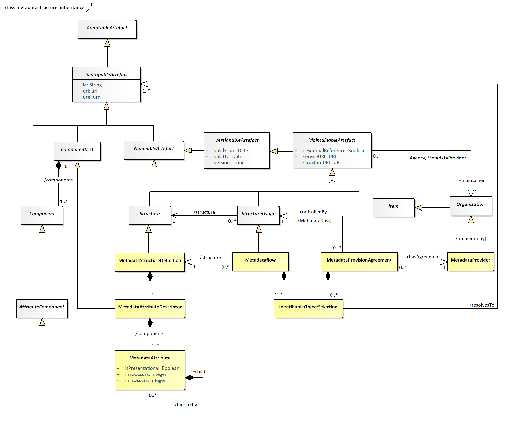
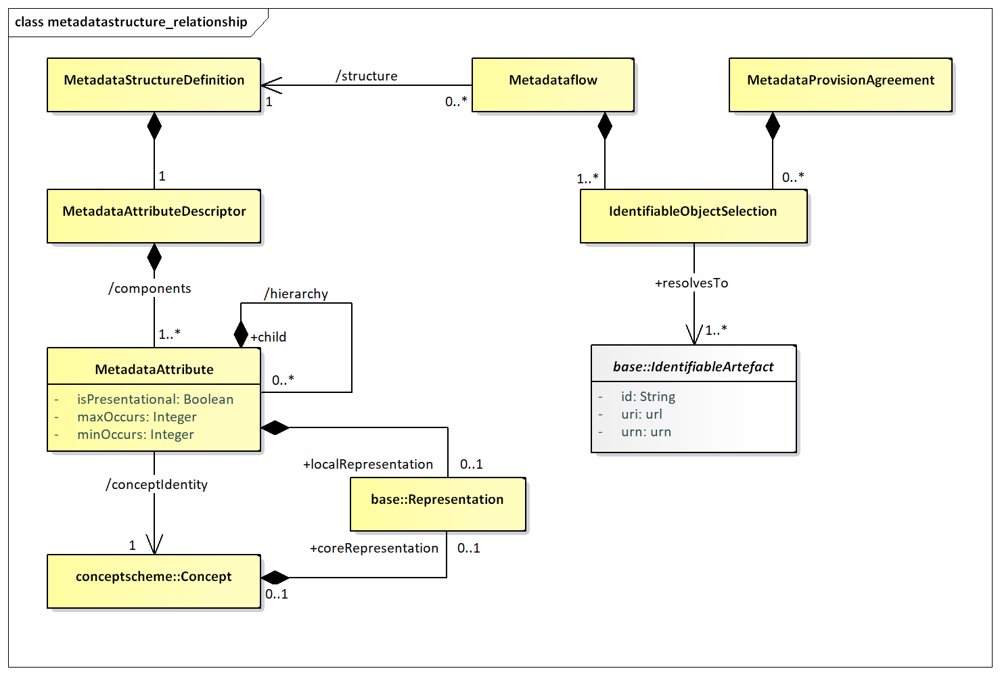
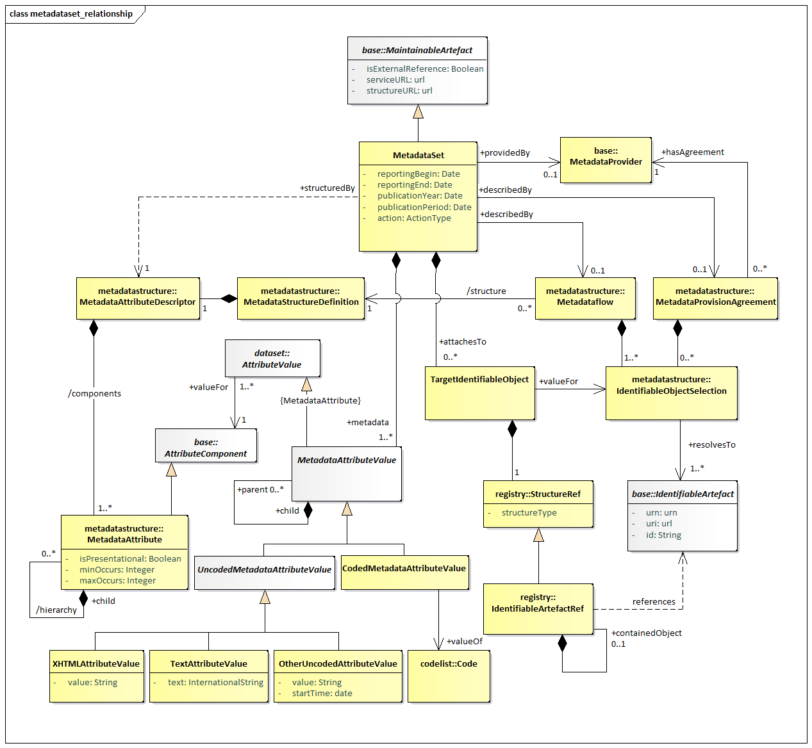

#   Metadata Structure Definition and Metadata Set

## Context

Besides the possibility to extend the components of Data Structure
Definitions by metadata attributes defined in Metadata Structure
Definitions, the SDMX metamodel allows metadata to describe any
identifiable artefact. These metadata can be:

1.  Exchanged without the need to embed it within the object that it is
    describing.

2.  Stored separately from the object that it describes, yet be linked
    to it (for example, an organisation has a metadata repository which
    supports the dissemination of metadata resulting from metadata
    requests generated by systems or services that have access to the
    object for which the metadata pertains. This is common in web
    dissemination where additional metadata is available for viewing
    (and eventually downloading) by clicking on an “information” icon
    next to the object to which the metadata is attached).

3.  Versioned and maintained like structural metadata, but from Metadata
    Providers than Agencies.

4.  Reported according to a defined structure.

In order to achieve this, the following structures are modelled:

-   The Metadata Structure Definition which comprises the metadata
    attributes that can be attached to the various object types (these
    attributes can be structured in a hierarchy), together with any
    constraints that may apply (e.g., association to a code list that
    contains valid values for the attribute when reported in a metadata
    set),

-   The Metadataflow and/or Metadata Provision Agreement, which contains
    the objects to which the metadata are to be associated (attached),

-   The Metadata Set, which contains reported metadata.

## Inheritance

### Introduction

As with the Data Structure Definition Structure, many of the constructs
in this layer of the model inherit from the SDMX Base layer. Therefore,
it is necessary to study both the inheritance and the relationship
diagrams to understand the functionality of individual packages. The
diagram below shows the full inheritance tree for the classes concerned
with the MetadataStructureDefinition, the MetadataProvisionAgreement,
the Metadataflow and the MetadataSet.

There are very few additional classes in the MetadataStructureDefinition
package that do not themselves inherit from classes in the SDMX Base. In
other words, the SDMX Base gives most of the structure of this sub model
both in terms of associations and in terms of attributes. The
relationship diagrams shown in this section show clearly when these
associations are inherited from the SDMX Base (see the Appendix “A Short
Guide to UML in the SDMX Information Model” to see the diagrammatic
notation used to depict this).

### Class Diagram - Inheritance

Figure 32: Inheritance class diagram of the Metadata Structure
Definition

### Explanation of the Diagram

#### Narrative

It is important to the understanding of the relationship class diagrams
presented in this section to identify the concrete classes that inherit
from the abstract classes.

The concrete classes in this part of the SDMX metamodel, which require
to be maintained by Maintenance Agencies, all inherit from
MaintainableArtefact. These are:

*StructureUsage* (concrete class is Metadataflow)

*Structure* (concrete class is MetadataStructureDefinition)

MetadataProvisionAgreement

These classes also inherit the identity and versioning facets of
*IdentifiableArtefact*, *NameableArtefact* and *VersionableArtefact*.

A *Structure* may contain several lists of components. In this case the
MetadataStructureDefinition acts as a list and contains *Component*s,
i.e., MetadataAttributes.

## Metadata Structure Definition

### Introduction

The diagrams and explanations in the rest of this section show how these
concrete classes are related in order to support the required
functionality.

### Structures Already Described

The MetadataStructureDefinition only contains MetadataAttributes, since
target objects are contained in Metadataflow and
MetadataProvisionAgreement, since SDMX 3.0.

### Class Diagram – Relationship

Figure 33: Relationship class diagram of the Metadata Structure
Definition

### Explanation of the Diagram

#### Narrative

In brief, a MetadataStructureDefinition (MSD) defines the
MetadataAttributes, within an MetadataAttributeDescriptor, that can be
associated with the objects identified in the Metadataflows and
MetadataProvisionAgreements that refer to the MSD. The hierarchy of the
MetadataAttributes is specified within the MetadataAttributeDescriptor.

The MetadataAttributeDescriptor comprises a set of MetadataAttributes –
these can be defined as a hierarchy. Each MetadataAttribute identifies a
Concept that is reported or disseminated in a MetadataSet
(/conceptIdentity) that uses this MetadataStructureDefinition. Different
MetadataAttributes in the same MetadataAttributeDescriptor can use
Concepts from different ConceptSchemes. Note that a MetadataAttribute
does not link to a Concept that defines its role in this
MetadataStructureDefinition (i.e., the MetadataAttribute does not play a
role).

The MetadataAttribute can be specified as having multiple occurrences
and/or specified as being mandatory (minOccurs=1 or more) or optional
(minOccurs=0). A hierarchical MetadataStructureDefinition can be defined
by specifying a hierarchy for a MetadataAttribute.

It can be seen from this, that the specification of the objects to which
a MetadataAttribute can be attached is indirect: the MetadataAttributes
are defined in a MetadataStructureDefinition, but they are attached to
one or more IdentifiableArtefacts as defined in the Metadataflows or
MetadataProvisionAgreements. This gives a flexible mechanism by which
the actual objects need not be defined in concrete terms in the model
but are defined dynamically by the IdentifiableObjectSelection. In this
way, the MetadataStructureDefinition can be used to define any set of
MetadataAttributes regardless of the objects to which they can be
attached.

Each MetadataAttribute can have a Representation specified (using the
/localRepresentation association). If this is not specified in the
MetadataStructureDefinition then the Representation is taken from that
defined for the Concept (the coreRepresentation association).

The definition of the various types of Representation can be found in
the specification of the Base constructs. Note that if the
Representation is non-enumerated then the association is to the
ExtendedFacet (which allows for XHTML as a FacetValueType). If the
Representation is enumerated, then is must use a Codelist.

The Metadataflow is linked to a MetadataStructureDefinition. The
Metadataflow, in addition to the attributes inherited from the Base
classes, it also has a list of IdentifiableObjectSelection constructs,
which resolve into the IdentifiableArtefacts that the Metadatasets will
refer to. The IdentifiableObjectSelection acts like a reference, but it
may also include wildcarding part of the reference terms.

The MetadataProvisionAgreement is linked to a Metadataflow. The former,
like the Metadataflow, may have IdentifiableObjectSelection constructs
to be used for specifying the proper targets for reference metadata.

#### Definitions

| Class | Feature | Description |
| :--- | :--- | :--- |
| <em>StructureUsage</em> |  | See “SDMX Base”. |
| Metadataflow | 
Inherits from:
 
<em>StructureUsage</em>
 | Abstract concept (i.e., the structure without any metadata) of a flow of metadata that providers will provide for different reference periods. Specifies possible targets for metadata, via the Identifiable Object Selection. |
|  | /structure | Associates a Metadata Structure Definition. |
| MetadataProvisionAgreement |  | Links the Metadata Provider to the relevant Structure Usage (i.e., Metadataflow) for which the provider supplies metadata. The agreement may constrain the scope of the metadata that can be provided, by means of a Constraint. Specifies possible targets for metadata, via the Identifiable Object Selection. |
| MetadataProvider |  | See Organisation Scheme. |
| IdentifiableObjectSelection |  | A list or wildcarded expression resolving into Identifiable Objects that metadata will refer to. |
| MetadataStructureDefinition | 
Inherits from:
 
<em>MaintainableArtefact</em>
 | A collection of metadata concepts and their structure when used to collect or disseminate reference metadata. |
| MetadataAttributeDescriptor | 
Inherits from:
 
ComponentList
 | Defines a set of concepts that comprises the Metadata Attributes to be reported. |
|  | /components | An association to the Metadata Attributes relevant to the Metadata Attribute Descriptor. |
| MetadataAttribute |  | Identifies a Concept for which a value may be reported in a Metadata Set. |
|  | /hierarchy | Association to one or more child Metadata Attribute. |
|  | /conceptIdentity | An association to the concept which defines the semantic of the attribute. |
|  | isPresentational | Indication that the Metadata Attribute is present for structural purposes (i.e. it has child attributes) and that no value for this attribute is expected to be reported in a Metadata Set. |
|  | 
minOccurs
 
maxOccurs
 | Specifies how many occurrences of the Metadata Attribute may be reported at this point in the Metadataset. |
|  | /localRepresentation | Associates a Representation that overrides any core representation specified for the Concept itself. |
| Representation |  | The representation of the Metadata Attribute. |

## Metadata Set

### Class Diagram

Figure 34: Relationship Class Diagram of the Metadata Set

### Explanation of the Diagram

#### Narrative

Note that the MetadataSet must conform to the
MetadataStructureDefinition associated to the Metadataflow or
MetadataProvisionAgreement for which this MetadataSet is an “instance of
metadata”. Whilst the model shows the association to the classes of the
MetadataStructureDefinition, this is for conceptual purposes to show the
link to the MetadataStructureDefinition. In the actual MetadataSet, as
exchanged, there must, of course, be a reference to the
MetadataStructureDefinition and optionally a Metadataflow or a
MetadataProvisionAgreement, but the MetadataStructureDefinition is not
necessarily exchanged with the metadata. Note that the
MetadataStructureDefinition classes are shown also but are not a part of
the MetadataSet itself.

A MetadataProvider is maintaining one or more MetadataSets, as the
latter is a *MaintainableArtefact*.

A MetadataSet comprises a set of *MetadataAttributeValue*s and a set of
TargetIdentifiableObjects, which must be part of those specified in the
relevant Metadataflow or MetadataProvisionAgreement.

The MetadataStructureDefinition specifies which MetadataAttributes are
expected as *MetadataAttributeValue*s. The TargetIdentifiableObjects
point to the *IdentifiableArtefact*s for which the
*MetadataAttributeValue*s are reported.

A simple text value for the *MetadataAttributeValue* uses the
*UncodedMetadataAttributeValue* sub class of *MetadataAttributeValue*
whilst a coded value uses the CodedMetadataAttributeValue sub class.

The *UncodedMetadataAttributeValue* can be one of:

-   XHTMLAttributeValue – the content is XHTML,

-   TextAttributeValue – the content is textual and may contain the text
    in multiple languages,

-   OtherUncodedAttributeValue – the content is a string value that must
    conform to the Representation specified for the MetadataAttribute in
    the MetadataStructureDefinition.

The CodedMetadataAttributeValue contains a value for a Code specified as
the Representation for a MetadataAttribute in the
MetadataStructureDefinition.

#### Definitions

| Class | Feature | Description |
| :--- | :--- | :--- |
| MetadataSet |  | Any organised collection of metadata. |
|  | reportingBegin | A specific time period in a known system of time periods that identifies the start period of a report. |
|  | reportingEnd | A specific time period in a known system of time periods that identifies the end period of a report. |
|  | publicationYear | <mark>Specifies the year of publication of the data or metadata in terms of whatever provisioning agreements might be in force</mark>. |
|  | publicationPeriod | <mark>Specifies the period of publication of the data or metadata in terms of whatever provisioning agreements might be in force</mark>. |
|  | action | Defines the action to be taken by the recipient system (information, append, replace, delete) |
|  | +describedBy | Associates a Metadataflow or a Metadata Provision Agreement to the Metadata Set. |
|  | +structuredBy | Associates the Metadata Attribute Descriptor of the Metadata Structure Definition that defines the structure of the Metadata Set. Note that this dependency explains that the Metadataset is structures according to the Metadata Structure Definition of the linked (by the +describedBy) Metadataflow or the Metadata Provision Agreement. |
|  | +publishedBy | Associates the Data Provider that reports/publishes the metadata. |
|  | +attachesTo | Associates the target identifiable objects to which metadata is to be attached. |
|  | +metadata | Associates the Metadata Attribute values which are to be associated with the object or objects identified by the Target Identifiable Objects(s). |
| TargetIdentifiableObject |  | Specifies the identification of an Identifiable object. |
|  | +valueFor | Associates the Target Identifiable Object being a part of the Identifiable Object Selection specified in the Dataflow or Metadata Provision Agreement. |
| StructureRef |  | Contains the identification of an Identifiable object. |
|  | structureType | The object type of the target object. |
| IdentifiableArtefactRef |  | Identification of the target object. |
|  | +containedObject | Association to a contained object in a hierarchy of Identifiable Objects such as a Transition in a Process Step. |
| <em>MetadataAttributeValue</em> | 
Abstract class
 
Sub classes are:
 
<em>UncodedMetadataAttributeValue</em>  CodedMetadataAttributeValue
 | The value for a Metadata Attribute. |
|  | 
+valueFor
 
(inherited from the <em>AttributeValue</em>)
 | 
Association to the Metadata Attribute in the Metadata Structure Definition that identifies the Concept and allowed Representation for the Metadata Attribute value.
 
Note that this is a conceptual association showing the link to the MSD construct. The syntax for the Metadata Attribute value will state, in some form, the id of the Metadata Attribute.
 |
|  | +child | Association to a child Metadata Attribute value consistent with the hierarchy defined in the MSD for the Metadata Attribute for which this child is a Metadata Attribute value. |
| <em>UncodedMetadataAttributeValue</em> | 
Inherits from
 
<em>MetadataAttributeValue</em>
 
Sub class:
 
XHTMLAttributeValue  TextAttributeValue  OtherUncodedAttributeValue
 | The content of a Metadata Attribute value where this is textual. |
| XHTMLAttributeValue |  | This contains XHTML |
|  | value | The string value of the XHTML |
| TextAttributeValue |  | This value of a Metadata Attribute value where the content is human-readable text. |
|  | text | The string value is text. This can be present in multiple language versions. |
| OtherUncodedAttributeValue |  | The value of a Metadata Attribute value where the content is not of human-readable text. |
|  | value | A text string that is consistent in format to that defined in the Representation of the Metadata Attribute for which this is a Metadata Attribute value. |
|  | startTime | This attribute is only used if the textFormat of the Metadata Attribute is of the Timespan type in the Metadata Structure Definition (in which case the value field takes a duration). |
| CodedMetadataAttributeValue | 
Inherits from
 
<em>MetadataAttributeValue</em>
 | The content of a Metadata Attribute value that is taken from a Code in a Code list. |
|  | value | The Code value of the Metadata Attribute value. |
|  | +value | 
Association to a Code in the Code list specified in the Representation of the Metadata Attribute for which this Metadata Attribute value is the value.
 
Note that this shows the conceptual link to the Item that is the value. In reality, the value itself will be contained in the Coded Metadata Attribute Value.
 |