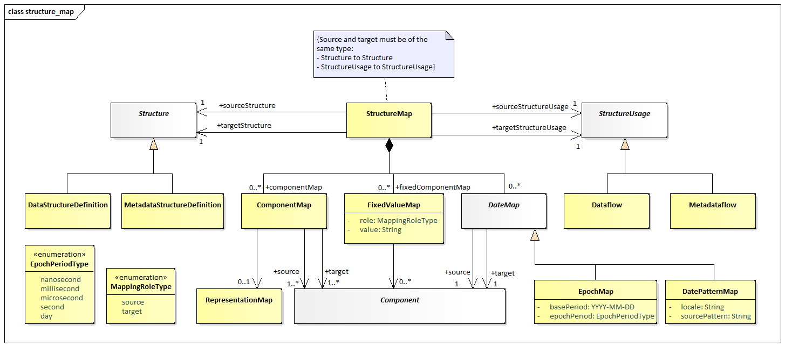
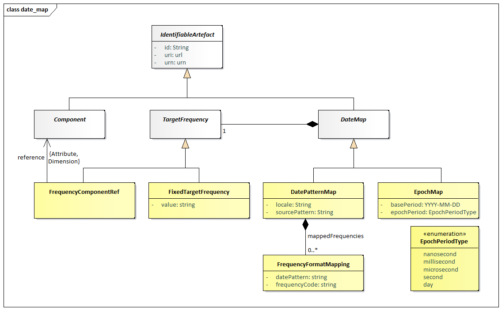

# Structure Map

## Scope

A StructureMap allows mapping between Data Structures or Dataflows. It
ultimately maps one DataStructureDefinition to another (source to
target) although it can do this via the Dataflow or directly against the
DataStructureDefinition.

The StructureMap defines how the *structure* of a source
DataStructureDefinition relates to the *structure* of the target
DataStructureDefinition. The term *structure* in this instance refers to
the Dimensions and Attributes (collectively called Components). An
example relationship is source REF\_AREA Dimension maps to target
COUNTRY Dimension. When converting data, systems should interpret this,
as ‘data reported against REF\_AREA in the source dataset, should be
converted to data against COUNTRY in the target dataset’. StructureMaps
can make use of the RepresentationMap to describe how the reported value
map, if there is a mapping to be done on the value, for example source
REF\_AREA.US may map to COUNTRY.USA. In the case of mapping Dates, the
EpochMap or DatePatternMap is used and maintained in the StructureMap
that uses it.

### Class Diagram – Relationship

Figure 37: Relationship Class diagram of the Structure Map

### Explanation of the Diagram

#### Narrative

The StructureMap is a *MaintainableArtefact*. The StructureMap can
either map a source and target DataStructureDefinition or a source and
target Dataflow, it cannot mix source and target types. The StructureMap
contains zero or more ComponentMaps. Each ComponentMap maps one or more
*Component*s from the source DataStructureDefinition to one or more
*Component*s in the target DataStructureDefinition[3]. In addition, the
StructureMap contains zero or more FixedValueMaps. In this case, one or
more *Component*s, from the source or target DataStructureDefinition,
map to a fixed value.

The rules pertaining to how reported values map, are maintained in
either a RepresentationMap, EpochMap, or DatePatternMap. A ComponentMap
can only reference one of these mapping types to define how the reported
values relate from source Dataset to the target Dataset. If a
ComponentMap has more than 1 source or target, a RepresentationMap must
be used to describe how the values map, as it is the only map which can
define multiple source and target values in combination.

If the ComponentMap does not reference any map type to describe how the
values map in a Dataset, then the values from the source Dataset are
copied to the target Dataset verbatim, with no mapping rules being
applied.

A RepresentationMap is a separate Maintainable structure. EpochMap and
DatePatternMap are maintained in the same StructureMap and are
referenced locally from the ComponentMap. EpochMap and DatePatternMap
are maintained outside of the ComponentMap and can therefore be reused
by multiple ComponentMaps.

### Class Diagram – Epoch Mapping and Date Pattern Mapping

Figure 38: Relationship Class diagram of the EpochMap and DatePatternMap

### Explanation of the Diagram

#### Narrative

The EpochMap and DatePatternMap are both *IdentifiableArtefact*. An
EpochMap and DatePatternMap both provide the ability to map source to
target date formats. The EpochMap describes the source date as the
number of epochs since a point in time, where the duration of each epoch
is defined, e.g., number of milliseconds since 1970. The DatePatternMap
describes the source date as a pattern for example MM-YYYY, accompanied
by the appropriate locale.

Both mappings describe the target date as a frequency Identifier. The
frequency identifier is given either a fixed value, e.g., ‘A’ or a
reference to a Dimension or Attribute in the target
DataStructureDefinition of the StructureMap, e.g. ‘FREQ’. In the latter
case, the frequency id is derived at run time when the output series and
observations are generated. Dates mapped using the frequency lookup can
therefore be mapped using different frequencies depending on the series
or observation being converted.

If the Frequency Identifier aligns with standard SDMX frequencies the
output date format can be derived using standard SDMX date formatting
(e.g., A=YYYY, Q=YYYY-Qn). If the SDMX standard formatting is not
desired or if the frequency Id is not a standard SDMX frequency Code,
the FrequencyFormatMapping can be used to describe the relationship
between the frequency Id and the output date format, e.g., A01=YYYY.

#### Definitions

| Class | Feature | Description |
| :--- | :--- | :--- |
| StructureMap | Inherits from  <em>MaintainableArtefact</em> | Links a source and target structure where there is a semantic equivalence between the source and the target structures. |
|  | +sourceStructure | Association to the source Data Structure. |
|  | +targetStructure | Association to the target Data Structure |
|  | +sourceStructureUsage | Association to the source Dataflow. |
|  | +targetStructureUsage | Association to the target Dataflow. |
| ComponentMap | Inherits from  <em>AnnotableArtefact</em> | Links source and target Component(s) where there is a semantic equivalence between the source and the target Components. |
|  | +source | Association to zero or more source Components. |
|  | +target | Association to zero or more the target Components. |
|  | mappingRules | Reference to either a RepresentationMap, an EpochMap or a DatePatternMap. |
| FixedValueMap | Inherits from  <em>AnnotableArtefact</em> | Links a Component (source or target) to a fixed value. |
|  | value | The value that a Component will be fixed in a fixed component map. |
| <em>DateMap</em> | Inherits from  <em>IdentifiableArtefact</em> |  |
|  | freqDimension | The Dimension or Attribute of the target Data Structure Definition which will hold the frequency information for date conversion. Mutually exclusive with targetFrequencyId. |
|  | yearStart | The date of the start of the year, enabling mapping from high frequency to lower frequency formats. |
|  | resolvePeriod | Which point in time to resolve to when mapping from low frequency to high frequency periods. |
|  | mappedFrequencies | A reference to a map of frequency id to date pattern for output. |
| EpochMap | Inherits from  <em>DateMap</em> |  |
|  | basePeriod | Epoch zero starts on this period. |
|  | targetFrequencyId | The frequency to convert the input date into. Mutually exclusive with freqDimension. |
|  | epochPeriod | Describes the period of time that each epoch represents. |
| DatePatternMap | Inherits from  <em>DateMap</em> | Described a source date based on a string pattern, and how it maps to the target date. |
|  | locale | The locale on which the input will be parsed according to the pattern. |
| DateMapping |  |  |
|  | sourcePattern | Describes the source date using conventions for describing years, months, days, etc. |
|  | targetFrequencyId | The frequency to convert the input date into. Mutually exclusive with freqDimension. |
| FrequencyFormatMapping | Inherits from <em>IdentifiableArtefact</em> | Describes the relationship between a frequency Id to the what the output date is formatted |
|  | frequencyId | The string used to describe the frequency |
|  | datePattern | The output date pattern for that frequency |