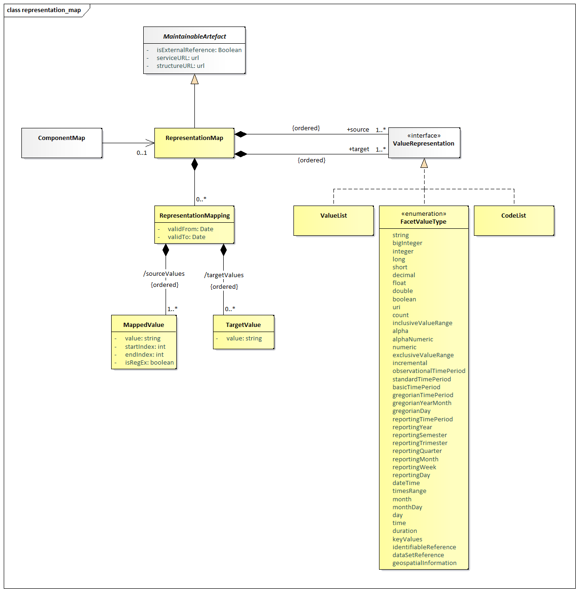

# RepresentationMap

## Scope

A RepresentationMap describes a mapping between source value(s) and
target value(s) where the values are restricted to those in a Codelist,
ValueList or be of a certain data type, e.g., Integer.

The RepresentationMap maps information from one or more sources, where
the values for each source are used in combination to derive the output
value for one or more targets. Each source value may match a substring
of the original data (using startIndex and/or endIndex) or define a
pattern matching rule described by a regular expression. The target
value is provided as an absolute string, although it can make use of
regular expression groups to carry across values from the source string
to the target string without having to explicitly state the value to
carry. An example is a regular expression which states ‘match a value
starting with AB followed by anything, where the anything is marked a
capture group’, the target can state ‘take the anything value and
postfix it with AB’ thus enabling the mapping of ABX to XAB and ABY to
YAB.

The absence of an output for an input is interpreted as ‘no output value
for the given source value(s)’.

### Class Diagram – Relationship

Figure 39: Representation Map

### Explanation of the Diagram

#### Narrative

The RepresentationMap is a *MaintainableArtefact*. It maps one or more
source values to one or more target values, where values that are being
mapped are defined by the *ValueRepresentation*. A *ValueRepresentation*
is an abstract container which is either a Codelist, ValueList or a
FacetValueType. Source and target values are in a list where the list
order is important as the RepresentationMapping sourceValues and
targetValues must match the order. It is permissible to mix types for
both source and target values, allowing for example a Codelist to map to
an Integer (which is a FacetValueType). The list of source or targets
can also be mixed, for example a Codelist in conjunction with a
FacetValueType and ValueList and can be defined as the source of a
mapping, thus allowing rules such as ‘When CL\_AREA=UK AND AGE=26
CURRENCY=$’.

#### Definitions

| Class | Feature | Description |
| :--- | :--- | :--- |
| RepresentationMap | Inherits from  <em>MaintainableArtefact</em> | Links source and target representations, whose values may conform to a linked Codelist, ValueList or enumerated type such as Integer. |
|  | source | Association to one or more Codelist, ValueList, or FacetValue – mixed types are permissible |
|  | target | Association to one or more Codelist, ValueList, or FacetValue – mixed types are permissible |
| RepresentationMapping | Inherits from  <em>AnnotableArtefact</em> | Describes how the source value(s) map to the target value(s) |
|  | validFrom | Optional period describing when the mapping is applicable |
|  | validTo | Optional period describing which the mapping is no longer applicable. |
|  | sourceValues | Input value for source in the RepresentationMap |
|  | targetValues | Output value for each mapped target in the RepresentationMap |
| MappedValue |  | Describes an input value that is part of the sourceValues in a RepresentationMapping |
|  | value | The value to compare the source data with |
|  | isRegEx | If true, the value field should be treated as a regular expression when comparing with the source data |
|  | startIndex | If provided, a substring of the source data should be taken, starting from this index (starting at zero) before comparing with the <em>value</em> field for matching |
|  | endIndex | If provided, a substring of the source data should be taken, ending at this index (starting at zero) before comparing with the <em>value</em> field for matching |
| TargetValue |  | Describes the target value that is part of the targetValues of a RepresentationMapping |
|  | value | Represents a value for the targetValues of a RepresenationMapping |